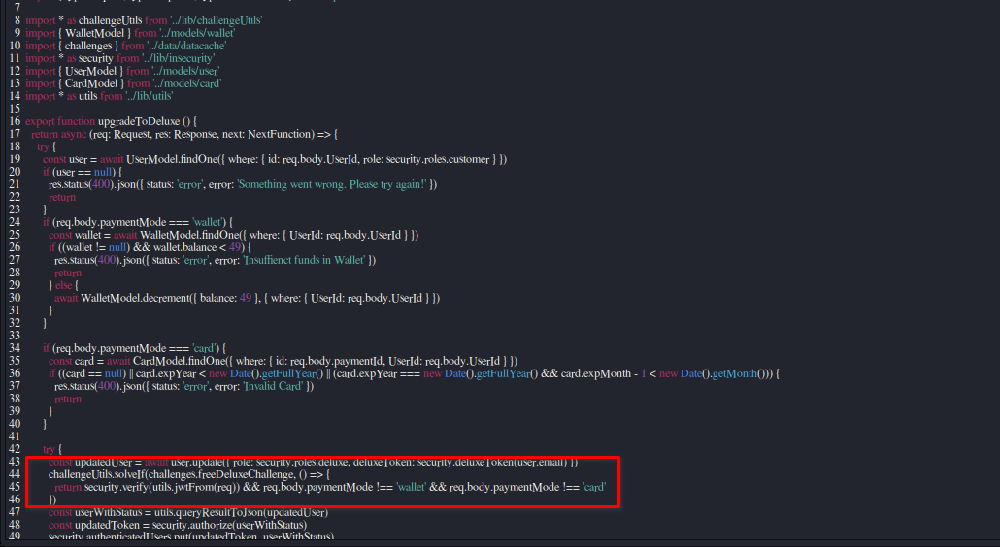
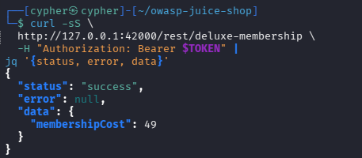
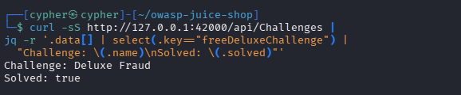

# Deluxe Fraud

## Challenge Information

- **Category:** Improper Input Validation
- **Challenge:** Deluxe Fraud
- **Application:** OWASP Juice Shop
- **Environment:** Local lab (`http://127.0.0.1:42000`)
- **Status:** Solved

## Objective

Investigate the deluxe membership upgrade process and determine whether the application validates the payment method before granting premium membership.

## Reconnaissance / Discovery

The challenge hints directed the investigation toward the deluxe membership payment page and the HTTP requests sent when different payment methods are selected.

The following areas were examined:

1. The deluxe membership page and its available payment methods.
2. The `POST /rest/deluxe-membership` endpoint.
3. The server-side implementation in `routes/deluxe.ts`.
4. The challenge status returned by the application.

Source-code inspection revealed that the handler performs payment checks for the `wallet` and `card` payment modes. The role update, however, is outside those two conditional checks.

## Attack Surface

- **Endpoint:** `POST /rest/deluxe-membership`
- **Input:** JSON request body, including `paymentMode`
- **Authentication:** Bearer token
- **Sensitive operation:** Changing a customer's role to deluxe membership

The endpoint is security-sensitive because it changes account privileges and should only do so after the required payment conditions have been satisfied.

## Validation

The source code was inspected to understand how the application handles payment modes.

The relevant logic checks wallet funds when `paymentMode` is `wallet` and validates card details when it is `card`. Other values do not enter either payment-validation branch.

This suggested a possible validation flaw: an unexpected payment-mode value might bypass both payment checks while still reaching the membership role-update logic.

## Exploitation

Using a test account in the local lab, an authenticated request was sent with an unexpected payment mode:

```http
POST /rest/deluxe-membership
Content-Type: application/json

{"paymentMode":"test"}
```

The request was authenticated with a bearer token. The token and session credentials are intentionally excluded from this documentation.

The application returned a generic error response. Therefore, the HTTP response alone did not confirm a successful membership upgrade.

However, the application's challenge-status endpoint subsequently reported **Deluxe Fraud — Solved: true**.

## Evidence

### 1. Source Code



The source code shows the separate payment-validation branches and the role-update logic that follows them.

### 2. Test Request



The request uses an unexpected payment-mode value. The captured response is a generic error, so it is not presented as proof of a successful HTTP transaction.

### 3. Challenge Solved



The challenge-status output confirms that OWASP Juice Shop marked the Deluxe Fraud challenge as solved.

## Security Impact

If an unexpected payment-mode value can reach the role-update operation without payment validation, an attacker may be able to obtain premium membership without completing the intended payment process.

Potential consequences include unauthorized privilege changes, loss of membership revenue, and abuse of premium-only functionality.

The observed challenge status supports the vulnerability finding. The exact resulting account state should be verified separately before claiming that a particular account was successfully upgraded.

## Root Cause

The suspected root cause is incomplete server-side validation of the `paymentMode` input.

The handler explicitly validates `wallet` and `card`, but does not reject every other value before reaching the role-update logic. This creates a gap between payment validation and authorization to grant membership.

## Lessons Learned

- Validate payment methods against an explicit allowlist.
- Reject missing, malformed, and unsupported payment modes.
- Keep membership changes behind a successful, verified payment result.
- Never rely on client-side controls to enforce payment requirements.
- Verify both the HTTP response and the resulting server-side state.
- Redact bearer tokens, cookies, and passwords from screenshots and reports.

## Conclusion

The Deluxe Fraud investigation identified a potentially unsafe relationship between payment-mode validation and membership role changes. Testing with an unexpected payment mode caused the Juice Shop challenge to be marked solved, although the request itself returned a generic error.

The finding demonstrates why security-sensitive account changes must depend on explicit server-side validation and verified payment outcomes.
