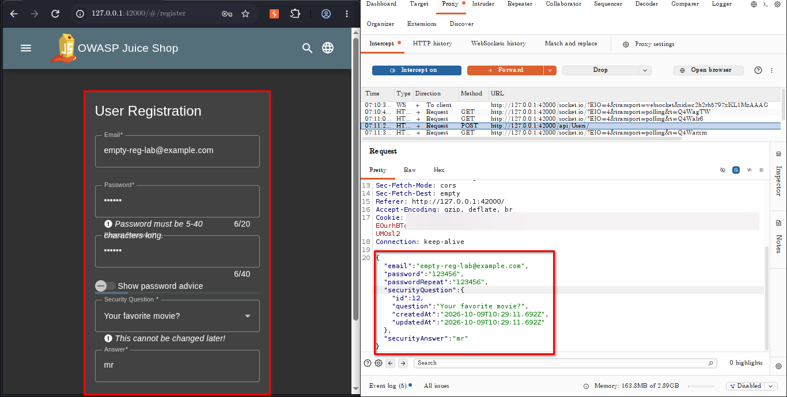
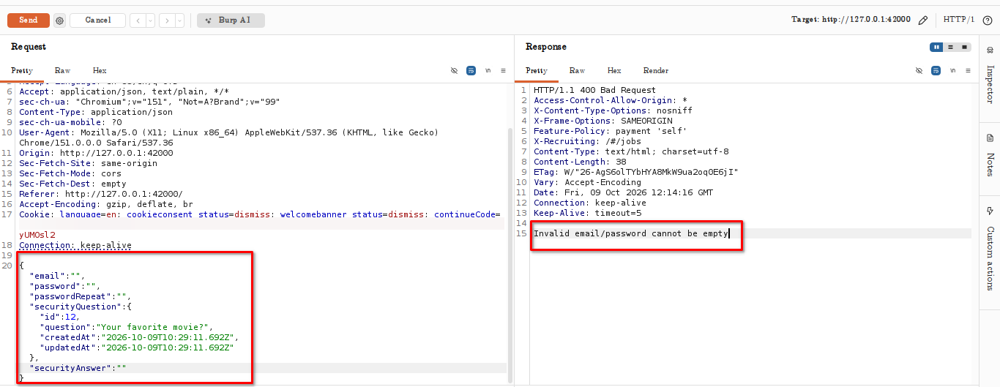
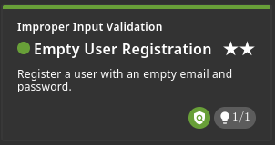

# Empty User Registration

## Challenge Information

- **Category:** Improper Input Validation
- **Challenge:** Empty User Registration
- **Application:** OWASP Juice Shop
- **Environment:** Local lab (`http://127.0.0.1:42000`)
- **Status:** Solved

## Objective

Investigate whether the registration endpoint correctly validates required fields when a request is modified outside the browser's normal form controls.

## Reconnaissance / Discovery

The challenge hint recommended intercepting and modifying the registration request payload.

The registration form included fields for email, password, password confirmation, security question, and security answer. Burp Suite was used to capture the registration request and inspect the JSON body sent to the server.

The captured request used:

- **Method:** `POST`
- **Endpoint:** `/api/Users/`
- **Content type:** `application/json`

The request structure provided a starting point for testing server-side validation independently of the browser interface.

## Attack Surface

The registration endpoint accepts user-controlled JSON containing account details and security-question information.

Because registration creates an account, the server must validate required fields and reject invalid input even when requests bypass frontend validation.

## Validation

An initial test replaced the email, password, password confirmation, and security answer with empty strings.

The server returned:

- **HTTP status:** `400 Bad Request`
- **Response:** `Invalid email/password cannot be empty`

This confirmed that the tested all-empty payload was rejected. That response alone did not demonstrate the vulnerability.

## Exploitation

The challenge was subsequently reported as **solved** by the OWASP Juice Shop scoreboard.

The available evidence establishes the solved status, but the captured all-empty request returned an error. Therefore, this report does not claim that this specific request created an account.

The exact request that triggered the challenge should be preserved from Burp history if available, so the successful test can be documented separately from the rejected validation test.

## Evidence

### 1. Registration Request

The intercepted registration request shows the endpoint and JSON structure used during testing.

### 2. Empty-Field Validation Response

The server rejected the tested empty-field payload with HTTP 400 and an explicit validation message.

### 3. Challenge Solved

The scoreboard confirms that OWASP Juice Shop marked the Empty User Registration challenge as solved.

## Security Impact

If required registration fields can be bypassed, the application may create incomplete or invalid accounts. Depending on downstream account handling, this could affect authentication, account management, or workflows that assume registration data is valid.

The precise impact should be tied to the successful request and the resulting account state rather than inferred solely from the challenge name.

## Root Cause

The challenge concerns the validation of required registration fields at the server boundary. A secure implementation must consistently reject missing, empty, malformed, or otherwise invalid values regardless of how the request is submitted.

The exact validation weakness should be confirmed against the successful request or relevant server-side implementation before assigning a more specific root cause.

## Lessons Learned

- Intercept requests to understand the actual API contract.
- Test server-side validation independently of frontend controls.
- Distinguish an observed error response from a successful exploit.
- Verify challenge status and resulting application state.
- Preserve the exact successful request as evidence.
- Remove cookies, tokens, passwords, and other secrets from screenshots.

## Conclusion

The Empty User Registration challenge was marked solved by the application scoreboard. Testing confirmed that one all-empty payload was rejected with HTTP 400. The successful triggering request should be used to complete the exploitation details so the final report accurately explains the vulnerability without overstating what the rejected request demonstrated.

