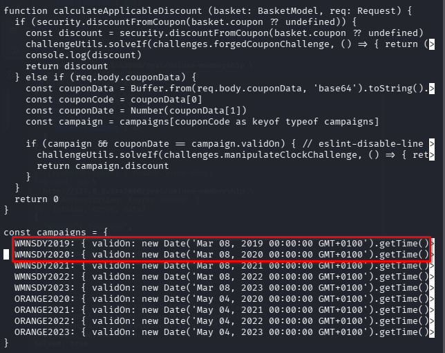
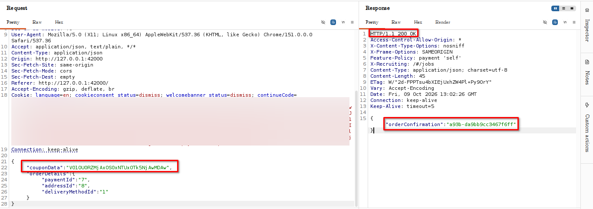
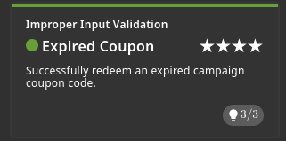

# Expired Coupon

## Challenge Information
- **Category:** Improper Input Validation
- **Challenge:** Expired Coupon
- **Objective:** Successfully redeem an expired campaign coupon code.

## Reconnaissance / Discovery

Inspected the local Juice Shop source code in `routes/order.ts` to understand how checkout processes coupon data.

The `calculateApplicableDiscount()` function revealed that the application supports historical campaigns identified by a campaign code and its original validity timestamp.

## Attack Surface

The checkout endpoint accepts a JSON request containing `couponData` and `orderDetails`.

The relevant application logic decodes `couponData` from Base64, separates the campaign code from its timestamp, and checks both against the stored campaign definition.

## Validation

The source code contained historical campaign entries, including `WMNSDY2019`, with a validity timestamp in the past.

This suggested that a historical campaign could be accepted if the supplied code and timestamp matched the application's stored values.

## Exploitation

Using Burp Suite Repeater, modified the `couponData` value in the local checkout request to supply the Base64-encoded historical campaign data.

The remaining checkout fields were retained. The application accepted the request and returned HTTP `200 OK` with an order confirmation.

## Evidence

The Juice Shop scoreboard confirmed that the **Expired Coupon** challenge was solved.

## Security Impact

If an application accepts expired promotional campaigns, customers may redeem discounts that should no longer be available. This can cause unintended financial losses and undermine promotional controls.

## Root Cause

The application accepts historical campaign data when the submitted campaign code and timestamp match a stored entry. The observed behavior demonstrates that the server-side logic permits redemption of a past campaign when the expected historical values are supplied.

## Lessons Learned

- Inspect source code to understand how promotional data is validated.
- Trace the complete request path from the client to the checkout handler.
- Distinguish a successful HTTP response from confirmed challenge completion.
- Validate promotional eligibility using server-controlled campaign status and expiration rules rather than trusting client-supplied historical values.

## Conclusion

The Expired Coupon challenge was solved by identifying the historical campaign validation logic and supplying matching campaign data in a local checkout request. The successful response and scoreboard confirmation provided evidence of the result.
