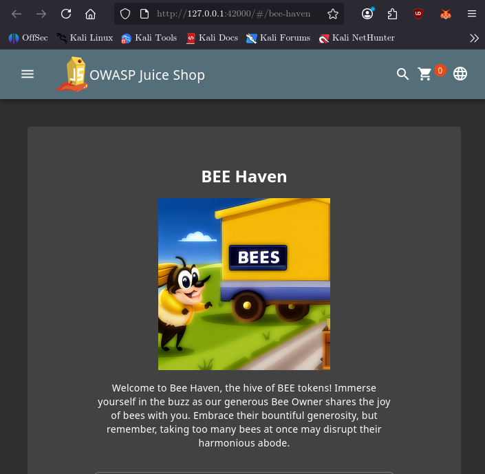
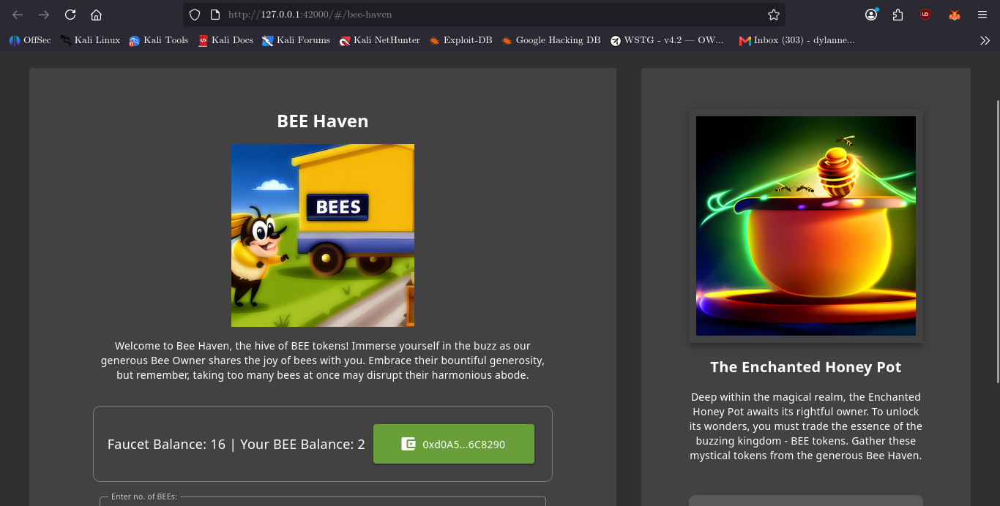
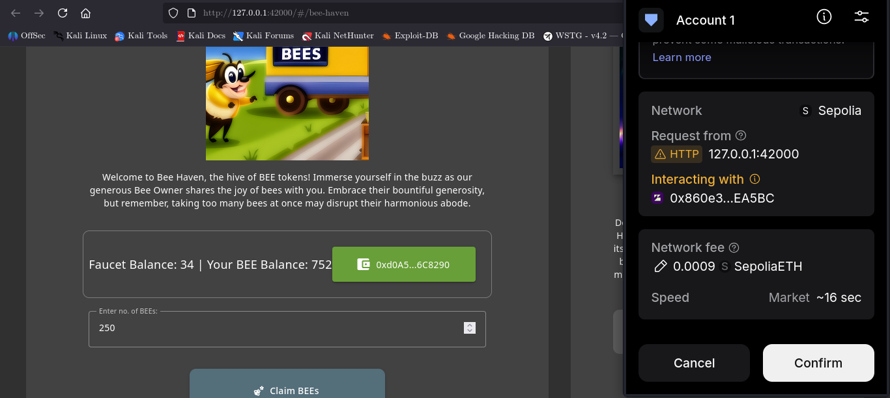
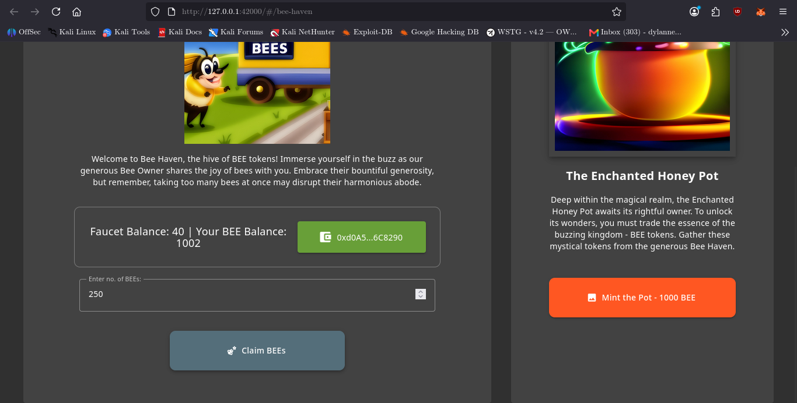
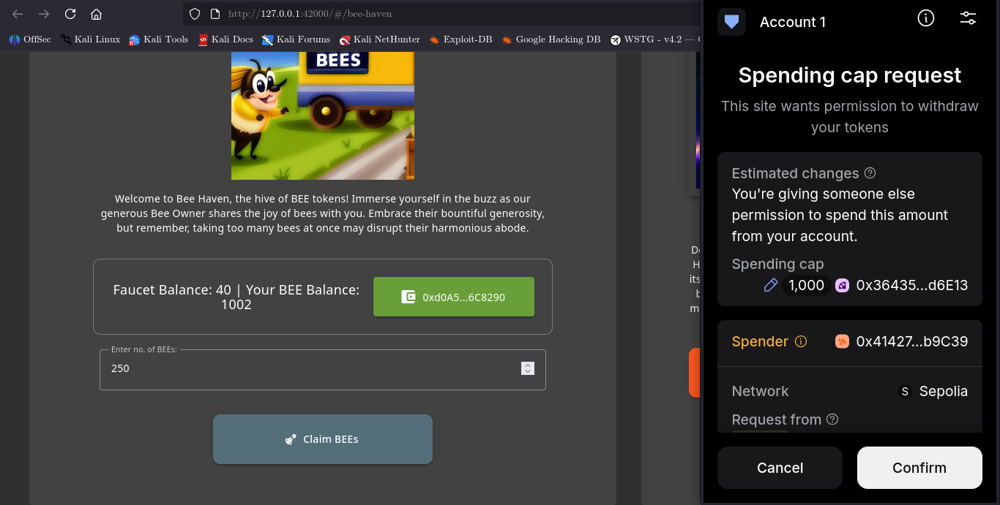
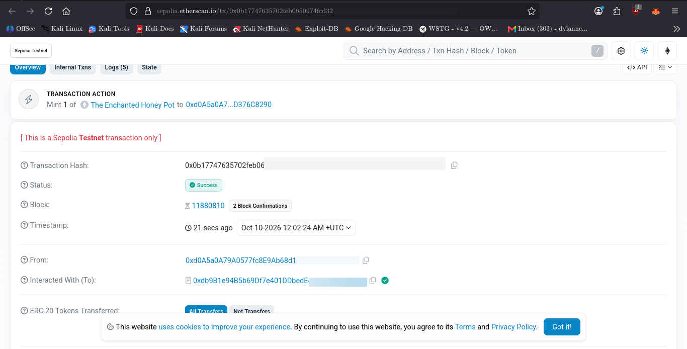

# Mint the Honey Pot

## 1. Challenge Information

| Field | Details |
|---|---|
| Application | OWASP Juice Shop |
| Category | Improper Input Validation |
| Challenge | Mint the Honey Pot |
| Target page | `http://127.0.0.1:42000/#/bee-haven` |
| Blockchain | Ethereum Sepolia testnet |
| Primary focus | Input validation, token withdrawals, smart-contract interaction, and transaction verification |
| Status | Solved |

### Objective

Investigate the Bee Haven interface, understand how BEE tokens are obtained, accumulate the required token balance, mint the Honey Pot NFT, and verify the successful transaction on the blockchain.

This exercise demonstrates how frontend input handling, smart-contract behavior, wallet approvals, and blockchain events can be investigated together.

## 2. Reconnaissance / Discovery

### 2.1 — Identify the challenge interface

The first step was to open the Bee Haven page and inspect its available functionality.



**Observation**

The interface provides access to the Bee Haven functionality, including the mechanism for obtaining BEE tokens and minting the NFT.

**Investigation questions**

- How are BEE tokens withdrawn from the faucet?
- Is the withdrawal amount validated by the frontend?
- What balance is required to mint the NFT?
- How does the application verify that minting succeeded?

These questions guided the subsequent source-code inspection.

### 2.2 — Locate the relevant frontend implementation

The following commands were used to locate the withdrawal input, event handler, and related interface elements.

```bash
grep -Rni -E 'withdrawAmount|extractBEETokens|LABEL_NUMBER_OF_BEES' \
  /var/lib/juice-shop/frontend/src/app/faucet
```

Inspect the withdrawal form:

```bash
sed -n '30,65p' \
  /var/lib/juice-shop/frontend/src/app/faucet/faucet.component.html
```

Inspect the withdrawal handler:

```bash
sed -n '185,235p' \
  /var/lib/juice-shop/frontend/src/app/faucet/faucet.component.ts
```

**What these commands establish**

- Where the withdrawal amount is entered.
- Which frontend function processes the withdrawal.
- Whether the input declares explicit minimum or maximum values.
- How the selected amount is passed to the wallet contract interaction.

**Finding**

The inspected withdrawal input used a numeric field bound to `withdrawAmount`, without explicit HTML `min` or `max` attributes. The frontend handler passed the selected amount into the contract withdrawal call.

This justified investigating the smart-contract interface and actual withdrawal behavior rather than relying only on the appearance of the form.

### 2.3 — Inspect the smart-contract interface and source

The relevant local contract source was located at:

```text
/var/lib/juice-shop/data/static/web3-snippets/BeeFaucet.sol
```

The NFT contract source was located at:

```text
/var/lib/juice-shop/data/static/web3-snippets/HoneyPotNFT.sol
```

Inspect the faucet implementation:

```bash
sed -n '1,180p' \
  /var/lib/juice-shop/data/static/web3-snippets/BeeFaucet.sol
```

Inspect the NFT contract:

```bash
sed -n '1,200p' \
  /var/lib/juice-shop/data/static/web3-snippets/HoneyPotNFT.sol
```

Inspect the frontend contract ABI:

```bash
grep -n -A 12 -B 4 'withdraw' \
  /var/lib/juice-shop/data/static/contractABIs.ts
```

**Key findings**

The NFT contract defines a mint price of 1,000 BEE, expressed in the token's smallest units. Its `mintNFT()` function transfers the required tokens from the caller before minting the NFT.

The faucet source declares an unsigned 8-bit balance and performs arithmetic on that balance during withdrawals. Its `balance >= 0` condition does not meaningfully test for a negative value because an unsigned integer cannot represent one. Whether arithmetic underflow is possible depends on the Solidity compiler version and its arithmetic semantics.

The local source and ABI were treated as investigation leads. Their behavior was not automatically assumed to be identical to the deployed contracts.

## 3. Attack Surface

The investigation identified four relevant components.

| Component | What was examined |
|---|---|
| Faucet withdrawal form | User-controlled withdrawal amount |
| Frontend withdrawal handler | Amount handling and contract invocation |
| BeeFaucet contract | Withdrawal arithmetic and token transfer |
| HoneyPotNFT contract | Required token allowance, transfer, and NFT minting |

The interaction crossed several trust boundaries: browser input, frontend code, wallet confirmation, smart-contract execution, and backend challenge verification.

## 4. Validation

### 4.1 — Test the withdrawal interaction

The withdrawal interface was used to request BEE tokens, with MetaMask providing the transaction-confirmation step.

During testing, the wallet accumulated BEE tokens through successive withdrawals rather than treating the process as a single withdrawal.



**Evidence**

The screenshot records a faucet balance of 16 BEE and a wallet balance of 2 BEE.

This is an intermediate observation in the withdrawal process, not proof on its own of a smart-contract arithmetic vulnerability.

### 4.2 — Observe the intermediate wallet balance

Further withdrawal interactions increased the wallet's BEE balance.



**Evidence**

The wallet displayed 752 BEE while MetaMask presented another withdrawal confirmation.

This confirmed that the wallet balance was increasing through the observed withdrawal sequence.

**Validation limitation**

A wallet confirmation window demonstrates a pending user-authorized transaction, not necessarily a successful on-chain transfer. The resulting wallet balance and transaction status are separate pieces of evidence.

### 4.3 — Confirm the minting threshold

After additional token accumulation, the wallet displayed 1,002 BEE.



**Observation**

The Mint the Pot button became clickable once the displayed balance exceeded the 1,000 BEE mint price.

The frontend balance-checking logic was also inspected. Its comparison conditions around exactly 1,000 BEE appeared inconsistent: the threshold was both enabled and disabled by separate checks at that boundary.

This is a frontend logic issue worth documenting separately from the withdrawal behavior.

## 5. Exploitation

### 5.1 — Initiate the NFT mint

With sufficient BEE in the wallet, the next step was to initiate the Honey Pot NFT mint through the application.

The minting process required the wallet to interact with the relevant token and NFT contracts.

### 5.2 — Review the MetaMask approval request



**Observation**

MetaMask displayed a spender-cap approval request during the minting process.

Token approvals authorize a specified spender to transfer tokens on behalf of a wallet, subject to the approved allowance and token-contract behavior. Approval and NFT minting are distinct operations; an approval prompt alone does not prove that an NFT has been minted.

For a real application, users should check the spender address, requested allowance, network, and transaction details before approving.

### 5.3 — Complete the mint transaction

After reviewing and confirming the required wallet interaction, the mint transaction was submitted to the Sepolia testnet.

The NFT contract's mint function is designed to transfer the required BEE amount and mint the NFT to the caller when the transaction succeeds.

**Result:** The transaction was confirmed successfully, and the Honey Pot NFT was minted.

## 6. Evidence — On-Chain Verification

### 6.1 — Verify the successful transaction



**Transaction details**

- Network: Ethereum Sepolia testnet
- Transaction hash: `0x0b17747635702feb0650974fcd321a4f2710535830a11bf9a04b39a3f198c962`
- Transaction status: Success
- NFT: The Enchanted Honey Pot
- Token ID: `637`

[View the transaction on Sepolia Etherscan](https://sepolia.etherscan.io/tx/0x0b17747635702feb0650974fcd321a4f2710535830a11bf9a04b39a3f198c962)

The successful transaction provides independent blockchain evidence of the mint. It is stronger evidence than the enabled mint button or a wallet confirmation prompt alone.

### 6.2 — Review the challenge verification logic

The backend verification route was inspected at:

```text
/var/lib/juice-shop/routes/nftMint.ts
```

Search for the challenge verification implementation:

```bash
grep -Rni -E 'nftMintChallenge|NFTMinted|Wallet did not mint' \
  /var/lib/juice-shop/routes \
  /var/lib/juice-shop/lib \
  /var/lib/juice-shop/data
```

Inspect the route:

```bash
sed -n '1,120p' /var/lib/juice-shop/routes/nftMint.ts
```

**Finding**

The route listens for the NFT contract's `NFTMinted` event and records the minter address in an in-memory set. When the verification endpoint receives a wallet address present in that set, it removes the address and marks the challenge as solved.

This explains the application's event-based challenge verification flow. Because the set is maintained in memory, the design also depends on the availability and continuity of the running application process.

## 7. Security Impact

The investigation highlighted several areas that matter when assessing token-based applications:

- **Input validation:** User-controlled withdrawal amounts should be validated consistently at the frontend and enforced by the smart contract.
- **Arithmetic safety:** Unsigned integer arithmetic and balance checks require careful review. A comparison against zero is not a substitute for appropriate bounds checking.
- **Frontend consistency:** Conflicting threshold checks can produce confusing or inconsistent user-interface behavior.
- **Wallet approval safety:** Excessive or poorly understood token allowances can expose users to unnecessary token-transfer risk.
- **Verification integrity:** Applications should define clearly what constitutes successful minting and how that result is verified.

These are security considerations arising from the inspected implementation. The evidence in this write-up does not establish that every identified concern was independently exploitable in the deployed contracts.

The activity was performed against the local Juice Shop challenge and the Sepolia test network, not a production financial application.

## 8. Root Cause and Technical Assessment

The relevant code paths exposed several review points:

1. The frontend withdrawal field lacked explicit HTML minimum and maximum constraints.
2. The frontend passed the selected withdrawal amount to the contract interaction, making contract-side validation important.
3. The faucet source used unsigned integer arithmetic and a balance check that could not detect a negative balance.
4. The frontend mint-threshold conditions appeared inconsistent at the exact 1,000 BEE boundary.
5. The backend challenge verifier relied on observed mint events and an in-memory address set.

**Important distinction:** The source-code observations, user-interface behavior, and successful mint transaction are different forms of evidence. A successful NFT mint proves the challenge outcome; it does not, by itself, prove which individual code issue made that outcome possible.

## 9. Recommendations

- Enforce withdrawal limits and sufficient-balance checks inside the smart contract.
- Use safe arithmetic and explicitly defined bounds for withdrawal amounts.
- Validate user input at both the frontend and contract layers.
- Consolidate mint-threshold logic so that exactly 1,000 BEE produces one consistent result.
- Request only the token allowance needed for the intended operation, where the token and application design support it.
- Verify minting against reliable on-chain state and handle event-processing failures explicitly.
- Test boundary values, invalid amounts, repeated withdrawals, and insufficient balances in a controlled test environment.

## 10. Lessons Learned

This challenge provided practical experience in:

- Tracing a user-controlled value from a frontend form into a smart-contract call.
- Reading Solidity source and frontend ABI definitions.
- Distinguishing wallet prompts from confirmed blockchain transactions.
- Understanding the relationship between token approvals, token transfers, and NFT minting.
- Correlating local application behavior with public testnet transaction evidence.
- Documenting observations separately from hypotheses and confirmed results.

## 11. Conclusion

The Mint the Honey Pot challenge was completed successfully. The investigation progressed from inspecting the Bee Haven interface to reviewing the frontend and smart-contract code, accumulating BEE tokens, confirming the minting interaction, and verifying the successful Sepolia transaction.

The final evidence records the mint of **The Enchanted Honey Pot, token ID 637**.

The main takeaway is that a meaningful security assessment connects the entire execution path—from user input and application logic to contract behavior and independently verifiable results—rather than relying on a single screenshot or source-code observation.
