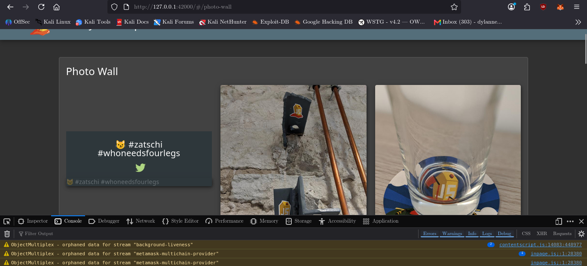
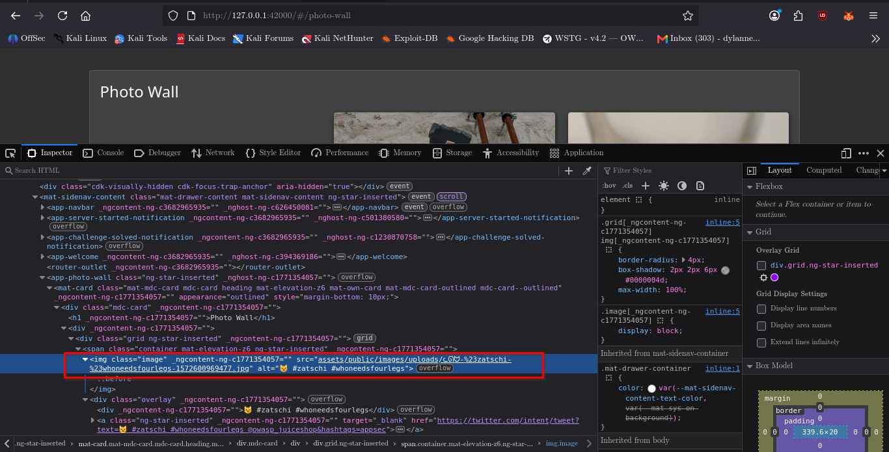
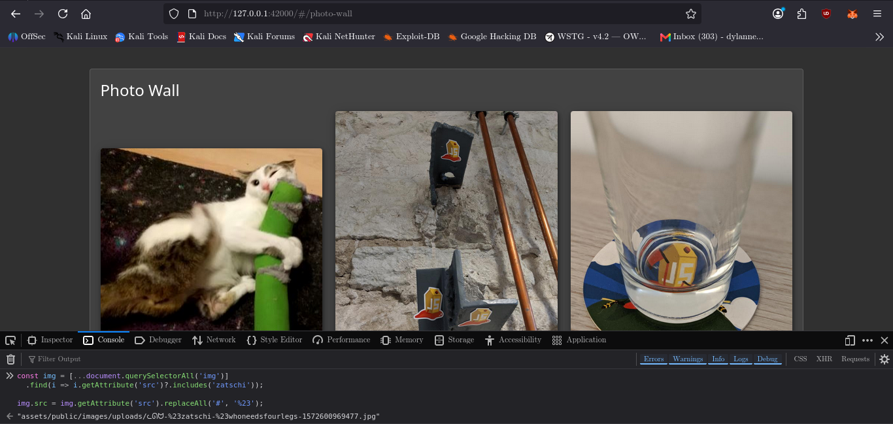
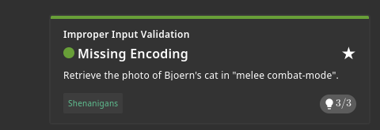

# Missing Encoding

## Challenge Information

- **Challenge:** Missing Encoding
- **Category:** Cryptographic Issues
- **Target:** OWASP Juice Shop — Photo Wall
- **Objective:** Retrieve the photo of Bjoern's cat in "melee combat-mode".
- **Vulnerability:** Improper URL encoding of special characters.
- **Status:** Solved

## 1. Reconnaissance / Discovery

### Challenge Clues

The challenge provided three clues:

1. Check the Photo Wall for an image that could not be loaded correctly.
2. Inspect the problem to understand the underlying issue.
3. Click the Tweet button associated with the entry and observe its behavior.

These clues directed the investigation toward the Photo Wall, the image URL, and the handling of special characters.

### Source Code Inspection

The Photo Wall template was inspected using:

```bash
sed -n '1,100p' /var/lib/juice-shop/frontend/src/app/photo-wall/photo-wall.component.html
```

The relevant template code was:

```html

```

The Tweet link was also examined:

```html
<a
  href="https://twitter.com/intent/tweet?text={{ image.caption }} {{ twitterHandle }}&hashtags=appsec"
  target="_blank">
```

The component logic was inspected using:

```bash
sed -n '1,220p' /var/lib/juice-shop/frontend/src/app/photo-wall/photo-wall.component.ts
```

The investigation showed that image URLs and captions were supplied to the template through `slideshowDataSource`. The Tweet link also interpolated the caption directly into a URL without explicitly applying URL-component encoding.

**Finding:** The application handled special characters in URLs without explicitly encoding the affected values.

## 2. Attack Surface

The relevant attack surface consisted of:

- The Photo Wall image-rendering functionality.
- Image paths containing special characters.
- Angular template interpolation of image URLs.
- The Tweet link generated from each image caption.

The affected image had the following source:

```text
assets/public/images/uploads/ᓚᘏᗢ-#zatschi-#whoneedsfourlegs-1572600969477.jpg
```

The literal `#` characters were significant because browsers interpret `#` as the beginning of a URL fragment. Consequently, the browser did not request the complete image path as intended.

## 3. Validation

### Inspecting the Broken Image

The Photo Wall displayed a broken image with the caption:

```text
😼 #zatschi #whoneedsfourlegs
```

The image element was inspected in the browser's Developer Tools. Its `src` attribute contained the literal `#` characters in the filename.

### Inspecting the Tweet Link

The Tweet button produced a URL containing:

```text
https://x.com/intent/tweet?text=%F0%9F%98%BC%20#zatschi%20#whoneedsfourlegs%20@owasp_juiceshop&hashtags=appsec
```

The emoji and spaces were percent-encoded, while the `#` characters remained literal. This supported the hypothesis that special characters were not being handled consistently during URL construction.

The Tweet action itself opened the X login flow, so the investigation did not require an X account.

## 4. Exploitation

The image source was corrected locally in the browser by encoding each literal `#` as `%23`.

The following JavaScript was executed in the browser's Developer Tools Console while the Photo Wall was open:

```javascript
const img = [...document.querySelectorAll('img')]
  .find(i => i.getAttribute('src')?.includes('zatschi'));

img.src = img.getAttribute('src')
  .replaceAll('#', '%23');
```

### Explanation

1. `document.querySelectorAll('img')` selected the page's image elements.
2. The `find()` method located the image whose source contained `zatschi`.
3. `getAttribute('src')` retrieved the original relative image path.
4. `replaceAll('#', '%23')` encoded the problematic characters.
5. Assigning the corrected value to `img.src` caused the browser to request the image using the corrected URL.

The cat image loaded successfully after the URL was corrected.

This modification was temporary and performed in the browser; it did not change the application's source code or permanently modify the server-side image path.

## 5. Evidence

### Evidence 1 — Broken Cat Image

The Photo Wall displayed the target image as broken, with the caption `😼 #zatschi #whoneedsfourlegs`.



### Evidence 2 — Unencoded Image URL

Developer Tools revealed that the image source contained literal `#` characters.



### Evidence 3 — Corrected Cat Image

After replacing the literal `#` characters with `%23`, the browser successfully loaded the cat photo.



### Evidence 4 — Challenge Completion

The Score Board screenshot records the challenge completion.



## 6. Security Impact

Improper URL encoding can cause browsers and applications to interpret URL components differently from what developers intend.

Depending on the context, this can result in:

- Broken images and inaccessible resources.
- Incorrect URL parameter parsing.
- Truncated or misinterpreted resource paths.
- Unexpected behavior in links and redirect destinations.

In this challenge, the immediate impact was the failure to retrieve the intended image because special characters in its path were interpreted as URL syntax.

## 7. Root Cause

The root cause was the failure to encode reserved URL characters when constructing or using a URL containing a filename with literal `#` characters.

The browser interpreted the first literal `#` as the beginning of a fragment rather than treating it as part of the image filename.

The Tweet link demonstrated a related encoding weakness: the caption was interpolated directly into the URL without explicitly encoding the caption as a URL parameter value.

## 8. Lessons Learned

- Inspect broken resources instead of assuming the file is missing from the server.
- Use browser Developer Tools to examine rendered HTML and resource URLs.
- Understand the difference between URL syntax and literal data.
- Encode dynamic values according to their context.
- Use `encodeURIComponent()` for individual URL parameter values rather than manually encoding selected characters.
- Verify a proposed fix by observing the browser's actual network request and response.
- Distinguish a local browser-side test from a permanent application fix.

## 9. Conclusion

The Missing Encoding challenge demonstrated how incorrect handling of reserved URL characters can prevent a valid resource from loading.

By following the challenge clues, inspecting the Photo Wall template, examining the broken image source, and encoding the literal `#` characters as `%23`, the target cat photo was retrieved successfully.

The investigation reinforced the importance of context-aware URL encoding and validating the actual behavior of a web application before documenting a vulnerability.
