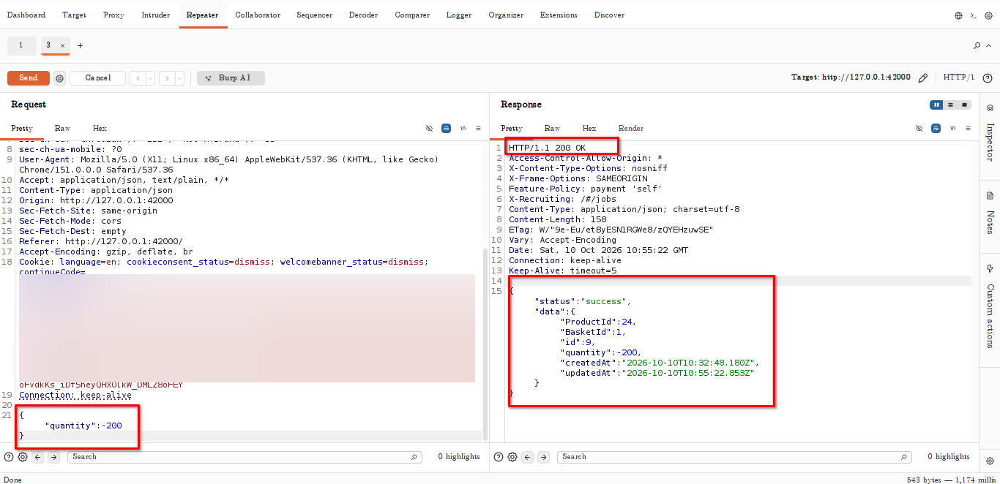
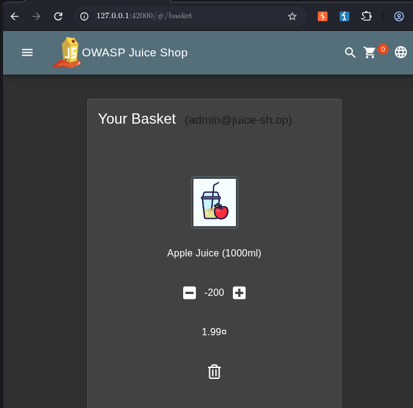
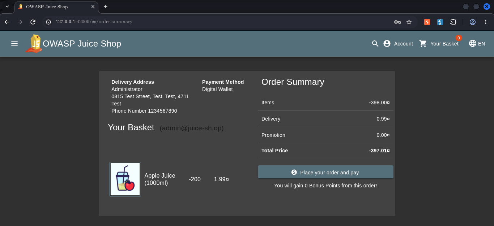
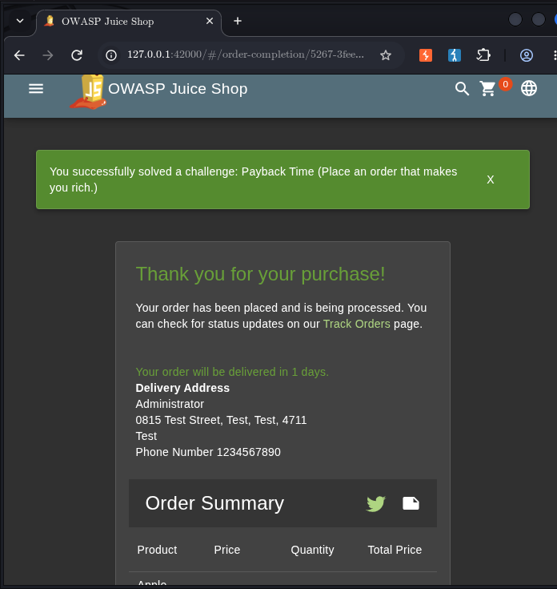

# Payback Time

## Challenge Information

- **Challenge Name:** Payback Time
- **Difficulty:** 2 stars
- **Category:** Improper Input Validation
- **Objective:** Place an order that results in a negative basket total.

## Reconnaissance / Discovery

The challenge was investigated through the OWASP Juice Shop basket interface and its basket API.

The basket API response exposed the product and basket-item details, including the product price and quantity. The relevant product was Apple Juice, priced at `1.99¤` per item.

The basket-item update endpoint was then tested to determine whether the server validated quantity values.

## Attack Surface

- Basket retrieval: `GET /rest/basket/1`
- Basket-item update: `PUT /api/BasketItems/9`
- Basket quantity field: `quantity`
- Product price: `1.99¤`

These endpoints and fields were relevant because the basket quantity directly affected the calculated item total.

## Validation

A request was sent to update the basket item's quantity to a negative number.

The server returned `HTTP 200 OK` and a successful JSON response containing the submitted negative quantity. A subsequent basket check showed the negative quantity and a negative basket total.

The Juice Shop basket interface also displayed the negative quantity.

## Exploitation

The basket item's quantity was changed to `-200`. This demonstrated that the server accepted a negative quantity instead of enforcing a positive quantity rule.

The resulting basket displayed a negative total.

The order was then completed in the local training application, and the Score Board confirmed that Payback Time had been solved.

## Evidence

The screenshots above document the key stages of the test:

1. API acceptance of a negative quantity.
2. Negative quantity displayed in the basket.
3. Negative basket total.
4. Successful challenge completion.

## Security Impact

If similar behavior existed in a real commerce application, an attacker might manipulate basket quantities to produce invalid order totals, potentially causing financial loss or inconsistent order records.

The practical impact would depend on whether the same values were accepted and processed by checkout, payment, inventory, and order-management systems.

## Root Cause

The application accepted a negative basket quantity without adequate server-side validation. Quantity constraints and pricing calculations should be enforced on the server rather than relying on client-side controls.

## Lessons Learned

- HTTP `200 OK` alone does not establish that application behavior is secure.
- Verify server responses and the resulting application state.
- Test whether numeric inputs enforce valid ranges and business rules.
- Validate order totals on the server before accepting an order.
- Keep screenshots free of session tokens, cookies, and other secrets.

## Conclusion

Payback Time was completed in the local OWASP Juice Shop lab by submitting a negative basket quantity, observing a negative basket total, and confirming successful challenge completion. The test demonstrated the importance of enforcing quantity constraints and business rules on the server.
