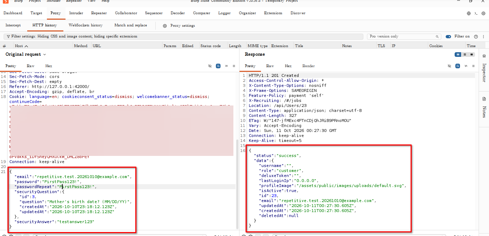
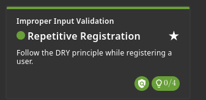

# Repetitive Registrations

## Challenge Information

- **Category:** Improper Input Validation
- **Challenge:** Repetitive Registrations
- **Target:** OWASP Juice Shop running locally at `http://127.0.0.1:42000`
- **Objective:** Identify and exploit the unnecessary repetition in the user registration process.

## Reconnaissance / Discovery

The registration process was examined through the application's registration form and the corresponding HTTP request.

The registration request contained both a `password` field and a `passwordRepeat` field:

```json
{
  "email": "repetitive.test.20261010@example.com",
  "password": "FirstPass123!",
  "passwordRepeat": "FirstPass123!",
  "securityQuestion": {
    "id": 3,
    "question": "Mother's birth date? (MM/DD/YY)"
  },
  "securityAnswer": "testanswer123"
}
```

The `passwordRepeat` field is the obvious repetition in the registration workflow.

**Finding:** Password confirmation is implemented as a repeated input, creating an opportunity to investigate whether the backend independently validates the duplicated value.



## Attack Surface

The relevant attack surface was the user registration endpoint.

The registration request accepts multiple user-controlled fields, including:

- Email address
- Password
- Password confirmation
- Security question
- Security answer

The `passwordRepeat` parameter was particularly relevant because it duplicates information already supplied by the `password` parameter.

## Validation

The registration request was intercepted and examined in Burp Suite.

The request was accepted by the application, and the response confirmed successful account creation:

```json
{
  "status": "success",
  "data": {
    "username": "",
    "role": "customer",
    "id": 23,
    "email": "repetitive.test.20261010@example.com"
  }
}
```

The successful response demonstrated that the registration request was processed by the backend and resulted in the creation of a customer account.

## Exploitation

The challenge was solved by interacting with the registration process through the HTTP request rather than relying solely on the browser's registration form.

The successful request demonstrated that the registration parameters could be directly manipulated at the HTTP layer.

This illustrates why client-side validation should not be treated as a security boundary. Input validation that matters for security should be enforced by the server.

## Evidence

### 1. Burp Registration Request and Response

The intercepted registration request and successful response provide the primary technical evidence.


### 2. Challenge Completion

The Juice Shop Score Board confirms that the **Repetitive Registrations** challenge was solved.



## Security Impact

Weak or inconsistent validation of repeated registration parameters can allow an attacker to bypass restrictions enforced only by the client-side interface.

More broadly, relying on duplicated client-side values for security-sensitive validation can create inconsistencies between the frontend and backend.

## Root Cause

The underlying issue is the reliance on a repeated input value as part of the registration workflow without ensuring that the server independently enforces the intended validation rules.

The `passwordRepeat` field exists primarily to confirm the password entered by the user. Such validation should be performed server-side rather than trusting the browser to enforce the relationship between the two fields.

## Lessons Learned

- Never rely exclusively on client-side validation.
- Treat all HTTP request parameters as attacker-controlled.
- Validate security-sensitive relationships on the server.
- Avoid unnecessary duplication of security-sensitive input where possible.
- Test registration endpoints directly rather than relying only on browser behavior.

## Conclusion

The **Repetitive Registrations** challenge demonstrated the security implications of duplicated registration input and client-side validation.

By examining the registration request directly in Burp Suite, the registration workflow could be manipulated at the HTTP layer and the application returned a successful account-creation response. The Score Board confirmed completion of the challenge.
