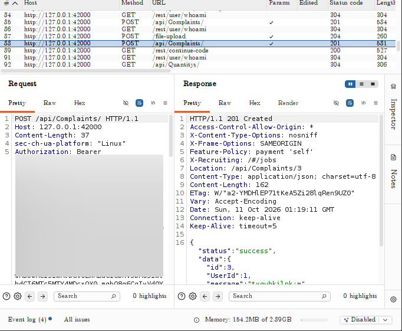
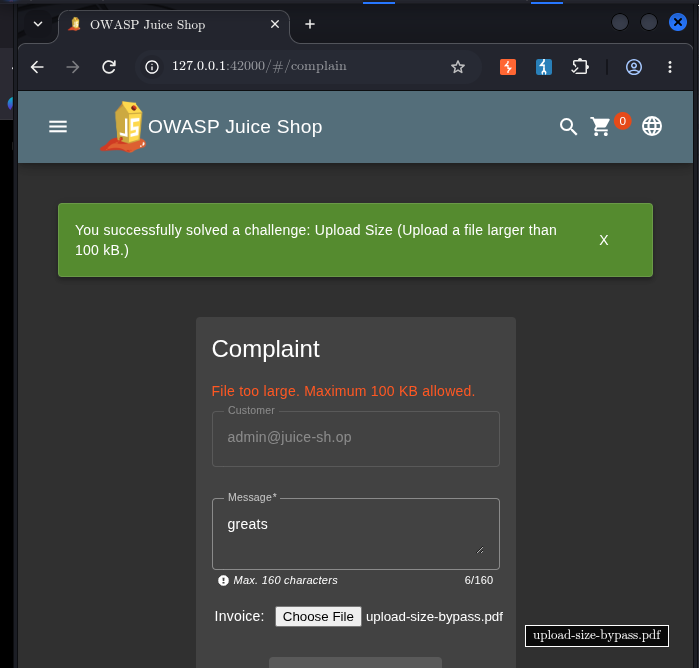

# Upload Size

## Challenge Information

- **Category:** Improper Input Validation
- **Challenge:** Upload Size
- **Target:** OWASP Juice Shop running locally at `http://127.0.0.1:42000`
- **Objective:** Upload a file larger than 100 KB by bypassing the client-side size restriction.

## Reconnaissance / Discovery

The investigation began with the **Complaint** form, which provides a file-upload feature.

A PDF larger than the stated 100 KB limit was submitted through the normal interface. The application rejected the upload with:

```text
File too large. Maximum 100 KB allowed.
```

This indicated that the browser-side upload workflow enforced a 100 KB restriction.

The upload request was then investigated to understand how the application handled files.

Further inspection of the application's built-in test suite revealed that the **Upload Size** challenge could be triggered by sending an oversized PDF directly to:

```text
POST /file-upload
```

The test creates a PDF larger than 100 KB and submits it directly to this endpoint instead of using the Complaint form's normal upload workflow.

**Finding:** The client-side 100 KB restriction could be bypassed by interacting directly with the backend upload endpoint.

## Attack Surface

The relevant attack surface consisted of two upload paths:

1. The Complaint form's client-side upload workflow.
2. The backend `/file-upload` endpoint.

The important distinction was that the client-side interface enforced the 100 KB restriction, while the backend endpoint accepted a file larger than that threshold.

## Validation

A PDF larger than 100 KB was first uploaded through the Complaint form.

The application rejected it:

```text
File too large. Maximum 100 KB allowed.
```

The same oversized PDF was then submitted directly to:

```text
POST /file-upload
```

using a multipart file upload.

The backend accepted the oversized file and the Juice Shop challenge was successfully triggered.



## Exploitation

The bypass was performed by sending the oversized PDF directly to the backend upload endpoint instead of using the client-side Complaint form.

The request was:

```bash
curl -sS -X POST \
  -F 'file=@/tmp/upload-size-bypass.pdf;type=application/pdf' \
  'http://127.0.0.1:42000/file-upload'
```

The direct backend request bypassed the client-side 100 KB restriction and successfully triggered the **Upload Size** challenge.

This demonstrates that a restriction enforced only by the client can be circumvented by communicating directly with the backend.

## Evidence

### 1. Direct Backend Upload

The Burp evidence shows the direct upload request to `/file-upload` and the successful server response.


### 2. Challenge Completion

The Juice Shop Score Board confirms that the **Upload Size** challenge was solved.



## Security Impact

Client-side-only upload restrictions can be bypassed by an attacker who communicates directly with the backend.

If the backend does not independently enforce the intended size restriction, an attacker could submit files larger than the application's user interface is designed to accept.

This can increase resource consumption and may contribute to denial-of-service conditions or unexpected application behavior.

## Root Cause

The root cause is inconsistent validation between the client and backend upload paths.

The Complaint interface enforced the 100 KB restriction, but the backend `/file-upload` endpoint accepted a larger file.

Security-sensitive upload restrictions must therefore be enforced server-side rather than relying on client-side controls.

## Lessons Learned

- Never treat client-side validation as a security boundary.
- Validate upload size on the server.
- Test backend endpoints directly rather than relying only on the application's UI.
- Ensure all upload paths enforce the same security requirements.
- Apply consistent validation regardless of how the request reaches the backend.

## Conclusion

The **Upload Size** challenge demonstrated a client-side validation bypass.

The Complaint interface rejected files larger than 100 KB, but the same type of oversized file could be submitted directly to `/file-upload` and accepted by the backend.

This confirms that upload-size restrictions must be enforced consistently on the server and across every available upload path.
