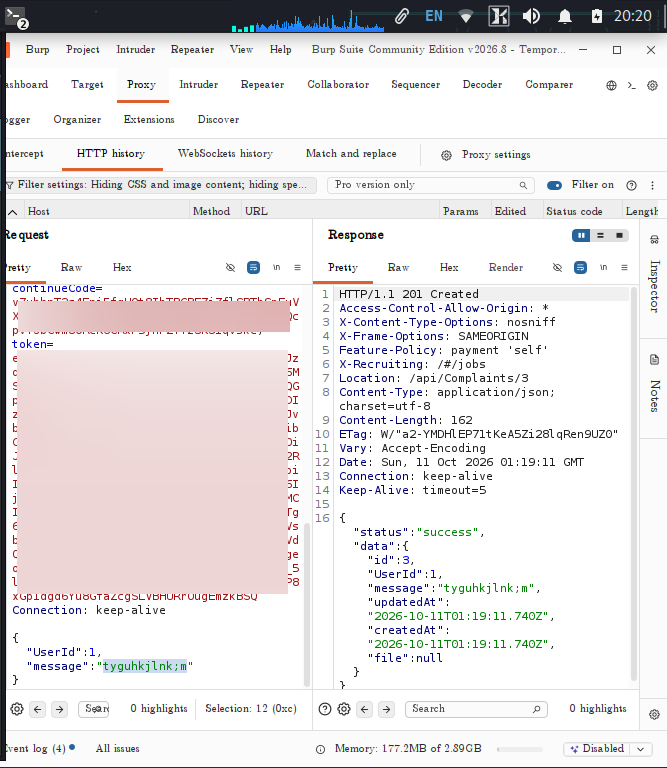
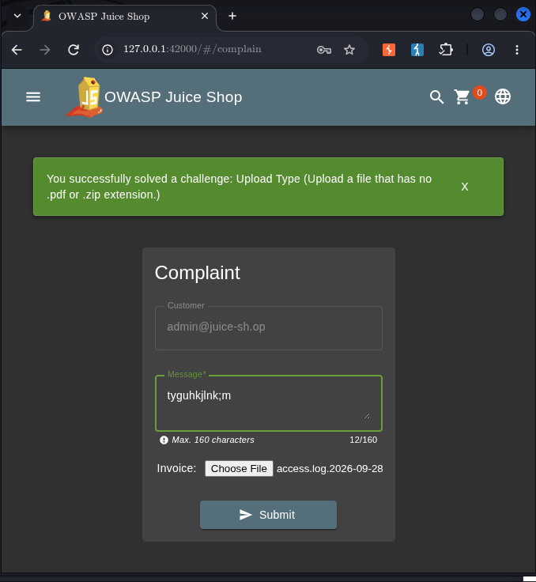

# Upload Type

## Challenge Information

- **Category:** Improper Input Validation
- **Challenge:** Upload Type
- **Target:** OWASP Juice Shop running locally at `http://127.0.0.1:42000`
- **Objective:** Upload a file whose extension is not `.pdf` or `.zip`.

## Reconnaissance / Discovery

The investigation focused on the **Complaint** form and how uploaded files are submitted to the application.

The upload request was observed in Burp Suite and was sent to the following endpoint:

```text
POST /api/Complaints/
```

The server returned an upload-related validation response indicating that only PDF and ZIP files were expected:

```text
Forbidden file type. Only PDF, ZIP allowed.
```

This indicated that the server was applying a file-type restriction to uploaded files.

**Finding:** The Complaint upload endpoint performs file-type validation, making the uploaded filename and file type important parts of the attack surface.



## Attack Surface

The relevant attack surface was the file upload functionality in the **Complaint** form.

The application accepts an uploaded file as part of the complaint submission. The backend then evaluates the uploaded file before processing the complaint.

The key validation rule observed during testing was:

```text
Only PDF, ZIP allowed.
```

This made the upload type validation the primary control to investigate.

## Validation

A file that did not use an accepted `.pdf` or `.zip` extension was submitted through the Complaint upload functionality.

The request was processed by:

```text
POST /api/Complaints/
```

The application accepted the manipulated upload and the corresponding Juice Shop challenge was marked as solved.

## Exploitation

The upload type restriction was bypassed by manipulating the uploaded file so that it did not conform to the expected `.pdf` or `.zip` extension while still being accepted by the application's upload processing logic.

The important observation was that the server-side validation could be circumvented through the way the uploaded file information was handled.

This demonstrated that relying on a superficial file-type attribute such as the filename extension is not sufficient for secure file-upload validation.

## Evidence

### 1. Burp Request and Response

The Burp evidence shows the upload request and the application's response during the successful test.


### 2. Challenge Completion

The Juice Shop Score Board confirms that the **Upload Type** challenge was successfully solved.



## Security Impact

Weak file-type validation can allow an attacker to upload files that the application intended to reject.

Depending on where uploaded files are stored and how they are later processed, this can lead to unexpected file exposure, malicious content storage, or other security issues.

## Root Cause

The root cause is insufficient validation of uploaded files.

A secure upload mechanism should not rely solely on a client-controlled filename extension. The server should validate the file independently using appropriate content validation, safe storage rules, and strict allowlisting.

## Lessons Learned

- Treat uploaded filenames and file metadata as attacker-controlled.
- Do not rely solely on filename extensions for security decisions.
- Perform file validation on the server.
- Use strict allowlists for permitted upload formats.
- Store uploaded files safely and prevent uploaded content from being executed.

## Conclusion

The **Upload Type** challenge demonstrated a weakness in the file-type validation performed by the Complaint upload functionality.

By manipulating the uploaded file and observing the server's handling of the request, the file-type restriction could be bypassed and the challenge was successfully solved.

The exercise demonstrates why secure file-upload validation must be enforced server-side and should not depend solely on client-controlled file metadata.
