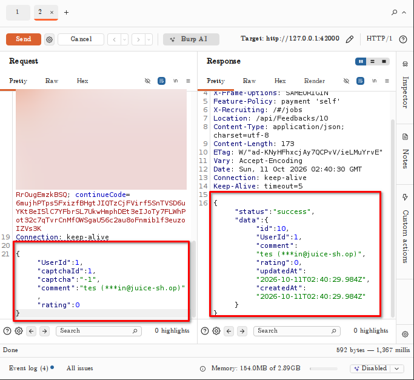
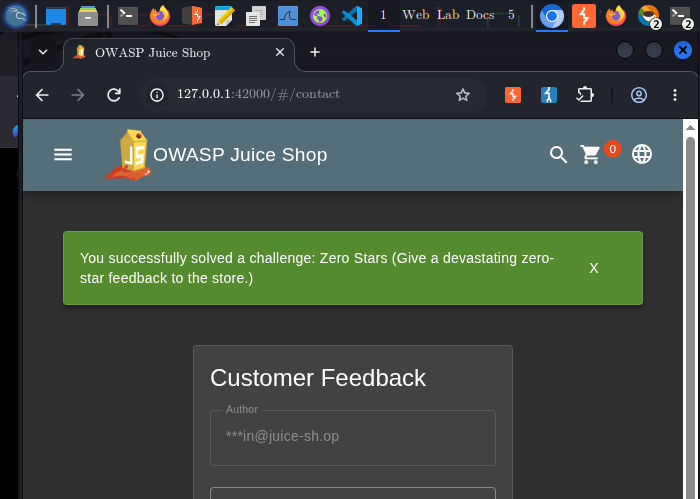

# Zero Stars

## Challenge Information

**Category:** Improper Input Validation
**Challenge:** Zero Stars
**Objective:** Submit a feedback rating of `0` stars despite the UI only allowing valid star selections.

## Reconnaissance / Discovery

The feedback form was first tested through the normal Juice Shop UI.

The UI only provided selectable star ratings within the normal range. A legitimate feedback submission was then intercepted using Burp Suite.

The normal request contained:

```json
{
  "UserId": 1,
  "captchaId": 1,
  "captcha": "-1",
  "comment": "tes (***in@juice-sh.op)",
  "rating": 2
}
```

The important observation was that the rating was supplied as a client-controlled JSON parameter:

```json
"rating": 2
```

This suggested that the backend should be tested for server-side validation of the rating value.

## Attack Surface

The relevant attack surface was the feedback submission endpoint.

The `rating` parameter was accepted directly from the client's JSON request, making it necessary to determine whether the server enforced the same restrictions as the UI.

## Validation

The intercepted request was sent to Burp Suite Repeater.

Only the rating value was modified:

```json
"rating": 0
```

The remaining request parameters were left unchanged.

The server accepted the modified request and returned a successful response containing:

```json
{
  "status": "success",
  "data": {
    "rating": 0
  }
}
```

This confirmed that the backend accepted a zero-star rating even though the normal UI did not provide that option.

**Screenshot:** `images/01-zero-stars-bypass.png`

## Exploitation

The vulnerability was exploited by modifying the client-controlled `rating` parameter from a valid UI value to `0`.

The server processed and stored the zero-star rating instead of rejecting the invalid value.

The challenge was subsequently marked as solved in the Juice Shop Score Board.

**Screenshot:** `images/02-zero-stars-solved.png`

## Evidence

### Backend accepts zero-star rating



The Burp request demonstrates the modified `rating` value of `0`, while the successful response confirms that the server accepted and stored the value.

### Challenge solved



The Juice Shop Score Board confirms successful completion of the Zero Stars challenge.

## Security Impact

Insufficient server-side validation allows clients to submit values that are outside the range enforced by the application interface.

In a real application, similar validation failures could allow invalid business data to be stored or processed and could potentially affect ratings, scoring, financial values, quantities, or other application logic.

## Root Cause

The root cause is **improper input validation**.

The application relied on the client-side interface to constrain the rating value but did not adequately validate the supplied rating on the server before accepting it.

## Lessons Learned

- Client-side restrictions are not security controls.
- User-controlled parameters must be validated server-side.
- Burp Suite can expose parameters hidden behind UI restrictions.
- Testing boundary and unexpected values is an important part of input validation testing.
- Successful HTTP responses should be examined to determine whether manipulated input was actually accepted and stored.

## Conclusion

The Zero Stars challenge demonstrated that restricting input through the UI is insufficient when the backend accepts the underlying parameter without enforcing the same validation rules.

By intercepting the feedback request and changing the `rating` value to `0`, the server accepted and stored the unexpected value, confirming an improper input validation vulnerability.
