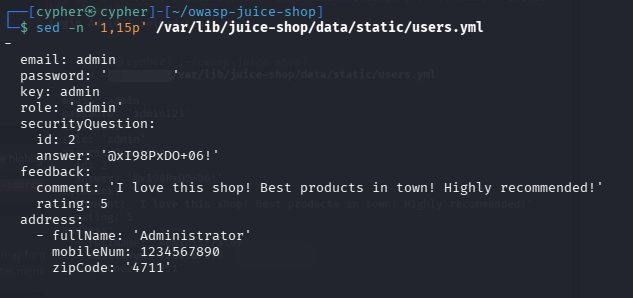
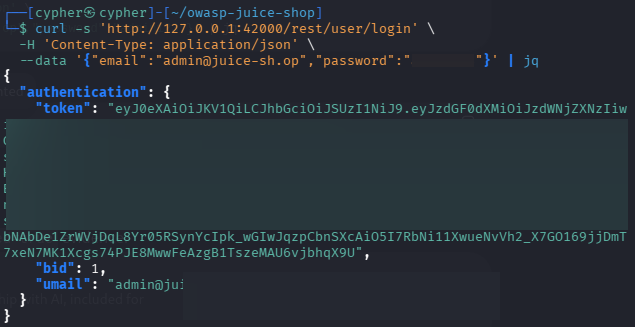
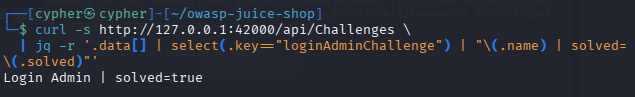

# Login Admin

## Challenge Information

| Field             | Details                                      |
| ----------------- | -------------------------------------------- |
| **Category**      | Injection                                    |
| **Challenge**     | Login Admin                                  |
| **Difficulty**    | 2                                            |
| **Challenge Key** | `loginAdminChallenge`                        |
| **Objective**     | Log in with the administrator's user account |

---

## 1. Reconnaissance / Discovery

The challenge description indicates that the administrator account can be targeted directly and that there are multiple possible approaches. Since the application is running locally, the first step was to inspect the application's source code and static data rather than blindly attempting SQL injection.

### 1.1 Locate the Challenge Logic

The challenge logic can be found in:

```text
/var/lib/juice-shop/routes/login.ts
```

Search for the challenge key:

```bash
grep -Rni -C 15 "loginAdminChallenge" \
  /var/lib/juice-shop/routes \
  /var/lib/juice-shop/build \
  /var/lib/juice-shop/models 2>/dev/null | head -200
```

The relevant post-login logic is:

```ts
challengeUtils.solveIf(challenges.loginAdminChallenge, () => {
  return user.data.id === users.admin.id
})
```

This reveals an important condition:

> The challenge is solved when the authenticated user's database ID matches the application's cached administrator user's ID.

Therefore, the objective is to authenticate as the actual administrator account.

---

## 2. Tracing `users.admin`

The source code does not directly define `users.admin` in `datacache.ts`.

The cache is initially declared as:

```ts
export const users: Record<string, UserModel> = {}
```

The next step was to determine where users are inserted into this cache.

Searching the application source revealed:

```bash
grep -Rni --include='*.ts' -E 'users\[[^]]+\]\s*=|Object\.assign\(users|Object\.keys\(users\)|users\s*=' \
  /var/lib/juice-shop \
  --exclude-dir=node_modules \
  --exclude-dir=build
```

This identified:

```text
/var/lib/juice-shop/data/datacreator.ts:145
```

The relevant code is:

```ts
const users = await loadStaticUserData()

...

datacache.users[key] = user
```

This means the `key` field from the static user data determines the property used in the `users` cache.

Therefore:

```text
key: admin
```

becomes:

```text
datacache.users.admin
```

---

## 3. Administrator Account Discovery

The static user definitions are stored in:

```text
/var/lib/juice-shop/data/static/users.yml
```

Searching specifically for the administrator cache key:

```bash
grep -Rni -C 8 --include='*.yml' --include='*.yaml' "key: admin" \
  /var/lib/juice-shop/data
```

The administrator entry contains:

```yaml
email: admin
password: 'admin123'
key: admin
role: 'admin'
```

The application constructs the complete email address during user creation:

```ts
const completeEmail = customDomain
  ? email
  : `${email}@${config.get<string>('application.domain')}`
```

With the local Juice Shop domain:

```text
juice-sh.op
```

the administrator's login email is therefore:

```text
admin@juice-sh.op
```

### Evidence



> **Security note:** The public documentation screenshot should contain only the minimum information required to demonstrate the discovery. Sensitive fields such as security answers, payment-card information, or authentication tokens should not be exposed.

---

# 4. Attack Surface

The relevant authentication endpoint is:

```text
POST /rest/user/login
```

The login handler constructs a SQL query using the submitted email and password:

```ts
models.sequelize.query(
  `SELECT * FROM Users WHERE email = '${req.body.email || ''}' AND password = '${security.hash(req.body.password || '')}' AND deletedAt IS NULL`,
  { model: UserModel, plain: true }
)
```

The login flow then passes the authenticated user to:

```ts
verifyPostLoginChallenges(user)
```

where the Login Admin challenge compares the authenticated user's ID with:

```ts
users.admin.id
```

This means the challenge is ultimately based on **identity**, not simply on whether a request reaches the login endpoint.

---

# 5. Validation

The discovered administrator credentials were supplied to the normal authentication endpoint:

```bash
curl -s 'http://127.0.0.1:42000/rest/user/login' \
  -H 'Content-Type: application/json' \
  --data '{"email":"admin@juice-sh.op","password":"admin123"}' | jq
```

The endpoint returned a successful authentication response.

The response contains an authentication token. The token was redacted from the documentation evidence because it is an active authentication credential.

### Evidence



---

# 6. Exploitation

No SQL injection was required for this solution.

The administrator credentials were discovered in the application's static user data and used through the normal login functionality.

The authentication flow successfully associated the session with the administrator user. The application's post-login challenge check then compared the authenticated user's ID against the cached administrator ID:

```ts
challengeUtils.solveIf(challenges.loginAdminChallenge, () => {
  return user.data.id === users.admin.id
})
```

Because the authenticated account was the administrator account, the comparison succeeded.

---

# 7. Challenge Verification

The challenge state was verified directly through the Juice Shop API:

```bash
curl -s http://127.0.0.1:42000/api/Challenges \
  | jq -r '.data[] | select(.key=="loginAdminChallenge") | "\(.name) | solved=\(.solved)"'
```

Output:

```text
Login Admin | solved=true
```

### Evidence



---

# 8. Root Cause

The challenge demonstrates several security weaknesses in the application's authentication design and test data:

* A privileged administrator account exists in static application data.
* The administrator uses a predictable, weak password.
* The password is stored directly in the application's static user definition.
* Authentication relies on credentials that can be recovered through application-side source/data inspection.
* The application contains privileged account information that should not be exposed in a production deployment.

The challenge is intentionally vulnerable and uses this setup to demonstrate how exposed privileged credentials can lead directly to administrative access.

---

# 9. Security Impact

An attacker who obtains valid administrator credentials can authenticate as the application's administrator.

Depending on the application's available administrative functionality, this can provide access to privileged operations and sensitive administrative data.

The important security boundary crossed in this challenge is:

```text
Unauthenticated user
        ↓
Known administrator credentials
        ↓
Successful authentication
        ↓
Administrator identity
        ↓
Privileged access
```

---

# 10. Lessons Learned

### 1. Read the application's source when performing authorized testing

Source inspection can reveal authentication logic, account structures, and challenge conditions that are otherwise difficult to identify.

### 2. Trace references instead of guessing

The important discovery chain was:

```text
loginAdminChallenge
        ↓
users.admin
        ↓
datacache.users[key]
        ↓
key: admin
        ↓
static users.yml
        ↓
administrator account
```

This was more reliable than repeatedly guessing credentials or attack payloads.

### 3. Privileged accounts require stronger protection

Administrative accounts should use strong, unique credentials and should never ship with predictable passwords.

### 4. Sensitive test data should not resemble production credentials

Static credentials inside application source or deployment files can become a serious security issue if the same pattern reaches a production environment.

---

# 11. Conclusion

The **Login Admin** challenge was solved by tracing the application's administrator reference back to the static user data, identifying the administrator account, and authenticating through the normal login endpoint.

The final challenge verification confirmed:

```text
Login Admin | solved=true
```

The key lesson is that authentication security is not only about SQL injection. **Exposed privileged credentials can completely bypass the need for an injection attack when an attacker can discover and use them.**
