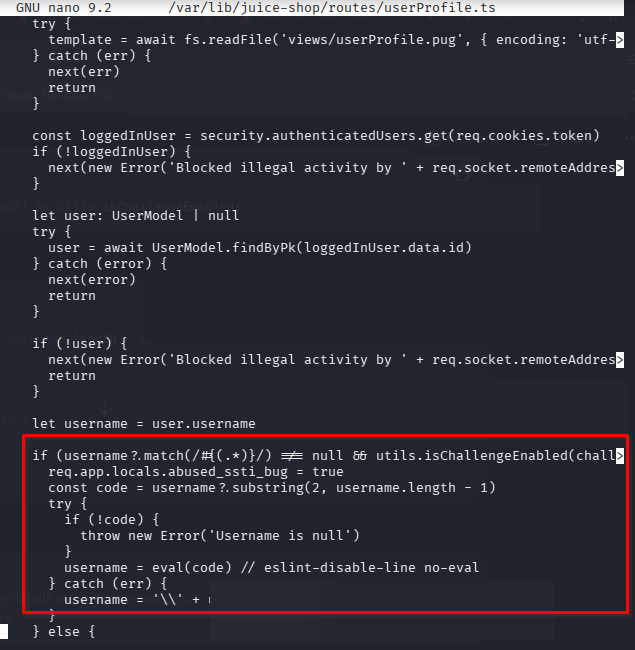
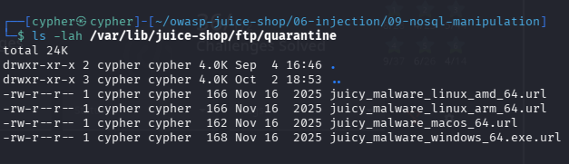
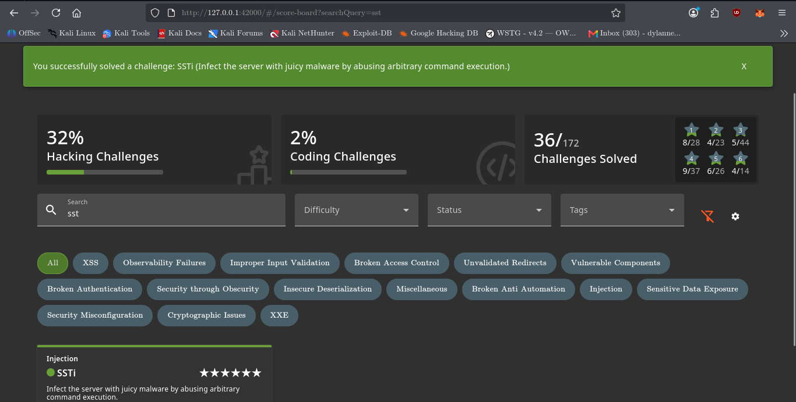
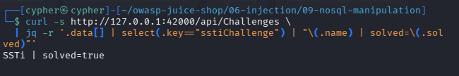

# SSTi

## Challenge Information

| Field             | Details                                                                      |
| ----------------- | ---------------------------------------------------------------------------- |
| **Name**          | SSTi                                                                         |
| **Category**      | Injection                                                                    |
| **Difficulty**    | 6                                                                            |
| **Challenge Key** | `sstiChallenge`                                                              |
| **Description**   | Infect the server with juicy malware by abusing arbitrary command execution. |

---

## Objective

Abuse a Server-Side Template Injection (SSTI) vulnerability in the Juice Shop user profile functionality to achieve server-side command execution.

The challenge requires the Juice Shop server to download and execute the **non-malicious Juicy Malware** artifact provided for the lab.

---

## Reconnaissance / Discovery

### 1. Identify the SSTI trigger

The challenge source was searched for indicators related to the SSTI challenge:

```bash
grep -Rni -C 15 -E \
"usernameXssChallenge|abused_ssti_bug|pug\.compile|eval\(code\)" \
/var/lib/juice-shop/routes \
/var/lib/juice-shop/views \
2>/dev/null | head -250
```

The search identified:

```text
/var/lib/juice-shop/routes/userProfile.ts
```

The relevant logic processes the username when it matches the `#{...}` pattern:

```ts
if (username?.match(/#{(.*)}/) !== null && utils.isChallengeEnabled(challenges.usernameXssChallenge)) {
  req.app.locals.abused_ssti_bug = true
  const code = username?.substring(2, username.length - 1)

  try {
    if (!code) {
      throw new Error('Username is null')
    }

    username = eval(code)
  } catch (err) {
    username = '\\' + username
  }
}
```

The important finding is:

```ts
username = eval(code)
```

User-controlled username data is therefore interpreted as JavaScript code.

The route subsequently compiles the generated profile template using Pug:

```ts
const fn = pug.compile(template)
```

This establishes the server-side code execution path.



---

## Attack Surface

The affected functionality is the authenticated user profile.

```text
http://127.0.0.1:42000/#/profile
```

The relevant input is:

```text
Username
```

The application recognizes the following structure as the SSTI trigger:

```text
#{...}
```

The important distinction is that this is **server-side processing**, not Angular client-side template injection.

---

## 2. Discover the intended malware artifact

The challenge hints stated that the Juicy Malware could be discovered through a badly placed quarantine folder.

A filesystem search was performed:

```bash
find /var/lib/juice-shop -type d \
  \( -iname '*quarantine*' -o -iname '*malware*' \) \
  2>/dev/null
```

This identified:

```text
/var/lib/juice-shop/ftp/quarantine
```

The directory contents were then inspected:

```bash
ls -lah /var/lib/juice-shop/ftp/quarantine
```

The directory contained platform-specific Internet Shortcut files:

```text
juicy_malware_linux_amd_64.url
juicy_malware_linux_arm_64.url
juicy_malware_macos_64.url
juicy_malware_windows_64.exe.url
```

The URLs were extracted with:

```bash
grep -Rni -E "https?://|ftp://|www\." \
  /var/lib/juice-shop/ftp/quarantine
```

The relevant Linux AMD64 artifact was:

```text
https://github.com/juice-shop/juicy-malware/raw/master/juicy_malware_linux_amd_64
```

The local architecture was confirmed with:

```bash
uname -m
```

Result:

```text
x86_64
```

Therefore the `linux_amd_64` artifact matched the local lab environment.



---

## 3. Validate the artifact URL

Before using the artifact in the challenge, the URL was checked with:

```bash
curl -I -L \
'https://github.com/juice-shop/juicy-malware/raw/master/juicy_malware_linux_amd_64'
```

The final response returned:

```text
HTTP/2 200
content-type: application/octet-stream
```

This confirmed that the URL resolved to the intended binary artifact.

---

## Validation

The challenge's own test suite was inspected to understand the intended execution path:

```bash
grep -Rni -C 20 -E \
"noSql.*malware|juicy.*malware|sstiChallenge|abused_ssti_bug|juicy_malware_linux" \
/var/lib/juice-shop/test \
/var/lib/juice-shop/build/test \
/var/lib/juice-shop/data \
2>/dev/null | head -400
```

The test confirmed that the SSTI challenge is disabled in Docker and is intended to execute in a non-Docker environment.

The test also demonstrated the intended Node.js execution mechanism through:

```text
global.process.mainModule.require('child_process').exec(...)
```

The challenge definition additionally confirmed:

```yaml
name: 'SSTi'
category: 'Injection'
description: 'Infect the server with juicy malware by abusing arbitrary command execution.'
key: sstiChallenge
disabledEnv:
  - Docker
  - Heroku
  - Gitpod
```

---

## Exploitation

The SSTI payload was submitted through the local Juice Shop profile username field.

The payload used the Node.js `child_process` module to make the Juice Shop server download the intended Juicy Malware artifact, mark it executable, and execute it.

The exploitation was performed exclusively against the local Juice Shop instance:

```text
127.0.0.1:42000
```



The important execution chain was:

```text
Username input
      ↓
#{...} SSTI expression
      ↓
JavaScript evaluation
      ↓
child_process.exec()
      ↓
Server-side command execution
      ↓
Download Juicy Malware
      ↓
Execute artifact
      ↓
abused_ssti_bug = true
```

---

## Challenge Verification

The challenge solver endpoint was then requested:

```bash
curl -i \
'http://127.0.0.1:42000/solve/challenges/server-side?key=tRy_H4rd3r_n0thIng_iS_Imp0ssibl3'
```

The challenge state was verified through the Challenges API:

```bash
curl -s http://127.0.0.1:42000/api/Challenges \
  | jq -r '.data[] | select(.key=="sstiChallenge") | "\(.name) | solved=\(.solved)"'
```

Result:

```text
SSTi | solved=true
```



---

## Security Impact

A server-side template injection vulnerability can become significantly more serious when template expressions can reach arbitrary JavaScript execution.

In this challenge, the vulnerable path allowed user-controlled input to reach:

```ts
eval(code)
```

This provided access to Node.js functionality and ultimately operating-system command execution.

The resulting impact can include:

* Arbitrary command execution on the application server
* Unauthorized file operations
* Downloading or executing programs
* Access to server-side resources available to the application process
* Potential compromise of the application environment

The actual impact depends on the privileges and isolation of the application process.

---

## Root Cause

The primary root cause is the unsafe evaluation of user-controlled input:

```ts
username = eval(code)
```

The application treats data supplied through the username field as executable JavaScript.

This breaks the fundamental separation between:

```text
User-controlled data
```

and:

```text
Application code
```

The use of dynamic template compilation further increases the importance of preventing attacker-controlled expressions from entering the template execution path.

---

## Lessons Learned

### 1. SSTI is not limited to Angular

The challenge name `SSTi` initially looks like it could relate to Angular because Juice Shop uses Angular on the frontend.

The source code revealed that the relevant execution occurs on the server through JavaScript/Pug processing.

---

### 2. Source code can reveal the real attack surface

Searching for:

```text
eval()
pug.compile()
abused_ssti_bug
sstiChallenge
```

quickly exposed the vulnerable execution path.

A useful source-analysis mindset is:

```text
User input
   ↓
Where is it processed?
   ↓
Is it interpreted?
   ↓
Which engine evaluates it?
   ↓
Can it reach code execution?
```

---

### 3. Challenge clues can guide reconnaissance

The quarantine clue led to:

```text
/var/lib/juice-shop/ftp/quarantine
```

which contained the platform-specific artifact URLs.

This demonstrates why challenge clues should be treated as reconnaissance leads rather than ignored.

---

### 4. Identify the execution environment

The local architecture was checked with:

```bash
uname -m
```

The result:

```text
x86_64
```

allowed the correct Linux AMD64 artifact to be selected.

In real assessments, identifying the target environment is important before testing execution paths.

---

### 5. Validate the vulnerability before attempting exploitation

The source code established:

```text
#{...}
```

as the trigger and:

```text
eval(code)
```

as the dangerous sink.

The test suite then provided additional confirmation of the intended execution path.

This is stronger than simply trying random payloads.

---

## Methodology

The reusable methodology from this challenge is:

```text
1. Identify suspicious input handling
          ↓
2. Trace the input through server-side processing
          ↓
3. Identify the template/interpreter
          ↓
4. Locate dangerous evaluation or execution sinks
          ↓
5. Determine the execution environment
          ↓
6. Identify the intended controlled test artifact
          ↓
7. Validate the execution path in the lab
          ↓
8. Verify the challenge condition
          ↓
9. Document source → discovery → exploitation → impact
```

When encountering a suspected SSTI during an authorized assessment, investigate:

```text
Template syntax
Template engine
User-controlled template data
Expression evaluation
Dynamic compilation
eval()
Function constructors
Command execution primitives
Application privileges
Sandboxing/isolation
```

---

## Conclusion

The SSTi challenge demonstrated how a seemingly ordinary profile field can become a server-side code-execution primitive when user-controlled data is evaluated as JavaScript.

The key finding was the unsafe flow:

```text
Username → SSTI expression → eval() → Node.js command execution
```

The challenge was successfully solved by using the intended non-malicious Juicy Malware artifact in the local Juice Shop environment.

The most important takeaway is not the specific payload. It is recognizing the vulnerability chain:

**user-controlled template input → server-side evaluation → code execution → operating-system command execution.**
