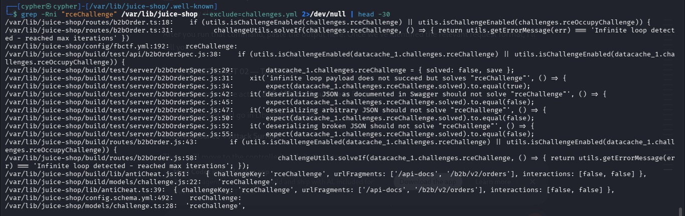
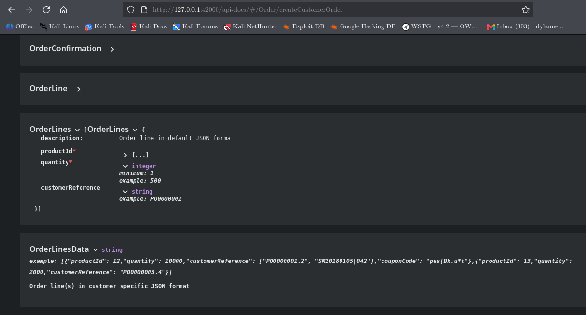
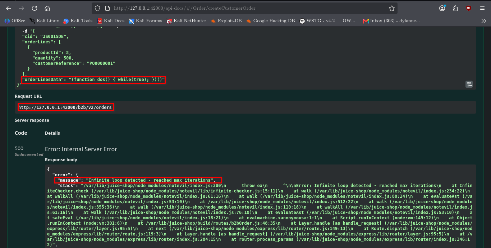

# Blocked RCE DoS

## Challenge Information

**Challenge:** Blocked RCE DoS
**Category:** Insecure Deserialization
**Difficulty:** 5
**Tag:** Danger Zone

## Objective

Perform a Remote Code Execution that would keep the application busy indefinitely.

## Reconnaissance

The challenge metadata reveals that the functionality required to solve the challenge is not directly advertised in the application.

The hints also indicate that JavaScript is likely involved because the application is written in JavaScript and that the server should be made busy indefinitely.



### Attack Surface Discovery

The hidden functionality was discovered through the **NextGen B2B API** documentation.

The API documentation was accessible through:

```text
http://127.0.0.1:42000/api-docs
```

The documentation exposed the B2B Order API and its order creation endpoint.

The request accepts an `orderLinesData` parameter, which is supplied as a string.



## Insecure Deserialization

The `orderLinesData` parameter accepts serialized data controlled by the client.

The application processes this value on the server instead of treating it strictly as ordinary data. This creates a dangerous deserialization and processing flow where attacker-controlled input can reach a JavaScript evaluation mechanism.

The relevant flow is:

```text
User-controlled orderLinesData
            ↓
        safeEval()
            ↓
   JavaScript evaluation
            ↓
     Malicious payload
            ↓
 Infinite-loop detection
```

## Code Evaluation

The B2B order route passes `orderLinesData` to `safeEval()` inside a Node.js VM context.

The application also uses `notevil` to detect certain dangerous JavaScript execution patterns.

The challenge source code contains a specific condition that recognizes the following error:

```text
Infinite loop detected - reached max iterations
```

This error is important because it confirms that the supplied JavaScript reached the intended execution path.

## Exploitation

A controlled JavaScript infinite-loop payload was supplied through the `orderLinesData` parameter:

```javascript
(function dos() { while(true); })()
```

The payload creates an immediately invoked function containing an infinite `while(true)` loop.

When processed by the application, `notevil` detected the infinite loop and generated the expected error:

```text
Infinite loop detected - reached max iterations
```



## Evidence

The server response confirmed:

```text
Error: Infinite loop detected - reached max iterations
```

The stack trace also showed the execution path through:

```text
notevil
    ↓
safeEval
    ↓
Node.js VM
    ↓
b2bOrder
```

This demonstrates that the supplied `orderLinesData` reached the server-side JavaScript evaluation mechanism.

## Impact

The vulnerability demonstrates the security risk of allowing attacker-controlled serialized data to reach a code-evaluation mechanism.

In this challenge, the payload creates an infinite loop that consumes execution resources and triggers the application's protection against this specific Denial-of-Service condition.

More broadly, unsafe server-side evaluation of user-controlled input can potentially expose an application to code execution and resource-exhaustion attacks.

## Mitigation

* Do not execute user-controlled input as JavaScript.
* Treat serialized input strictly as data.
* Use safe serialization and deserialization mechanisms.
* Validate incoming data against a strict schema.
* Avoid dynamic code evaluation such as `eval()` or equivalent mechanisms.
* Apply execution timeouts and resource limits as defense-in-depth controls.
* Minimize the privileges available to server-side execution contexts.

## Lessons Learned

* Hidden API functionality can expose attack surfaces that are not visible through the normal application interface.
* API documentation can be useful during reconnaissance.
* Serialized input should remain data and should not cross into executable-code contexts.
* Code evaluation of attacker-controlled input can introduce serious security risks.
* Error messages can provide valuable evidence about how an application's defensive mechanisms process malicious input.
* Exploitation should verify the application's actual security condition rather than simply generating excessive traffic.
