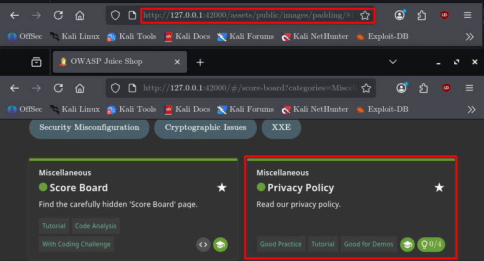
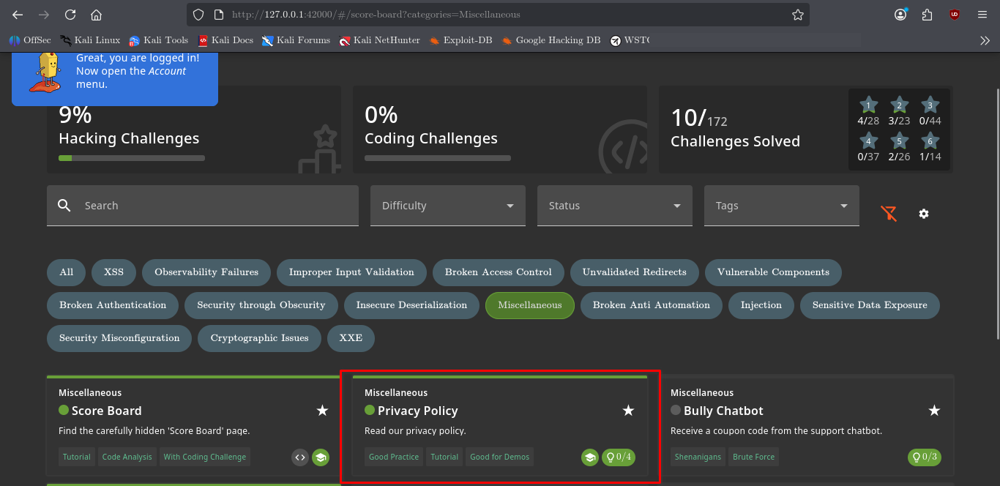

# Privacy Policy

## Challenge Information

| Field          | Details                                 |
| -------------- | --------------------------------------- |
| **Category**   | Miscellaneous                           |
| **Difficulty** | 1                                       |
| **Challenge**  | Privacy Policy                          |
| **Tags**       | Good Practice, Tutorial, Good for Demos |
| **Objective**  | Read the application's privacy policy.  |

---

## Objective

The objective of this challenge is to access the OWASP Juice Shop privacy policy and trigger the corresponding challenge completion condition.

Although this challenge does not involve a traditional vulnerability exploit, it demonstrates how application functionality and resource requests can be connected to challenge logic.

---

## Reconnaissance

The challenge metadata indicated that simply reading the privacy policy should solve the challenge.

However, visiting the Privacy Policy page normally did not immediately show the challenge as solved.

The challenge source was therefore inspected to determine what condition the application uses to mark the challenge as completed.

---

## Attack Surface Discovery

The challenge validation logic was found in:

```text
/var/lib/juice-shop/build/routes/verify.js
```

The relevant condition was:

```javascript
challengeUtils.solveIf(
  datacache_1.challenges.privacyPolicyChallenge,
  () => {
    return utils.endsWith(url, '/81px.png')
  }
)
```

This revealed that the challenge is solved when the application receives a request for a resource whose URL ends with:

```text
/81px.png
```

The resource was identified as:

```text
/assets/public/images/padding/81px.png
```



---

## Exploitation

The identified resource was requested directly through the Juice Shop application:

```text
http://127.0.0.1:42000/assets/public/images/padding/81px.png
```

Once the request was processed, the backend condition for `privacyPolicyChallenge` evaluated to true and the challenge was marked as solved.

No authentication bypass, injection, or code execution was required.

---

## Exploitation Evidence

The Score Board confirmed that the **Privacy Policy** challenge was successfully completed.



---

## Technical Analysis

The challenge demonstrates a simple but useful application-analysis technique:

1. Identify the challenge name and key.
2. Locate where the challenge is referenced in the application source.
3. Determine the exact condition required for `solveIf()` to execute.
4. Identify the resource or request that satisfies the condition.
5. Trigger the request.
6. Verify completion through the Score Board.

The important condition was:

```text
URL ends with /81px.png
```

This means the challenge completion was tied to a specific resource request rather than a conventional user action such as clicking a button or submitting a form.

---

## Security Perspective

The Privacy Policy challenge itself is not a vulnerability.

However, examining the backend validation demonstrates an important penetration-testing technique: **tracing application behavior from a user-facing feature into its backend implementation**.

Source-code inspection can reveal:

* Hidden endpoints
* Internal resource paths
* Challenge or feature flags
* Validation conditions
* Unexpected application behavior

In a real application assessment, similar techniques can help identify functionality that is not obvious from the normal user interface.

---

## Lessons Learned

* User-facing functionality can trigger backend logic through resource requests.
* Source-code analysis can reveal hidden application behavior.
* Exact URL conditions can be important when tracing application functionality.
* Not every security challenge requires exploitation of a vulnerability.
* Always verify the result after performing an action.

---

## Conclusion

The **Privacy Policy** challenge was completed by identifying the backend validation condition and requesting the corresponding `81px.png` resource.

This exercise reinforced the importance of tracing application behavior from the frontend to the backend and understanding how specific HTTP requests can trigger server-side logic.
