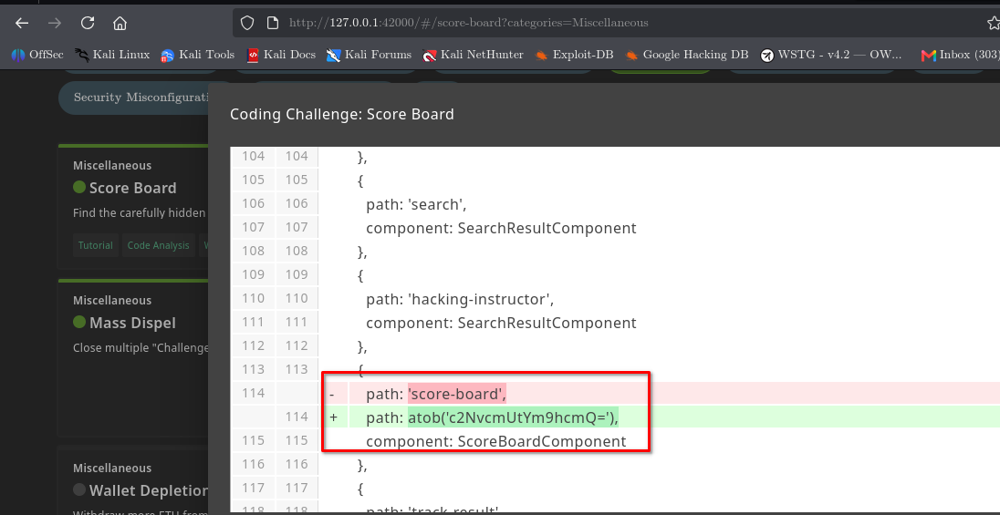

# Score Board

## Challenge Information

| Field          | Details                                       |
| -------------- | --------------------------------------------- |
| **Category**   | Miscellaneous                                 |
| **Difficulty** | 1                                             |
| **Challenge**  | Score Board                                   |
| **Objective**  | Find the carefully hidden "Score Board" page. |

---

## Objective

The objective of this challenge is to locate the hidden Score Board page within the OWASP Juice Shop application.

The challenge is based on discovering the correct application path rather than exploiting a traditional vulnerability.

---

## Reconnaissance

The challenge description indicated that the Score Board page was carefully hidden.

Instead of relying only on visible navigation elements, the application was examined for accessible routes and paths that could reveal the hidden page.

---

## Attack Surface Discovery

During application reconnaissance, the hidden Score Board path was identified.

The discovered path provided direct access to the application's Score Board functionality.

This demonstrated the importance of examining application routes and looking for resources that may not be directly exposed through the normal user interface.

---

## Exploitation

After identifying the hidden Score Board path, it was accessed directly through the browser.

The application loaded the Score Board page successfully, confirming that the hidden route had been discovered.

---

## Evidence

The screenshot above shows the discovered Score Board path and the resulting Score Board page.

The challenge was successfully marked as solved after accessing the hidden page.

---

## Security Perspective

This challenge demonstrates the concept of **security through obscurity**.

Simply hiding a sensitive or important application route does not provide meaningful access control. If a resource is intended to be restricted, the application should enforce proper authorization rather than relying on users not knowing the URL.

In a real penetration test, route discovery can be performed through:

* Application crawling
* JavaScript analysis
* Source-code review
* Directory and endpoint enumeration
* Browser developer tools
* Reviewing application requests

---

## Lessons Learned

* Hidden URLs can often be discovered through application reconnaissance.
* URL obscurity is not a substitute for access control.
* Application routes should be reviewed during web application testing.
* Directly accessing discovered routes can reveal functionality that is not visible in the normal UI.
* Findings should always be verified through observable application behavior.

---

## Conclusion

The **Score Board** challenge was completed by discovering the hidden Score Board path and accessing the page directly.

The exercise reinforced the importance of application route discovery and demonstrated why sensitive functionality should rely on proper access controls rather than obscurity.
