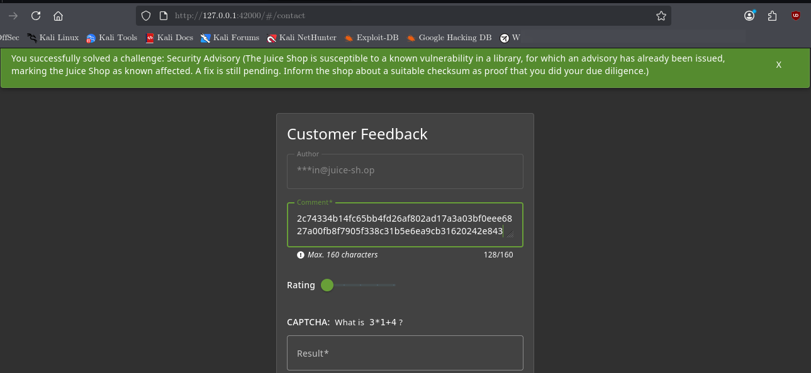
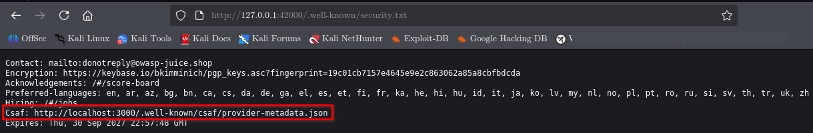
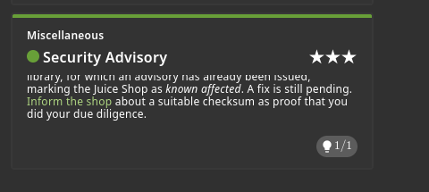

# Security Advisory

## Challenge Information

| Field          | Details                                                                                                            |
| -------------- | ------------------------------------------------------------------------------------------------------------------ |
| **Category**   | Miscellaneous                                                                                                      |
| **Difficulty** | 3                                                                                                                  |
| **Challenge**  | Security Advisory                                                                                                  |
| **Objective**  | Identify a known vulnerability advisory and inform the shop using the required checksum as proof of due diligence. |



---

## Objective

The objective of this challenge is to identify the security advisory information provided by the Juice Shop and submit the required checksum as proof that the advisory was investigated.

The challenge demonstrates how security advisories and machine-readable security information can be used during application security assessment.

---

## Reconnaissance

The challenge description indicated that the Juice Shop was affected by a known vulnerability and that a security advisory had already been issued.

The challenge hint suggested checking the application's `security.txt` file because security advisories are commonly referenced there.

The following resource was inspected:

```text
http://127.0.0.1:42000/.well-known/security.txt
```

The file contained a CSAF reference:

```text
Csaf: http://localhost:3000/.well-known/csaf/provider-metadata.json
```



---

## Attack Surface Discovery

The CSAF provider metadata was accessed to investigate the advisory infrastructure.

The metadata identified OWASP Juice Shop as the publisher and provided information about its CSAF provider configuration.

Further source-code inspection was used to determine how the challenge verifies completion.

The relevant validation logic was found in:

```text
/var/lib/juice-shop/build/routes/verify.js
```

The application checks for the configured `csafHashValue` in either:

* Customer feedback comments
* Customer complaint messages

The validation logic is effectively:

```text
Feedback comment contains csafHashValue
                    OR
Complaint message contains csafHashValue
                    ↓
          Security Advisory solved
```

---

## Hash Discovery

The configured checksum was located in the application's configuration:

```text
/var/lib/juice-shop/config/default.yml
```

The `csafHashValue` was then submitted through the customer complaint functionality.

This provided the application with the required proof value expected by the challenge validation logic.

---

## Exploitation

The CSAF checksum was submitted through the **Contact / Complaint** functionality.

After the submission was processed, the challenge validation logic detected the configured checksum and marked the **Security Advisory** challenge as solved.

This was not an attempt to exploit the underlying third-party vulnerability. Instead, the exercise focused on identifying the advisory information and providing the expected checksum to the application.

---

## Exploitation Evidence

The Score Board confirmed that **Security Advisory** was successfully solved.



---

## Security Perspective

Security advisories provide important information about known vulnerabilities affecting software components.

This challenge demonstrates several useful security assessment techniques:

* Inspecting `security.txt`
* Following advisory references
* Identifying CSAF provider information
* Reviewing application source code
* Tracing challenge validation logic
* Inspecting application configuration
* Verifying findings through observable application behavior

The exercise also demonstrates why security teams should monitor published advisories and determine whether deployed software is affected.

---

## Lessons Learned

* `security.txt` can provide useful security-related information about an application.
* CSAF provides a structured format for communicating security advisories.
* Source-code inspection can reveal how application functionality is validated.
* Configuration files can contain important security-related values.
* Security advisories should be investigated when software is known to be affected.
* Findings should be verified rather than assumed.

---

## Conclusion

The **Security Advisory** challenge was completed by following the security information exposed through `security.txt`, investigating the CSAF provider metadata, identifying the checksum expected by the application's validation logic, and submitting it through the complaint functionality.

The exercise reinforced the importance of security advisory discovery, source-code analysis, configuration inspection, and verification during web application security assessments.
