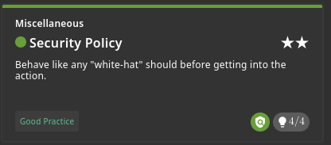
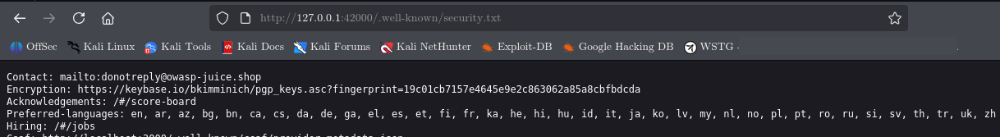

# Security Policy

## Challenge Information

| Field          | Details                                                                               |
| -------------- | ------------------------------------------------------------------------------------- |
| **Category**   | Miscellaneous                                                                         |
| **Difficulty** | 2                                                                                     |
| **Challenge**  | Security Policy                                                                       |
| **Tag**        | Good Practice                                                                         |
| **Objective**  | Behave like an ethical hacker before conducting security research on the application. |



---

## Objective

The objective of this challenge is to read the application's security policy before conducting security research.

The challenge emphasizes responsible security testing, including understanding whether testing is authorized and whether a vulnerability disclosure or bug bounty process is available.

---

## Reconnaissance

The challenge hints indicated that an ethical hacker should review the application's security policy before beginning security research.

The application's `security.txt` file was inspected at:

```text
http://127.0.0.1:42000/.well-known/security.txt
```

This is a standard location used by websites to publish security contact and vulnerability disclosure information.



---

## Exploitation

No traditional exploit was required for this challenge.

The `security.txt` resource was accessed and the application's security policy information was reviewed. This satisfied the challenge's validation condition and marked **Security Policy** as solved.

---

## Security Perspective

A security policy helps security researchers understand how an organization expects vulnerabilities to be reported and what conditions apply to authorized security testing.

Before conducting security research against a real application, researchers should:

* Confirm that testing is authorized.
* Review the organization's security policy.
* Check for a vulnerability disclosure or bug bounty program.
* Identify the approved reporting channel.
* Follow any stated testing restrictions.

The `/.well-known/security.txt` location provides a standardized way for organizations to publish security contact and policy information.

---

## Lessons Learned

* Security research should begin with authorization and scope verification.
* `security.txt` can provide useful information for security researchers.
* Vulnerability disclosure policies define how security issues should be reported.
* Ethical hacking involves respecting the application's owner and defined testing boundaries.
* Not every security challenge requires exploitation; reconnaissance and responsible disclosure practices are also part of security work.

---

## Conclusion

The **Security Policy** challenge was completed by locating and reviewing the application's `security.txt` resource.

The exercise demonstrates an important principle of ethical hacking: understand the authorization, scope, and reporting process before conducting security research.
