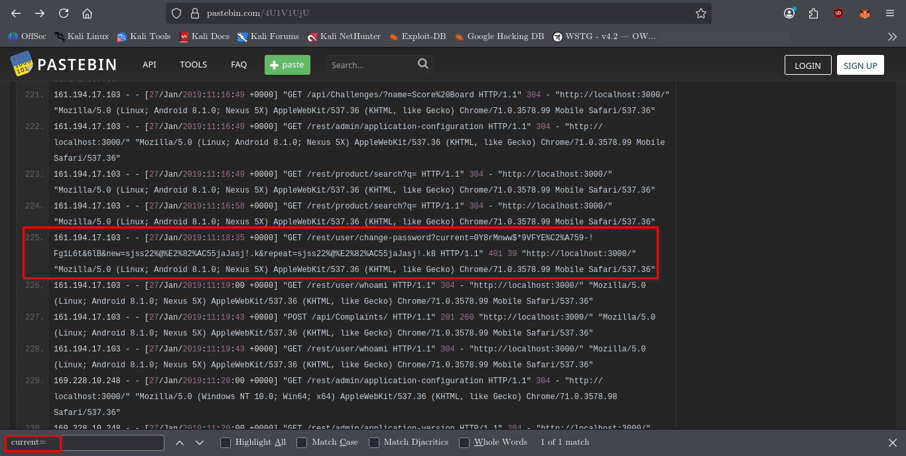
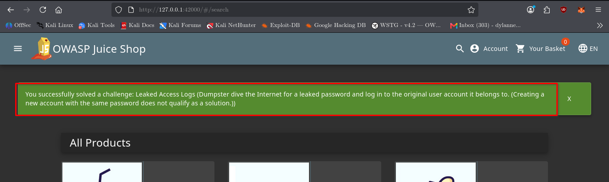

# Leaked Access Logs

## Challenge Information

* **Category:** Observability Failures
* **Difficulty:** 5 ⭐
* **Challenge:** Leaked Access Logs
* **Objective:** Discover sensitive credentials exposed through leaked access logs and use them to authenticate to the application.

---

## Reconnaissance / Discovery

The first step was to search the local Juice Shop source code for references to the challenge.

### Command

```bash
grep -Rni -C 8 "leakedAccessLogs\|Leaked Access Logs" /var/lib/juice-shop/build /var/lib/juice-shop/config 2>/dev/null | head -120
```

### Finding

The search identified the challenge in the Cypress login tests:

```text
cy.expectChallengeSolved({ challenge: 'Leaked Access Logs' });
```

The same test showed that the challenge is solved after successfully logging in with the `J12934` account.

The search also identified an API test referencing a Pastebin resource associated with the challenge:

```text
https://pastebin.com/4U1V1UjU
```

This gave us the next attack surface to investigate.

---

## Leaked Access Log

The Pastebin resource contained historical HTTP access-log entries.

Searching the page for `J12934` revealed an interesting request:

```text
GET /rest/user/change-password?current=<redacted>&new=<redacted>&repeat=<redacted>
```

The request exposed sensitive password information directly inside the URL.

### Important observations

* The password was transmitted as a URL parameter.
* The request was recorded by the web server's access log.
* Anyone with access to the leaked logs could potentially recover the credential.
* The request returned HTTP `401`, but the credential was still recorded in the log.

This demonstrated the underlying information disclosure.



---

## Validation

The Juice Shop test suite provided additional confirmation that the leaked credential belonged to the `J12934` account and could be used for authentication.

The relevant test performs a normal login and expects the **Leaked Access Logs** challenge to be solved afterward.

This established the exploitation path:

```text
Leaked access log
        ↓
Sensitive credential exposed
        ↓
Identify affected account
        ↓
Authenticate with exposed credential
        ↓
Challenge solved
```

---

## Exploitation

The leaked credential was used to authenticate through the Juice Shop login page.

### Target

```text
http://127.0.0.1:42000/#/login
```

### Account

```text
J12934@juice-sh.op
```

The password was taken from the leaked access-log entry.

After submitting the credentials, authentication succeeded and access to the application was obtained.



---

## Evidence

The following screenshots document the attack:

### Attack Surface

`02-leaked-access-logs-attack-surface.png`

Shows the leaked access-log entry containing sensitive information in the request URL.

### Exploitation Evidence

`01-leaked-access-logs-exploitation-evidence.png`

Shows successful authentication using the exposed credential.

The **Leaked Access Logs** challenge was also confirmed as solved on the Juice Shop Score Board.

---

## Security Impact

Sensitive credentials should never appear in URLs because URLs are commonly recorded by:

* Web server access logs
* Reverse proxies
* Monitoring systems
* Browser history
* Analytics systems
* Referrer headers
* Third-party logging infrastructure

If access logs are exposed, credentials contained within requests can become an additional authentication compromise path.

---

## Root Cause

The underlying issue is the transmission of sensitive password information through a URL.

GET request parameters are inappropriate for secrets because the complete URL can be logged and retained by multiple systems.

The leaked access log therefore became a secondary source of authentication credentials.

---

## Lessons Learned

* Never place passwords or other secrets in URLs.
* Treat access logs as sensitive security data.
* Review what information is captured by application logging.
* Use appropriate request methods and secure request bodies for sensitive operations.
* Restrict access to server logs.
* Remove or redact sensitive information from logs where possible.
* During reconnaissance, publicly exposed logs can reveal credentials, internal endpoints, and application behavior.

---

## Conclusion

The **Leaked Access Logs** challenge demonstrated how sensitive credentials can be exposed indirectly through server logging.

The investigation followed this chain:

**Reconnaissance → Pastebin discovery → Access-log analysis → Credential disclosure → Authentication → Challenge solved**

The vulnerability was not an authentication bypass itself. Instead, the authentication credential was obtained from an exposed logging artifact and then used through the application's normal login functionality.
