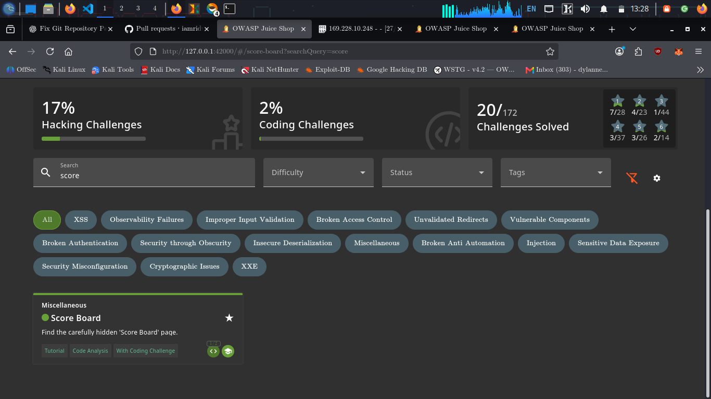

# Score Board

## Challenge Information

* **Category:** Score Board
* **Difficulty:** 1 ⭐
* **Challenge:** Score Board
* **Objective:** Discover and access the hidden Score Board page.

---

## Reconnaissance / Discovery

The challenge was investigated by searching the local Juice Shop source code for references to the Score Board challenge:

```bash
grep -Rni -C 8 "Score Board\|scoreBoard" /var/lib/juice-shop/build /var/lib/juice-shop/config 2>/dev/null | head -120
```

### Key Finding

The Cypress test for the challenge revealed the hidden route:

```javascript
cy.visit('/#/score-board');
cy.url().should('match', /\/score-board/);
cy.expectChallengeSolved({ challenge: 'Score Board' });
```

This confirmed that the challenge is solved by successfully accessing the `/score-board` route.

---

## Validation

The discovered route was accessed directly:

```text
http://127.0.0.1:42000/#/score-board
```

The application loaded the Score Board page successfully.

This validated that the discovered route was active and accessible.

---

## Exploitation

The hidden Score Board was accessed by navigating to:

```text
/#/score-board
```

Full local URL:

```text
http://127.0.0.1:42000/#/score-board
```

No authentication bypass or additional payload was required. The vulnerability was the lack of effective concealment of the Score Board route.

---

## Evidence

The Score Board page was successfully accessed and the challenge was marked as solved.



---

## Security Impact

A hidden application route should not be treated as a security control.

If sensitive functionality or information is accessible simply by discovering an unlinked route, an attacker can potentially access it without needing to exploit a complex vulnerability.

In this challenge, the Score Board was accessible through a discoverable client-side route.

---

## Root Cause

The application relied on the Score Board being hidden from normal navigation rather than enforcing access restrictions.

The route:

```text
/#/score-board
```

remained directly accessible.

This demonstrates why **security through obscurity** should not be used as a substitute for proper access control.

---

## Lessons Learned

* Hidden routes can often be discovered through source-code analysis.
* Client-side routes should not be considered secret.
* Sensitive functionality requires proper authorization controls.
* Reconnaissance includes identifying application routes and endpoints, not just server infrastructure.
* Source-code and test-case inspection can reveal undocumented application functionality.

---

## Conclusion

The **Score Board** challenge was solved by discovering the hidden `/score-board` route through local source-code reconnaissance and accessing it directly.

The key discovery was:

```text
/#/score-board
```

Navigating to the route successfully loaded the Score Board and triggered the challenge completion.
