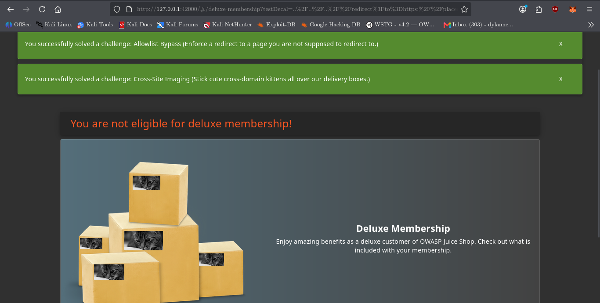

Absolutely — here’s the **ready-to-copy-and-paste replacement** with the redirect-bypass sequence clarified properly.

# Cross-Site Imaging

## Challenge Information

* **Category:** Security Misconfiguration
* **Challenge:** Cross-Site Imaging
* **Difficulty:** 5 ⭐
* **Application:** OWASP Juice Shop
* **Target:** `http://127.0.0.1:42000`
* **Status:** Solved

---

## Objective

Exploit a forgotten frontend parameter and chain it with the application's redirect allowlist bypass to load an external cross-domain kitten image.

---

## Reconnaissance

The first step was to search the Juice Shop source code for references to the challenge.

```bash
grep -Rni -C 8 "Cross-Site Imaging\|crossSiteImaging" \
/var/lib/juice-shop/build /var/lib/juice-shop/config 2>/dev/null | head -120
```

The search identified the Cypress test for the challenge:

```javascript
describe('/#/deluxe-membership', () => {
  describe('challenge "svgInjection"', () => {
    it('should be possible to pass in a forgotten test parameter abusing the redirect-endpoint to load an external image', () => {
      cy.login({ email: 'jim', password: 'ncc-1701' });

      cy.location().then((loc) => {
        cy.visit(
          `/#/deluxe-membership?testDecal=${encodeURIComponent(
            `../../..${loc.pathname}/redirect?to=https://placecats.com/g/200/100?x=https://github.com/juice-shop/juice-shop`
          )}`
        );
      });

      cy.expectChallengeSolved({ challenge: 'Cross-Site Imaging' });
    });
  });
});
```

### Key Findings

The test revealed several important parts of the attack chain:

* The vulnerable page is `/deluxe-membership`.
* A forgotten parameter named `testDecal` is accepted by the frontend.
* `testDecal` can be used to construct a path to the application's `/redirect` endpoint.
* The redirect endpoint accepts a destination through the `to` parameter.
* The redirect functionality contains an allowlist-bypass vulnerability.
* The bypass can be chained to redirect to an external image.
* The challenge specifically expects a **cross-domain kitten image**.

---

## Validation

The redirect endpoint was examined to understand how the redirect functionality works.

```bash
grep -Rni -C 12 "redirect.*to\|to.*redirect" \
/var/lib/juice-shop/build/routes /var/lib/juice-shop/build/test 2>/dev/null | head -160
```

This identified:

```text
/var/lib/juice-shop/build/routes/redirect.js
```

The relevant logic was:

```javascript
function performRedirect() {
  return ({ query }, res, next) => {
    const toUrl = query.to;

    if (security.isRedirectAllowed(toUrl)) {
      challengeUtils.solveIf(
        datacache_1.challenges.redirectChallenge,
        () => {
          return isUnintendedRedirect(toUrl);
        }
      );

      res.redirect(toUrl);
    } else {
      res.status(406);
      next(new Error('Unrecognized target URL for redirect: ' + toUrl));
    }
  };
}
```

The endpoint takes the destination from:

```text
/redirect?to=<destination>
```

It then checks the destination with:

```javascript
security.isRedirectAllowed(toUrl)
```

If the URL passes that check, the application performs the redirect with:

```javascript
res.redirect(toUrl);
```

The source also contained tests for the separate **Allowlist Bypass** challenge. This established that the redirect functionality has a URL-validation weakness that can be abused to make an unintended external redirect pass the allowlist check.

---

## Redirect Bypass Sequence

The important distinction is that **Cross-Site Imaging does not bypass the redirect allowlist by itself**.

Instead, it chains the forgotten `testDecal` parameter with the existing redirect allowlist bypass vulnerability.

The sequence is:

```text
Deluxe Membership
        ↓
Forgotten testDecal parameter
        ↓
Construct path to /redirect
        ↓
/redirect?to=<crafted destination>
        ↓
Redirect allowlist validation
        ↓
Allowlist parsing/bypass behavior
        ↓
Crafted external destination accepted
        ↓
res.redirect(toUrl)
        ↓
External placecats.com kitten image
        ↓
Cross-Site Imaging solved
```

Therefore, the vulnerabilities involved are:

```text
Forgotten test parameter
        +
Redirect allowlist bypass
        +
External image loading
        =
Cross-Site Imaging
```

The redirect allowlist bypass is the **enabling vulnerability**, while the forgotten `testDecal` parameter provides the frontend entry point used to chain it into the Cross-Site Imaging challenge.

---

## Exploitation

The application was accessed while authenticated as the required user:

```text
http://127.0.0.1:42000/#/deluxe-membership
```

The forgotten `testDecal` parameter was then supplied with a path that references the redirect endpoint.

The intended external image target was:

```text
https://placecats.com/g/200/100?x=https://github.com/juice-shop/juice-shop
```

The complete attack chain was:

```text
1. Open Deluxe Membership
        ↓
2. Supply the forgotten testDecal parameter
        ↓
3. testDecal points toward /redirect
        ↓
4. /redirect receives the external destination through to=
        ↓
5. The redirect allowlist weakness allows the crafted destination
        ↓
6. Juice Shop performs the redirect
        ↓
7. placecats.com returns the cross-domain kitten image
        ↓
8. Cross-Site Imaging is solved
```

The challenge was successfully triggered after loading the crafted Deluxe Membership URL.

---

## Evidence

The final page displayed the externally loaded kitten image and the challenge was marked as solved.



---

## Security Impact

This challenge demonstrates how multiple seemingly small weaknesses can be chained into a working attack.

The combination of:

* a forgotten development/test parameter,
* a redirect endpoint,
* insufficient redirect allowlist validation, and
* externally controlled image content

allows an attacker to influence which external resource is loaded through the application's functionality.

Similar weaknesses can contribute to phishing, unwanted external redirects, content injection, tracking, or other client-side security issues depending on how the affected application handles externally controlled resources.

---

## Root Cause

The vulnerability chain results from several development mistakes:

1. A forgotten `testDecal` parameter remained available in the production frontend.
2. The parameter could be used to construct a path to the redirect endpoint.
3. The redirect endpoint accepted a user-controlled `to` destination.
4. The redirect allowlist contained a bypass condition.
5. The bypass allowed an unintended external destination to pass validation.
6. The application then redirected the browser to the attacker-controlled external resource.

---

## Lessons Learned

* Search for forgotten development and testing parameters.
* Inspect frontend Angular code rather than relying only on visible application behavior.
* Trace user-controlled parameters into backend endpoints.
* Understand the complete validation flow before attempting exploitation.
* Test redirect allowlists for URL parsing and normalization weaknesses.
* Treat separate vulnerabilities as potential building blocks for attack chains.
* External resource loading can become a security issue when attackers can influence the destination.

---

## Conclusion

The Cross-Site Imaging challenge demonstrates a multi-step vulnerability chain involving a forgotten frontend parameter and a redirect allowlist bypass.

The `testDecal` parameter provided the entry point into the redirect functionality. The redirect allowlist weakness allowed the crafted external destination to pass validation, after which Juice Shop redirected to the cross-domain kitten image required by the challenge.

This successfully demonstrated how individually small application weaknesses can be chained together to produce an unintended security outcome.
