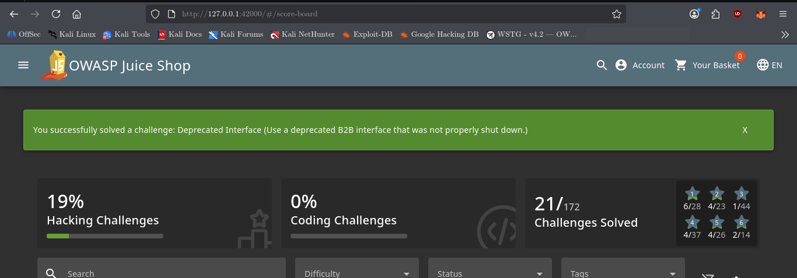

# Deprecated Interface

## Challenge Information

* **Category:** Security Misconfiguration
* **Challenge:** Deprecated Interface
* **Objective:** Discover and use the remaining deprecated file-upload interface.

---

## Reconnaissance / Discovery

The challenge was investigated by searching the local Juice Shop source code for references to the challenge:

```bash
grep -Rni -C 8 "deprecatedInterface\|Deprecated Interface" /var/lib/juice-shop/build /var/lib/juice-shop/config 2>/dev/null | head -120
```

### Key Finding

The Cypress challenge test revealed that the deprecated interface could still accept XML files:

```javascript
describe('challenge "deprecatedInterface"', () => {
    it('should be possible to upload XML files', () => {
        cy.get('#complaintMessage').type('XML all the way!');
        cy.get('#file').selectFile('test/files/deprecatedTypeForServer.xml');
        cy.get('#submitButton').click();
        cy.expectChallengeSolved({ challenge: 'Deprecated Interface' });
    });
});
```

This established the intended attack surface:

* Complaint functionality
* File upload field
* XML file
* Backend endpoint: `/file-upload`

---

## Attack Surface

The upload route was identified in `server.js`:

```javascript
app.post(
    '/file-upload',
    uploadToMemory.single('file'),
    fileUpload_1.ensureFileIsPassed,
    metrics.observeFileUploadMetricsMiddleware(),
    fileUpload_1.checkUploadSize,
    fileUpload_1.checkFileType,
    fileUpload_1.handleZipFileUpload,
    fileUpload_1.handleXmlUpload,
    fileUpload_1.handleYamlUpload
);
```

The relevant endpoint is:

```text
POST /file-upload
```

The uploaded file is submitted using the multipart form field:

```text
file
```

---

## Validation

The XML handler was then examined:

```bash
grep -Rni -C 12 "handleXmlUpload" /var/lib/juice-shop/build 2>/dev/null | head -100
```

The relevant logic was:

```javascript
function handleXmlUpload({ file }, res, next) {
    if (utils.endsWith(file?.originalname.toLowerCase(), '.xml')) {
        challengeUtils.solveIf(
            datacache_1.challenges.deprecatedInterfaceChallenge,
            () => { return true; }
        );
        ...
    }
}
```

This confirmed that an uploaded file ending in `.xml` reaches the deprecated XML handler and immediately triggers the challenge.

The API test provided an additional validation:

```javascript
it('POST file type XML deprecated for API', () => {
    const file = node_path_1.default.resolve(
        __dirname,
        '../files/deprecatedTypeForServer.xml'
    );
    const form = frisby.formData();
    form.append('file', node_fs_1.default.createReadStream(file));

    return frisby.post(URL + '/file-upload', {
        headers: {
            'Content-Type': form.getHeaders()['content-type']
        },
        body: form
    }).expect('status', 410);
});
```

The expected `HTTP 410 Gone` response is intentional. The deprecated handler processes the XML request and then returns the deprecation error.

---

## Exploitation

The challenge was solved through the old complaint file-upload interface.

The Cypress test demonstrates the intended workflow:

1. Enter a complaint message.
2. Select an XML file.
3. Submit the complaint.
4. The XML file is sent to `/file-upload`.
5. `handleXmlUpload()` detects the `.xml` extension.
6. The `Deprecated Interface` challenge is marked as solved.

No special XML payload or additional attack was required.

The Juice Shop source explicitly confirms that simply using the deprecated interface is sufficient to solve the challenge.

---

## Evidence

The challenge was successfully solved by submitting an XML file through the deprecated complaint upload functionality.



---

## Security Impact

Deprecated functionality that remains reachable can increase an application's attack surface.

In this case, the application had replaced the old B2B complaint interface with a newer implementation, but the legacy XML/YAML processing functionality remained available in the backend.

The XML handler also parses uploaded XML using:

```javascript
libxml.parseXml(data, {
    noblanks: true,
    noent: true,
    nocdata: true
})
```

The `noent: true` configuration is security-relevant because XML entity processing can introduce additional risks such as XXE. Juice Shop therefore has separate challenges involving XML entity processing.

Those XXE challenges are distinct from **Deprecated Interface** itself; this challenge is solved simply by reaching the old interface.

---

## Root Cause

The root cause is incomplete removal of deprecated functionality.

The application documentation states that:

* The old B2B interface was replaced by a newer interface.
* Not all components of the old interface were cleanly removed.
* The remaining deprecated interface was still accessible.

This left legacy functionality exposed through the `/file-upload` endpoint.

---

## Lessons Learned

* Deprecated functionality should be completely removed when it is no longer required.
* Old API endpoints can remain part of an application's attack surface even when they are no longer linked from the frontend.
* Source-code reconnaissance can reveal legacy functionality that is difficult to discover through normal application navigation.
* HTTP status codes such as `410 Gone` do not necessarily mean that the underlying functionality is unreachable.
* XML processing should be reviewed carefully because insecure parser configurations can introduce additional vulnerabilities.
* Security testing should include legacy and deprecated endpoints, not only currently documented functionality.

---

## Conclusion

The **Deprecated Interface** challenge was solved by discovering and using the application's remaining XML upload functionality.

The reconnaissance process identified:

```text
Complaint interface
        ↓
XML file upload
        ↓
POST /file-upload
        ↓
handleXmlUpload()
        ↓
Deprecated Interface challenge solved
```

The key lesson is that replacing an old interface is not enough if its backend functionality remains accessible. Legacy functionality should be properly removed or securely disabled when it is no longer required.
