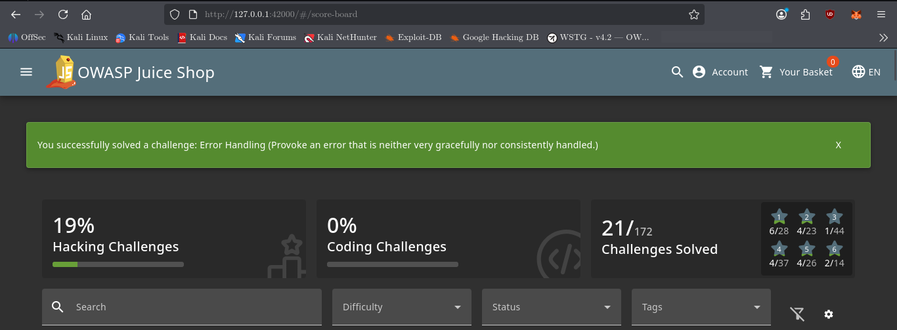
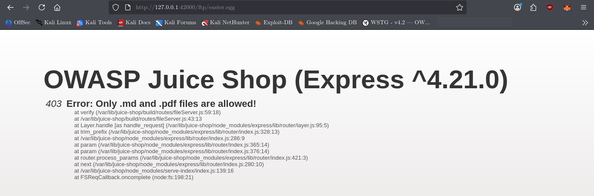

# Error Handling

## Challenge Information

* **Category:** Security Misconfiguration
* **Challenge:** Error Handling
* **Objective:** Provoke an application error that is neither very gracefully nor consistently handled.

---

## Reconnaissance / Discovery

The challenge was investigated by searching the local Juice Shop source code for references to the **Error Handling** challenge:

```bash
grep -Rni -C 8 "errorHandling\|Error Handling" /var/lib/juice-shop/build /var/lib/juice-shop/config 2>/dev/null | head -120
```

### Key Finding

The Cypress test revealed the exact attack path:

```javascript
describe('challenge "errorHandling"', () => {
    it('should leak information through error message accessing /ftp/easter.egg due to wrong file suffix', () => {
        cy.visit('/ftp/easter.egg', { failOnStatusCode: false });
        cy.get('#stacktrace').then((elements) => {
            expect(!!elements.length).to.be.true;
        });
        cy.expectChallengeSolved({ challenge: 'Error Handling' });
    });
});
```

This established that requesting `/ftp/easter.egg` with an unsupported file extension causes an error response containing a visible stack trace.

---

## Attack Surface

The vulnerable functionality is the public FTP file-serving endpoint.

The discovered path was:

```text
/ftp/easter.egg
```

The `.egg` extension is not an allowed file type. Juice Shop expects supported files such as `.md` and `.pdf`.

The application's error-handling middleware was also identified in `server.js`:

```javascript
app.use(verify.errorHandlingChallenge());
app.use(errorhandler());
```

This confirmed that errors generated by application routes pass through the application's error-handling mechanism.

---

## Validation

The challenge test provided the exact request:

```text
http://127.0.0.1:42000/ftp/easter.egg
```

The test deliberately uses:

```javascript
{ failOnStatusCode: false }
```

because the request is expected to return an HTTP error.

It then checks for:

```text
#stacktrace
```

The presence of this element confirms that the application exposes a stack trace in the error response.

---

## Exploitation

The unsupported FTP resource was accessed:

```text
http://127.0.0.1:42000/ftp/easter.egg
```

The invalid `.egg` extension caused the application to return:

```text
403 Error: Only .md and .pdf files are allowed!
```

However, the error response also exposed a detailed server-side stack trace.

The stack trace disclosed internal information such as:

```text
/var/lib/juice-shop/build/routes/fileServer.js
/var/lib/juice-shop/node_modules/express/
```

It also revealed function names, source-code line numbers, framework components, and the internal request-processing sequence.

The exposed stack trace triggered the **Error Handling** challenge.

No authentication bypass or complex payload was required.

---

## Evidence

The first screenshot confirms that the **Error Handling** challenge was successfully triggered and solved.



The second screenshot captures the actual information disclosure. The error response exposes the server-side stack trace, including internal filesystem paths, source locations, line numbers, and Express framework components.



Together, these screenshots provide both **proof of challenge completion** and **evidence of the underlying security issue**.

---

## Security Impact

Detailed error responses can provide attackers with valuable information about an application's internal implementation.

The exposed stack trace revealed:

* Internal filesystem paths
* Source-code file locations
* Line numbers
* Function names
* Express framework components
* Node.js internals
* Request-processing flow

This information can assist further reconnaissance and help an attacker understand the application's architecture and potential attack surface.

---

## Root Cause

The root cause is overly verbose error handling.

The application correctly rejected the unsupported `.egg` file extension with HTTP 403, but the error response also exposed a detailed server-side stack trace.

In a production environment, internal debugging information should not normally be returned to untrusted clients.

A safer implementation would return a generic error message to the user while recording detailed exception information internally for authorized developers or administrators.

---

## Lessons Learned

* Error responses are an important part of security testing.
* Invalid file extensions can reveal weaknesses in error handling.
* Stack traces should not be exposed to untrusted users.
* Internal filesystem paths and source-code locations can provide useful reconnaissance information.
* HTTP status codes alone do not determine whether an error response is secure.
* Detailed debugging information should be separated from user-facing error messages.
* Public file-serving functionality should be tested with unexpected filenames and extensions.

---

## Conclusion

The **Error Handling** challenge was solved by requesting the unsupported FTP resource:

```text
/ftp/easter.egg
```

The application returned a `403` response because `.egg` is not an allowed file type. However, the response also exposed a detailed server-side stack trace.

The key security issue was therefore not the `403` response itself, but the unnecessary disclosure of internal application details through the error page.

The two pieces of evidence document the complete chain:

```text
Reconnaissance
      ↓
/ftp/easter.egg discovered
      ↓
Invalid file extension
      ↓
403 error generated
      ↓
Stack trace exposed
      ↓
Error Handling challenge solved
```
