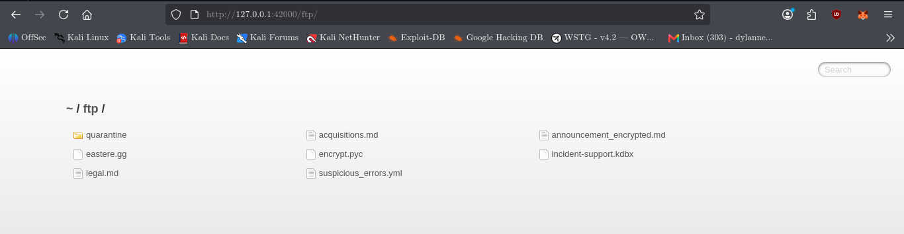
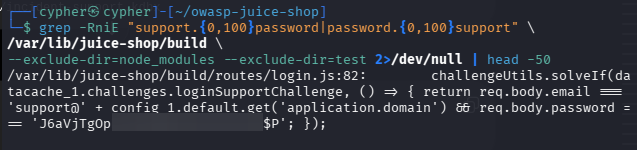
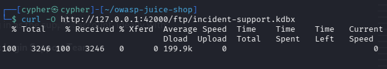
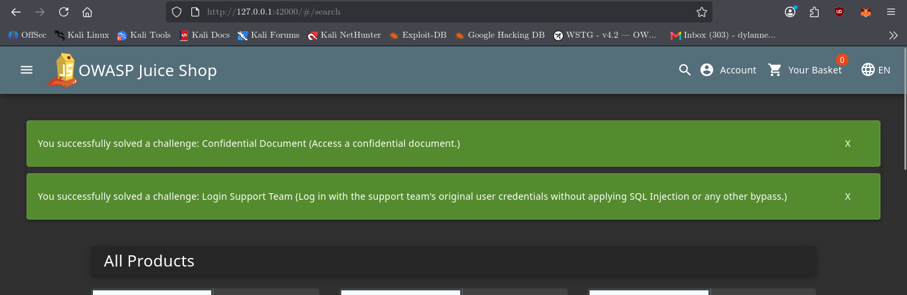

# Login Support Team

## Challenge Information

* **Category:** Security Misconfiguration
* **Challenge:** Login Support Team
* **Difficulty:** 6 ⭐
* **Objective:** Log in with the support team's original user credentials without using SQL Injection or another authentication bypass.

---

## Reconnaissance / Discovery

The challenge description provided several clues:

* The support team uses a third-party tool to access the current account password.
* The support account uses a strong password.
* SQL Injection can authenticate as the support team, but this does not solve the challenge.
* The objective is to recover and use the support team's **original credentials**.

Instead of attempting SQL Injection, the investigation focused on discovering exposed support-related files and resources.

### Discovering the FTP Directory

The Juice Shop `/ftp` endpoint was checked:

```bash
curl -i http://127.0.0.1:42000/ftp/
```

The server returned `200 OK` and exposed a directory listing.

Among the discovered files was the following password-management database:

```text
incident-support.kdbx
```



### Key Finding

The `.kdbx` extension was significant because KDBX is the database format used by **KeePass**, a password-management application.

This matched the challenge clue about the support team using a third-party tool to access credentials.

---

## Attack Surface

The investigation identified the following publicly accessible resource:

```text
/ftp/
└── incident-support.kdbx
```

The database could be downloaded directly:

```bash
curl -O http://127.0.0.1:42000/ftp/incident-support.kdbx
```

The downloaded file was then identified:

```bash
file incident-support.kdbx
```

The output identified it as:

```text
Keepass password database 2.x KDBX
```

The KDBX database was encrypted and required a master password.



Rather than attempting to break the database encryption, the investigation continued by examining the application's authentication logic for the original support credentials.

---

## Validation

The application source code was searched for support-related authentication information:

```bash
grep -RniE "support.{0,100}password|password.{0,100}support" \
/var/lib/juice-shop/build \
--exclude-dir=node_modules --exclude-dir=test 2>/dev/null | head -50
```

The search revealed support authentication logic in:

```text
routes/login.js
```

The source code contained the original support account credentials.



> **Note:** The password has been redacted from the screenshot and documentation to avoid publishing a working credential.

### Key Finding

The original support credentials were present directly in the application's source code.

This provided the intended route to the support account without using SQL Injection or another authentication bypass.

---

## Exploitation

The discovered support credentials were entered through the normal Juice Shop login functionality.

The support account used the application's configured domain:

```text
support@<application-domain>
```

The original password discovered during source-code analysis was supplied through the normal login form.

No SQL Injection was used.

No authentication bypass was required.

The application successfully authenticated the support account and triggered the challenge completion.

---

## Evidence

The successful authentication triggered the Juice Shop challenge notification.



The application confirmed:

```text
You successfully solved a challenge:
Login Support Team
```

The evidence confirms that the original support credentials were successfully used to authenticate and complete the challenge.

---

## Security Impact

Exposing authentication credentials in application resources can allow unauthorized users to authenticate as the affected account.

In this challenge, both a sensitive KeePass database and the original support credentials were exposed through application resources.

Potential consequences include:

* Unauthorized access to the support account
* Exposure of support-related information
* Account compromise
* Credential reuse against other systems
* Further access to functionality available to the support account

---

## Root Cause

The root cause is the exposure of sensitive credential material through application resources.

The `/ftp` directory publicly exposed a KeePass database, while the application's source code contained the original support account credentials.

Sensitive credentials should not be hard-coded into application source code or exposed through publicly accessible directories.

Credential-management databases should also be stored outside publicly accessible application paths and protected by appropriate access controls.

---

## Lessons Learned

* Publicly accessible directories should be tested for sensitive files.
* File extensions can reveal the purpose of unfamiliar files.
* KDBX files should be treated as sensitive password-management databases.
* Source-code reconnaissance can reveal authentication logic and exposed credentials.
* Hard-coded credentials can provide direct access to application accounts.
* SQL Injection is not always the intended solution even when it can bypass authentication.
* Challenge clues can help identify the intended attack path.
* Sensitive credential material should never be exposed through public application resources.

---

## Conclusion

The Login Support Team challenge was solved by following the provided clues and investigating the application's exposed resources and source code.

The investigation followed this chain:

```text
Challenge clues
      ↓
/ftp/ directory discovered
      ↓
incident-support.kdbx discovered
      ↓
KeePass database identified
      ↓
Support authentication logic searched
      ↓
Original support credentials discovered
      ↓
Normal login performed
      ↓
Support account authenticated
      ↓
Challenge solved
```
