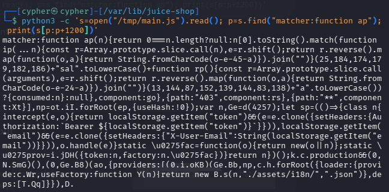
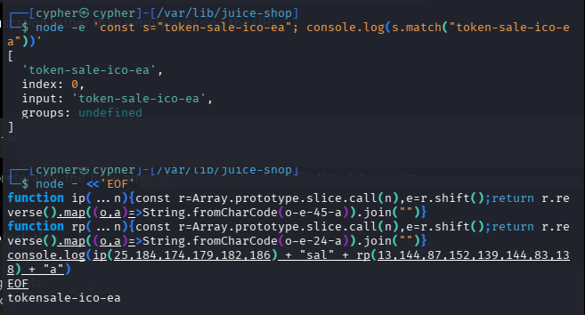
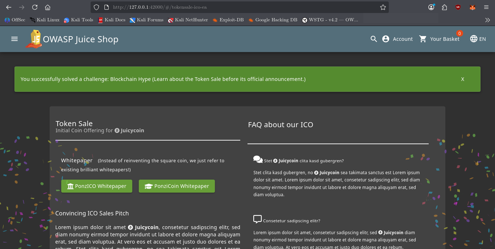

# Blockchain Hype

## Challenge Information

**Category:** Security through Obscurity
**Challenge:** Blockchain Hype
**Difficulty:** 5

### Objective

Discover the hidden token sale page despite the application's use of URL obfuscation as a security mechanism.

### Challenge Clues

1. The developers believe in **Security through Obscurity** instead of proper access restrictions.
2. Guessing or brute-forcing the token sale URL is unlikely to succeed.
3. Closely investigate where all application paths are defined.
4. Manually defeating the obfuscation mechanism would take time. There may be an easier way to undo it.

---

## Reconnaissance / Discovery

The first clue suggested that the token sale page was not protected by conventional authorization, but instead hidden through an obscure URL.

Because the third clue specifically mentioned the location where application paths are defined, the frontend JavaScript bundle was investigated.

The Juice Shop frontend was accessible at:

```text
http://127.0.0.1:42000
```

The JavaScript bundle was downloaded for inspection:

```bash
curl -s http://127.0.0.1:42000/main.js -o /tmp/main.js
```

The bundle contained the application's Angular route definitions.

Searching for the known `juicy-nft` route exposed the surrounding route configuration:

```bash
curl -s http://127.0.0.1:42000/main.js | grep -o '.\{500\}juicy-nft.\{500\}' | head -c 2500
```

The output revealed a custom route matcher following the normal routes:

```text
{matcher:function ap(n){return 0===n.length?null:
n[0].toString().match(...)?{consumed:n}:null},component:go}
```

This was significant because the route was not represented by a normal:

```text
path:"..."
```

definition.

### Evidence



The matcher contained two functions using `String.fromCharCode()` to construct an obfuscated string.

---

## Attack Surface

The relevant attack surface was the **client-side Angular routing configuration**.

The hidden route was controlled by:

```text
matcher:function ap(n)
```

and rendered:

```text
component:go
```

Further inspection of `component:go` showed:

```text
selectors:[["app-token-sale"]]
```

and:

```text
altcoinName="Juicycoin"
```

This confirmed that the component associated with the hidden matcher was the **Token Sale** component.

---

## Validation

Instead of manually reversing every `String.fromCharCode()` operation, the obfuscation functions were executed directly with Node.js.

The first decoder was:

```javascript
function ip(...n){
    const r=Array.prototype.slice.call(n),
    e=r.shift();
    return r.reverse()
        .map((o,a)=>String.fromCharCode(o-e-45-a))
        .join("")
}
```

The second decoder was:

```javascript
function rp(...n){
    const r=Array.prototype.slice.call(arguments),
    e=r.shift();
    return r.reverse()
        .map((o,a)=>String.fromCharCode(o-e-24-a))
        .join("")
}
```

The encoded values were passed to Node.js:

```bash
node - <<'EOF'
function ip(...n){
    const r=Array.prototype.slice.call(n),e=r.shift();
    return r.reverse().map((o,a)=>String.fromCharCode(o-e-45-a)).join("")
}

function rp(...n){
    const r=Array.prototype.slice.call(n),e=r.shift();
    return r.reverse().map((o,a)=>String.fromCharCode(o-e-24-a)).join("")
}

console.log(ip(25,184,174,179,182,186) + "sal" + rp(13,144,87,152,139,144,83,138) + "a")
EOF
```

The resulting route was:

```text
tokensale-ico-ea
```

### Evidence



---

## Exploitation

The decoded route was accessed through the application's hash-based Angular router:

```text
http://127.0.0.1:42000/#/tokensale-ico-ea
```

The hidden Token Sale page was displayed, confirming that the route had been successfully discovered.

### Evidence



---

## Security Impact

This demonstrates why **security through obscurity is not an access-control mechanism**.

The token sale page was hidden from normal navigation, but the route definition and its decoding logic were delivered to the client. Anyone capable of inspecting the application's JavaScript could recover the hidden route.

Client-side obfuscation therefore provided concealment rather than authorization.

---

## Root Cause

The root cause was relying on an **obfuscated client-side route** to hide functionality instead of enforcing server-side access controls.

The application exposed:

* The route-matching logic.
* The obfuscation algorithm.
* The encoded route components.
* The Token Sale component itself.

All of this was available to the client.

---

## Lessons Learned

* Hidden URLs are not security controls.
* Client-side JavaScript must be treated as publicly accessible.
* Obfuscation can slow discovery but does not provide authorization.
* Application route definitions are valuable reconnaissance targets.
* When code contains an encoding/obfuscation routine, executing the routine can be more efficient than manually reversing it.
* Security controls should be enforced server-side.

---

## Conclusion

The Blockchain Hype challenge demonstrated a practical example of **Security through Obscurity**.

The hidden Token Sale route was discovered by investigating the application's Angular route definitions, identifying the custom matcher, and executing its obfuscation functions to recover the route:

```text
tokensale-ico-ea
```

The route was then accessed successfully, demonstrating that obscuring a resource is fundamentally different from restricting access to it.
