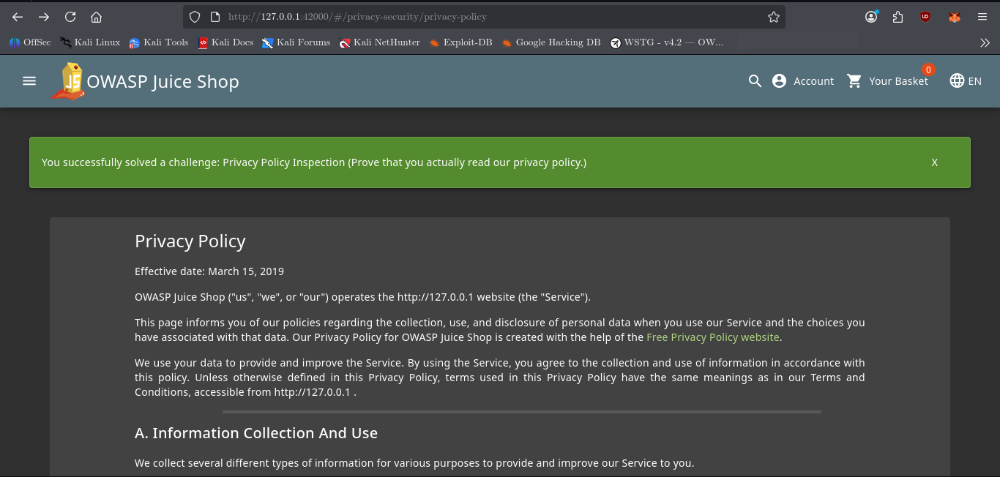
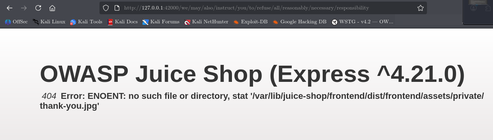

# Privacy Policy Inspection

## Challenge Information

**Category:** Security through Obscurity
**Challenge:** Privacy Policy Inspection
**Difficulty:** — 3
**Application:** OWASP Juice Shop

### Objective

Identify the hidden information embedded within the Privacy Policy and use it to construct the special URL required to complete the challenge.

---

## Reconnaissance / Discovery

The challenge clue indicated that the Privacy Policy needed to be read carefully and specifically mentioned using the mouse cursor to avoid losing sight of the paragraph being read.

The first step was to open the Privacy Policy:

```text
http://127.0.0.1:42000/#/privacy-security/privacy-policy
```

While reading through the page and moving the mouse cursor across the text, certain portions of the policy produced a visual highlight.

These highlighted sections contained fragments of the URL information.



The discovered fragments included:

```text
http://127.0.0.1
We may also
instruct you
to refuse all
reasonably necessary
responsibility
```

The important information was not presented as an obvious link. It had to be discovered by carefully inspecting the rendered Privacy Policy.

---

## Attack Surface

The relevant attack surface was the Privacy Policy page itself:

```text
/#/privacy-security/privacy-policy
```

The application exposed information through content that appeared to be ordinary policy text but contained hidden/highlighted fragments.

This demonstrated that sensitive information can be unintentionally exposed through client-side content even when it is not presented as a conventional hyperlink.

---

## Validation

The discovered fragments were combined to reconstruct the special URL path:

```text
/we/may/also/instruct/you/to/refuse/all/reasonably/necessary/responsibility
```

The resulting URL was:

```text
http://127.0.0.1:42000/we/may/also/instruct/you/to/refuse/all/reasonably/necessary/responsibility
```

Visiting this URL triggered the challenge completion.



---

## Exploitation

No brute-force attack was required.

The intended discovery process was:

1. Open the Privacy Policy.
2. Carefully read and inspect the rendered text.
3. Move the mouse cursor across the paragraphs.
4. Identify the highlighted fragments.
5. Combine the fragments in their intended order.
6. Construct the resulting URL path.
7. Visit the reconstructed URL.
8. Confirm the challenge completion notification.

The challenge relied on **security through obscurity**: the special endpoint was not openly presented as a normal navigational link, but information necessary to discover it was embedded within the page.

---

## Security Impact

Relying on an obscure or difficult-to-discover URL is not an access-control mechanism.

If knowledge of a URL is the only barrier protecting a resource or functionality, discovering that URL can bypass the intended obscurity.

---

## Root Cause

The underlying issue is reliance on **obscurity instead of explicit access restrictions**.

The application exposed enough information within the client-side Privacy Policy to reconstruct a hidden endpoint. Anyone able to inspect the page and recognize the pattern could recover the URL.

Proper authorization controls should protect sensitive functionality regardless of whether its URL is known.

---

## Lessons Learned

* Carefully inspect application content rather than relying only on visible links.
* Hovering over rendered content can reveal behavior that is not immediately obvious.
* Hidden information can be distributed across multiple pieces of text.
* Client-side content should not be treated as secret merely because it is difficult to notice.
* URL obscurity should never replace authentication or authorization controls.
* When investigating an application, pay attention to unusual UI behavior and inconsistencies in otherwise ordinary text.

---

## Conclusion

The Privacy Policy Inspection challenge was solved by carefully examining the rendered Privacy Policy, identifying highlighted text fragments, reconstructing the hidden URL from those fragments, and visiting the resulting endpoint.

The challenge demonstrates why **hiding a resource is fundamentally different from protecting it**: once the hidden location is discovered, obscurity alone provides no meaningful access control.
