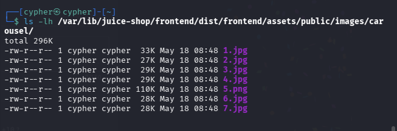
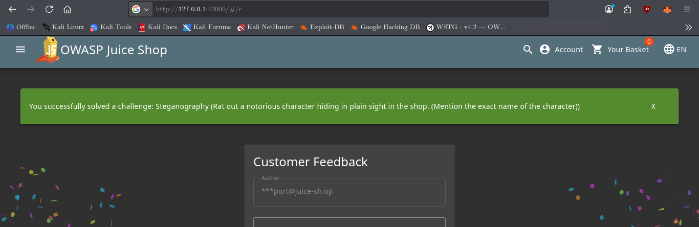

# Steganography

## Challenge Information

**Category:** Miscellaneous / Steganography
**Challenge:** Steganography
**Difficulty:** 4
**Target:** OWASP Juice Shop
**Local URL:** `http://127.0.0.1:42000/#/contact`

### Objective

Rat out a notorious character hiding in plain sight in the shop.

The challenge requires identifying the exact name of the hidden character and submitting it through the Customer Feedback form.

---

## Reconnaissance / Discovery

The challenge initially directs attention toward the Customer Feedback page:

```text
http://127.0.0.1:42000/#/contact
```

The page itself does not expose the hidden character directly. The challenge clues indicate that specialized steganography tooling is required and that simply reading the visible Lorem Ipsum text is not sufficient.

### 1. Investigate image assets

The Juice Shop frontend contains a carousel image directory:

```bash
ls -lh /var/lib/juice-shop/frontend/dist/frontend/assets/public/images/carousel/
```

The directory contained:

```text
1.jpg
2.jpg
3.jpg
4.jpg
5.png
6.jpg
7.jpg
```

The important anomaly was **`5.png`**:

* It was the only PNG in the numbered carousel sequence.
* The other six files were JPEG images.
* `5.png` was approximately 110 KB, while the other carousel images were approximately 27–33 KB.

This made `5.png` the primary steganography candidate.



---

## Attack Surface

The relevant attack surface was the application's publicly served image content.

The investigation narrowed the target from the application's visible pages to the numbered carousel assets:

```text
1.jpg
2.jpg
3.jpg
4.jpg
5.png
6.jpg
7.jpg
```

The unusual file format and significantly larger size of `5.png` suggested that additional data could be embedded inside the image.

---

## Validation

The suspected image was copied to a temporary working location:

```bash
cp /var/lib/juice-shop/frontend/dist/frontend/assets/public/images/carousel/5.png /tmp/5.png
```

The file type was confirmed:

```bash
file /tmp/5.png
```

Output:

```text
/tmp/5.png: PNG image data, 400 x 300, 8-bit/color RGB, non-interlaced
```

The PNG structure was also inspected:

```bash
pngcheck -v /tmp/5.png
```

The image contained only the normal:

```text
IHDR
IDAT
IEND
```

chunks and no obvious metadata or additional PNG chunks.

This indicated that the hidden content was likely contained within the image data itself rather than being stored as ordinary PNG metadata.

---

## Exploitation

### 1. Identify suitable steganography tooling

`zsteg` was used to examine common PNG bit-plane and LSB patterns:

```bash
zsteg /tmp/5.png -b 1,2,3,4,5,6,7,8
```

The results contained several apparent file signatures, but they did not produce a reliable or recognizable hidden payload.

Because the challenge specifically indicated that specialized tooling would make the task easier, **OpenStego** was used for extraction.

The installed version was:

```bash
openstego --version
```

Output:

```text
OpenStego v0.8.6
```

Available algorithms were checked:

```bash
openstego algorithms
```

The relevant algorithm was:

```text
RandomLSB
```

`RandomLSB` supports PNG files:

```bash
openstego readformats -a RandomLSB
```

which included:

```text
png
```

### 2. Extract the hidden data

An output directory was created:

```bash
mkdir -p /tmp/extracted
```

The `5.png` image was then opened in OpenStego's **Extract Data** function.

The important distinction is that OpenStego expects an **output directory**, not an output filename.

The extraction configuration used:

```text
Stego File:
 /tmp/5.png

Output Folder:
 /tmp/extracted
```

The extraction successfully produced:

```text
/tmp/extracted/J7RbRp1D5XDM5LINx0TdgeFX_o.png
```

The extracted file was verified:

```bash
file /tmp/extracted/J7RbRp1D5XDM5LINx0TdgeFX_o.png
```

Output:

```text
PNG image data, 100 x 100, 8-bit colormap, non-interlaced
```

The extracted image revealed the hidden character: **Pickle Rick**.


---

## Validation of the Challenge

The identified character name was submitted through the Customer Feedback form at:

```text
http://127.0.0.1:42000/#/contact
```

The answer submitted was:

```text
Pickle Rick
```

The application confirmed that the challenge was successfully solved.



---

## Security Impact

Steganography can conceal additional information inside apparently ordinary files.

In this challenge, an image that appeared to be a normal carousel asset contained an additional hidden image. An attacker investigating application assets could identify unusual files through characteristics such as:

* Unexpected file format
* Unusual file size
* Irregular asset naming or sequencing
* Suspicious image characteristics
* Embedded data detectable through specialized steganography tools

This demonstrates why publicly accessible static files should not automatically be assumed to contain only the visible information presented by the application.

---

## Root Cause

The challenge demonstrates **security through obscurity combined with hidden data in a publicly accessible asset**.

The hidden information was placed inside an image that was available as part of the application's frontend assets. No access control prevented an investigator from obtaining the original image and analyzing it with specialized tools.

The security issue demonstrated here is therefore not that steganography itself is inherently insecure, but that **hiding sensitive information inside publicly accessible resources is not an access-control mechanism**.

---

## Lessons Learned

* Investigate unusual files instead of assuming every asset is benign.
* Compare related files for anomalies in format and size.
* Use specialized tools when a challenge explicitly points toward steganography.
* `zsteg` can be useful for initial PNG LSB analysis, but its output can contain false positives.
* OpenStego can extract data hidden using RandomLSB.
* When using OpenStego's GUI, the output field expects a **directory**, not a destination filename.
* Always validate extracted data with tools such as `file`.
* A successful extraction should still be visually inspected and correlated with the application's challenge objective.
* Discovery should precede exploitation: first identify the suspicious asset, then determine what technique is required to analyze it.

---

## Conclusion

The Steganography challenge was solved by investigating the application's carousel assets and identifying `5.png` as an anomalous image. Specialized steganography tooling was then used to extract a hidden PNG from the image.

The extracted image revealed **Pickle Rick**, whose name was submitted through the Customer Feedback page to complete the challenge.
